## Örnek Çalışma

*Bu örnekte K8s konfigürasyon değişiklikleri için Argo CD uygulaması ile tam otomatik CD pipeline'ının kurulması ve çalıştırılmasını göreceğiz*

Bu örnek uygulamada bize gerekenler:

- "Deployment" ve "service" yaml dosyalarını içeren Git repo'su

- Örnekte kullanılacak olan Docker imajlarını içeren Docker Hub repo'su

- İçerisi boş olan Minikube cluster'ı

Bu örneğin tamamlanması için gerçekleştirilecek adımlar:

1. Install Argo CD in K8s cluster

2. "Aplication" CRD ile Argo CD'nin konfigüre edilmesi

3. *Deployment.yaml* dosyasını güncelleyerek kurulumun test edilmesi

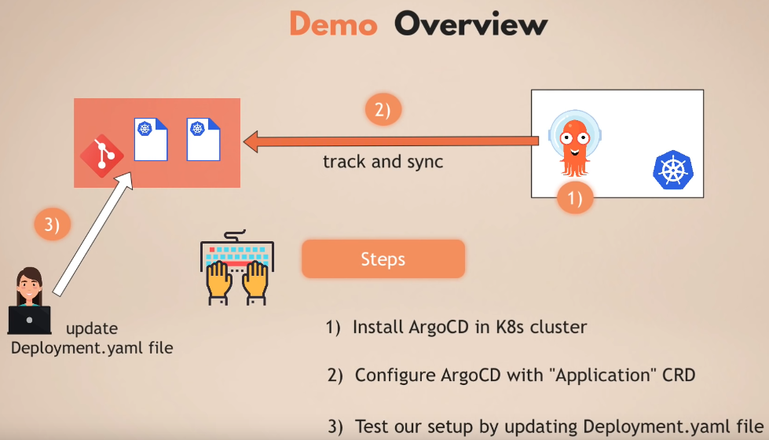

## 1. Adım - Install ArgoCD in K8s cluster

Kurulum adımlarının anlatıldığı internet sayfasına [buradan](https://argo-cd.readthedocs.io/en/stable/getting_started/#1-install-argo-cd) ulaşabilirsiniz.

- K8s cluster'ının içerisine Argo CD namespace'i oluşturuyoruz:

    `kubectl create namespace argocd`

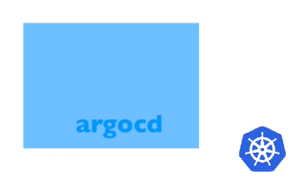

- Namespace içerisine Argo CD uygulamasının kurulumunu yapıyoruz

    `kubectl apply -n argocd -f https://raw.githubusercontent.com/argoproj/argo-cd/stable/manifests/core-install.yaml`

  Kurulum sonucunu görebilmek için `kubectl get pod -n argocd` komutunu çalıştırıp çıktıları görebiliriz.

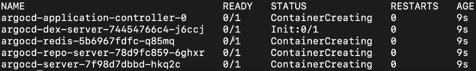

Tüm pod'ların çalışır duruma geçmesini beklemeliyiz. `kubectl get pod -n argocd -w` komutu ile gözlemleme(watch) konumuna geçip kolayca takip edebiliriz.

### Argo CD UI'ına Erişmek

  K8s cluster'ında çalışan Servisleri `kubectl get svc -n argocd` komutu ile incelediğimizde *argocd-server* servisinin *80* ve *443* portlarının açık olduğunu gözlemleyebiliriz.

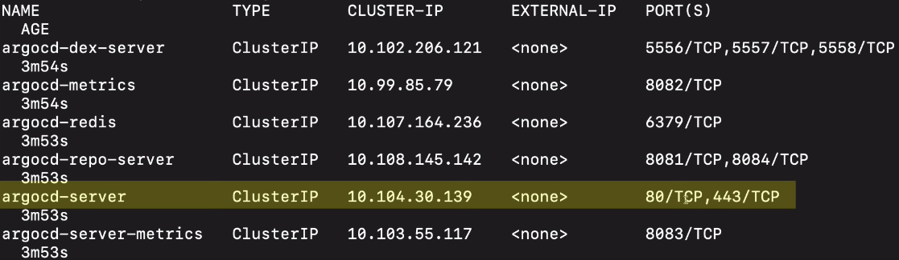

  Bu port'ları kendi makinemizin port'larına yönlendirip UI'a erişebilir hale geleceğiz.

  `kubectl port-forward -n argocd svc/argocd-server 8080:443`

  Bu komut ile bu servise artık localhost üzerinden erişebilir hale gelmiş olduk.

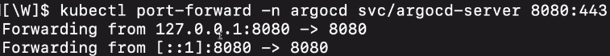

Artık [localhost:8080](localhost:8080) veya [127.0.0.1:8080](127.0.0.1:8080) adresleri ile service erişebiliriz

Aşağıdaki gibi güvensiz bağlantı uyarısı alınılması durumunda *Advanced -> Proceed to 127.0.0.1 (unsafe)* şeklinde ilerleme yapılarak bağlantıya erişebilir olmuş olacağız.

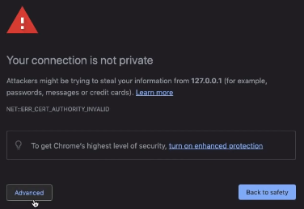

Artık Argo CD uygulamasının UI'ı önümüze gelecektir:

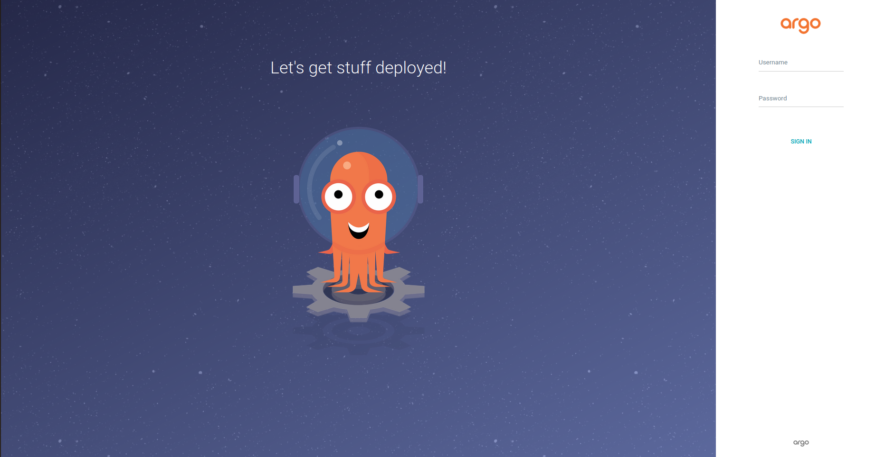

Yukarıda bahsedilen ve kurulum adımlarının anlatıldığı [internet sitesi](https://argo-cd.readthedocs.io/en/stable/getting_started/#1-install-argo-cd) üzerindeki *4. Login Using The CLI* başlığı altında sisteme nasıl giriş yapıldığı anlatılmaktadır, biz de burada bahsedeceğiz. Yeni güncellemeler sonrası buradaki giriş yöntemi değişirse (ki önceden bu durum olmuştu) o zaman bahsi geçen internet sitesinden yeni yöntemi denemeniz faydalı olacaktır.

Username'in *admin* olarak tanımlandığı sistemin şifresi ise Argo CD kurulumu yapılırken oluşmaktadır. Şifre *argocd-initial-admin-secret* ismiyle oluşturulan secret içerisinde saklanmaktadır.

Secret'ı ekrana yaml olarak bastırıyoruz:

`kubectl get secret argocd-initial-admin-secret -n argocd -o yaml`

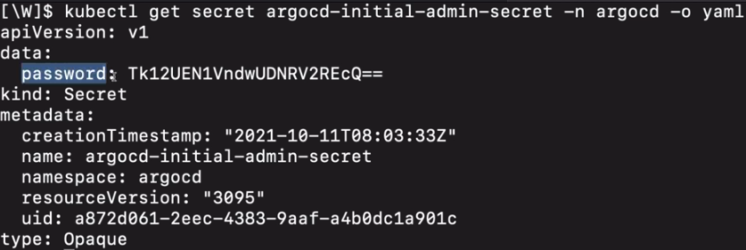

*data*'nın altında yer alan *password*'ün karşısında yazan şifre bilgisi base64 encode değeridir. Bu değeri decode edip şifreye ulaşabileceğiz:

`echo <encoded_password_value> | base64 --decode`

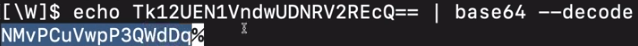

**%** işaretini dikkate almadan önceki değerleri kopyalayarak şifreyi elde etmiş oluruz. Username'i admin olan kullanıcının *initial password* değerine de bu şekilde ulaşmış olduk.

Giriş yaptıktan sonra Argo CD'nin boş UI ekranı önümüze gelecektir.

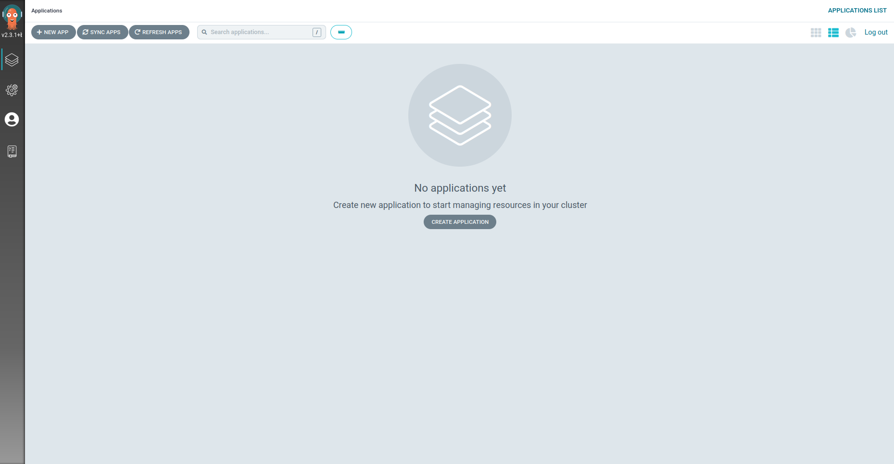

## 2. Adım - Configure Argo CD with "Application" CRD

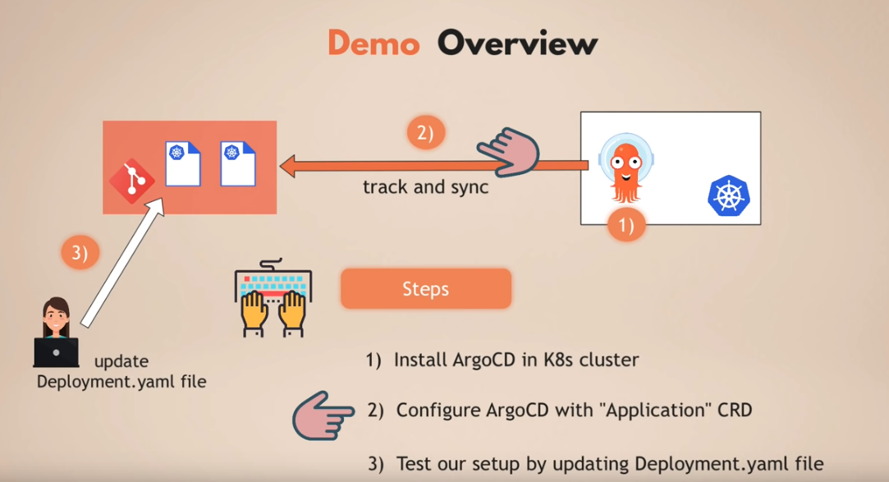

Bu adımda konfigürasyon dosyalarının yer aldığı Git repo'sunun Argo CD ile bağlantısını sağlayacak olan konfigürasyon dosyasını yazıp bağlantıyı tamamlayacağız (Argo CD'nin konfigurasyon dosyası da yine bu konfigurasyon repo'sunda olacaktır.)

Config repo: [https://github.com/Scope-Infrastructure-Calismalari/argocd-app-config](https://github.com/Scope-Infrastructure-Calismalari/argocd-app-config)

Docker repo: [https://hub.docker.com/repository/docker/scopeinfra/argocd-app](https://hub.docker.com/repository/docker/scopeinfra/argocd-app)

Argo CD konfigürasyonunu yazarak işe başlayabiliriz, dosya ismimiz application.yaml. Konfigurasyon aslında çok basit. Custom components'ler (veya Custom Resource Definitions - CRD'lar) için apiVersion projenin kendi versiyonu olacaktır.

**Dikkat: Bu örnekte `argoproj.io/v1alpha1` olarak tanımlanan versiyon Argo CD projesinin yeni versiyonları çıktıkça değiştirilmelidir, bu yüzden bu örnek denendiği zaman bu alan kontrol edilip yenilenmelidir!**

Versiyon kontrolü için [Declarative Setup](https://argo-cd.readthedocs.io/en/stable/operator-manual/declarative-setup/) bağlantısı altındaki *Applications* başlığının altındaki dosya örnek alınabilir.

Dosyamızın ilk satırları aşağıdaki gibidir. Bu satırlar ile uygulamanın konponent'leri Argo CD uygulamasının çalıştığı namespace'in altında oluşturulmasını sağlayacaktır.

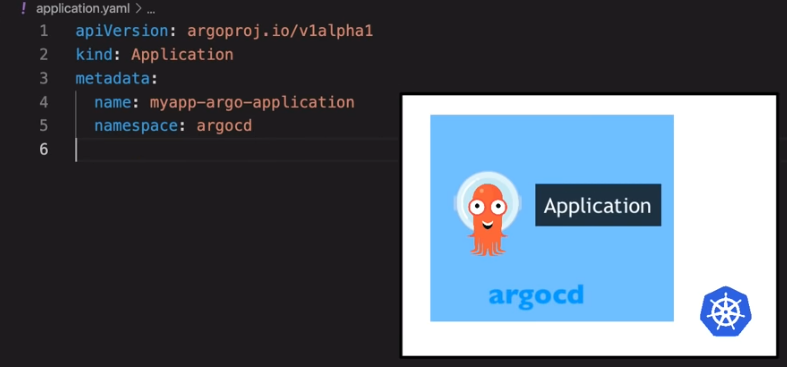

Kodları yazmaya *spec* ile devam ediyoruz. spec altındaki *project* birden fazla uygulamayı gruplamamızı sağlamakta. Bu bizim için önemli değilse *default* yazıp devam edebiliriz. Eğer bu satırı hiç yazmaz, tanımlama yapmak isek o zaman da *default* olarak kabul edilecektir.

Buradan sonra ise tüm Argo CD uygulamalarını oluştururken gerekli iki adıma geçiyoruz. İlk olarak; Argo CD'nin bağlanacağı ve senkronizasyon sağlayacağı Git repo'su, ikinci olarak ise Git repo'sunda bulduğu tanımlamaları uygulayacağı destination(K8s cluster) bilgisi.

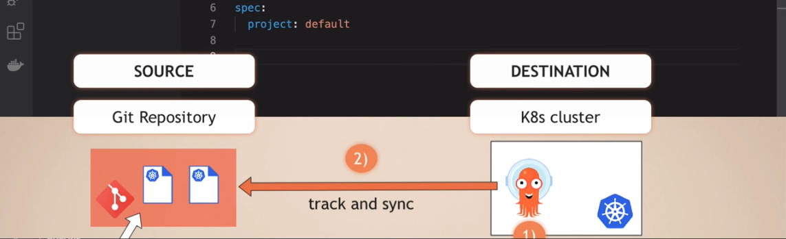

**Source**

- *repoURL* ile Git repo'sunun bağlantısı tanımlanır.
- *targetRevision: HEAD* tanımlaması ise Argo CD'nin her zaman son commit'i almasını sağlar.
- *path: dev* ise repo içerisindeki senkronize etmek veya takip etmek istediğimiz spesifik bir path tanımlamamızı sağlar. Bizim örneğimizde bu *dev* klasörüdür.

**Destination**

- *server* K8s cluster'ının kendi adresini tanımladığımız yer. `https://kubernetes.default.svc` adresi K8s API server'ın internal adresidir.

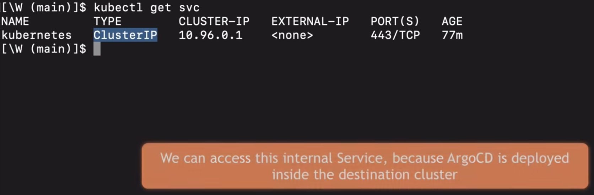

*Not: Argo CD K8s cluster'ının içerisinde çalıştığı için cluster'ın API server'ına erişmesi için internal IP adresi yeterlidir, external cluster endpoint'e gerek yoktur. Argo CD cluster'a dışarıdan erişebileceği veya birden çok cluster'ı yönetebileceği için böyle bir tanımlama vardır ama bizim örneğimizde internal adres yeterli olmaktadır.*

- *namespace* alanı ile de Argo CD'nin Git repo'sunda bulduğu konfigurasyon dosyalarını nereye uygulayacağını tanımlamış oluyoruz. *myapp* olarak tanımlayınca tüm konfigurasyonların myapp isimli namespace'de oluşturulmasını sağlamış oluyoruz.

  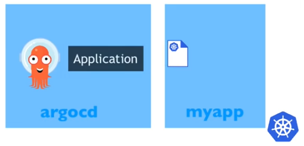
  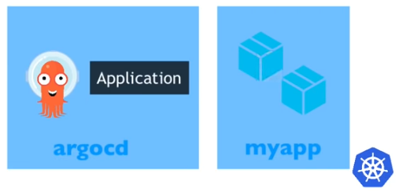

Daha önceden myapp isimli bir namespace tanımlaması yapmamıştık, bu durumda Argo CD uygulamayı deploy etmeyi denediğinde hata alacaktır. Bunun önüne geçmek için *syncPolicy* altında *syncOptions* altında *- CreateNamespace=true* ile destination cluster'da bu namespace'in olacağından emin olmuş olduk.

**Dikkat: Argo CD uygulaması bu dokümanda sürekli "Otomatik olarak Git repo'sunu dinler" olarak anlatılmış olsa da bu özelllik defaukt olarak kapalı gelmektedir, bunu şu şekilde açıyoruz:**

*"automated"* başlığı altında iki ayarın tanımlaması yapılabilmektedir. *"selfHeal"* ile Argo CD uygulamasına uygulanan tüm manuel değişikliklerin geri alınması veya üzerinde yazılması sağlanmaktadır. Bu "*Single Source of Truth*"un gerçekleşmesini sağlayacaktır. Yani sadece repo'da yer alan bilgiler Argo CD için geçerli olacaktır, manuel değişiklikler kaldırılıp asıl hale dönülecektir.

*automated* ile ayarlamasını yaptığımız Argo CD, her 3 dakikada bir Git repo'sunu kontrol edip eğer kendi anlık durumu ile farklılık varsa bu farklılıkları giderip kendini Git repo'sunda yer alan ayarlara göre yapılandıracaktır.

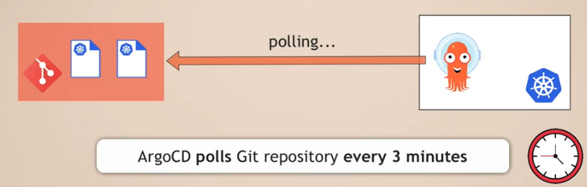

*Not: Eğer 3 dakika beklemek yerine Argo CD'nin değişiklikten anında bilgilenmesini istiyorsak bunun için "Git webhook" kullanılabilir.*

Peki otomatik senkronizasyon, kendini iyileştirme, prune etme gibi özellikler neden kapalı gelmektedir?

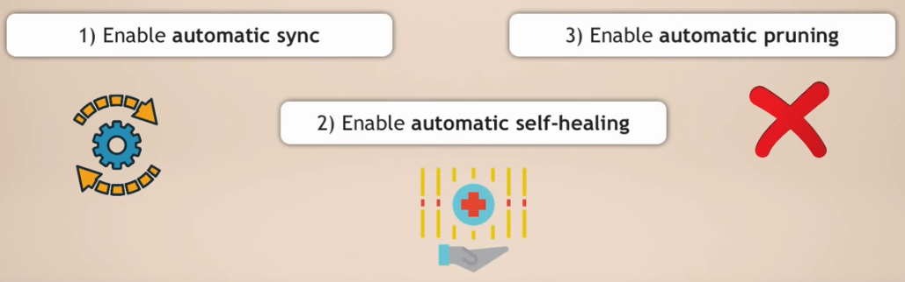

Tam cevabını bilemesem de bu muhtemel olarak "güvenlik" altında düşünülüp uygulanmış kararlardır. Böylece bazı şeylerin yanlışlıkla silinmesi sonucu bizim dışarıdan enable etmemizin gerekmemekte olacak, bazı durumlarda da  denediğimiz ayarların otomatik senkronizasyon nedeniyle silinip deneme-yanılma yapmamızı engelleyeceğinden bunların önüne geçilmiş olacaktır.

**aplication.yaml** dosyamızın yazımını bitirip tamamladıktan sonra ilk ve son defa çalıştırmamız gereken komut ile bu yaml dosyamızı cluster'a uygulayacağız. Aşağıdaki çıktıdan da görebilceğimiz üzere application component oluşturulmuş oldu.

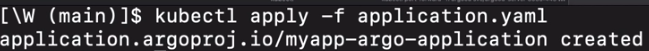

Uygulamamız şu anda cluster içerisinde çalışmaktadır.

Eğer buraya kadarki adımları başarı ile tamamlayabildiysek localhost üzerinden Argo CD uygulamasına eriştiğimizde aşağıdaki gibi bir ekran bizi karşılayacak ve cluster'a kurulmuş olan uygulamamız gözükecektir:

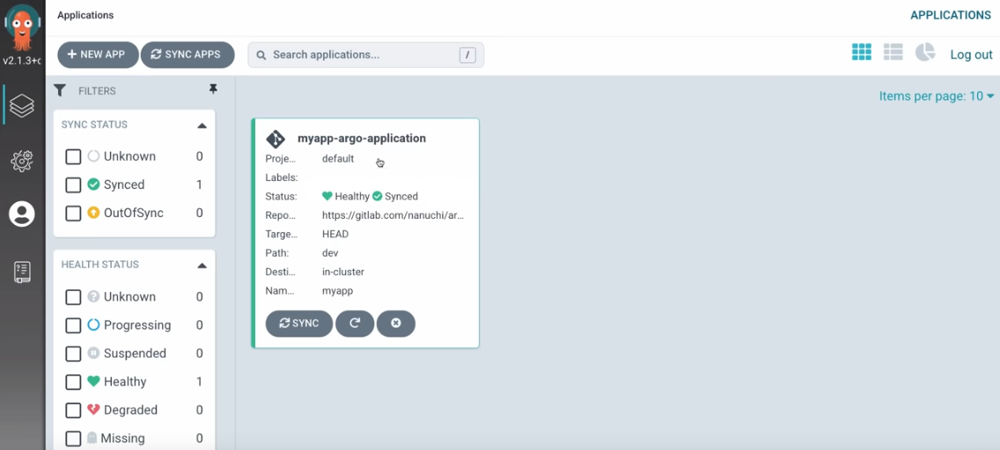

Kuruluma tıkladığımızda ise kurulmuş olan tüm component'leri görebileceğiz:

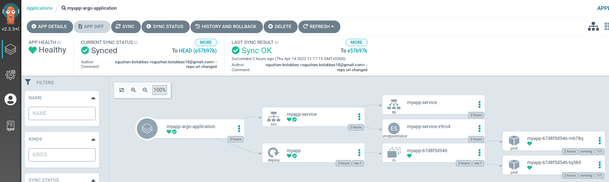

Deployment'ın altındaki "rs" ile belirtilen "replica set"e bağlı olan iki pod göreceğiz:

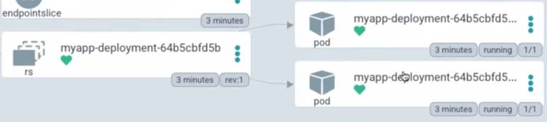

Bu *"deployment.yaml"* dosyası içerisinde "spec" başlığı altında "replicas: " alanını "2" olarak tanımlamamızdan kaynaklanmaktadır. Verdiğimiz sayıya göre oluşturulan replica'ları bu aşamada UI üzerinden görebilmiş olduk.

Pod'lardan birinin üzerine tıkladığımızda "main data" bilgisini, pod'un hangi Docker imajı ile çalıştığını, "actual state manifest (live manifest)" bilgilerini görebileceğiz. Pod'un gerçekleştirdiği event'leri ve bunların log bilgilerini de yine bu pencereden bulabiliriz.

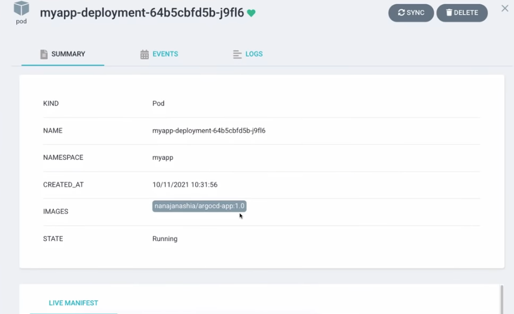

## 3. Adım - Test our setup by updating Deployment.yaml file

Git repo'muzda yer alan *dev* klasörü altındaki *deployment.yaml*'da yapacağımız değişiklikler Argo CD bu repo ile senkronize çalıştığı için uygulamaya otomatik yansıyacaktır. Örneğin bu dosyadaki *spec:* altındaki *containers:* altındaki *image* satırındaki *"scopeinfra/argocd-app:1.0"* satırını **1.0**'dan **1.2**'ye alıp tekrardan GitHub'a push'larız.

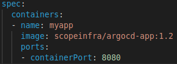

Bu değişiklikten sonra Argo CD'nin bu değişikliği algılayıp deploy ettiğimiz uygulamayı değiştirmesi gerekiyor. Bunun için 3 dakika süre boyunca bekleyebiliriz veya Argo CD uygulama sayfasında yer alan "Sync" butonuna basarak senkronizasyonu kendi elimizle tetikleyebiliriz.

Tetikleme sonrasında yeni bir *replica set (rs)* oluşturulacak ve buna bağlı iki yeni pod oluşacaktır. Bu yeni pod'lar Git repo'sundaki deployment.yaml ile ayarladığımız üzere scopeinfra/argocd-app Dcoker image'ının **1.2** versiyonu ile ayağa kalkacak olup eski image tag'ini kullanan diğer iki pod ise kaldırılacaktır (Kaldırılan pod'ların bağlı olduğu rs'in silinmediği gözlemlenmiştir, nedeni için araştırma yapılması ve onun da silinmesinin ayarlanması gerekmektedir).

`kubectl edit deployment -n myapp myapp` komutu ile deployment bilgilerini düzenleyebilir, replica sayısını 2'den 4'e çıkarıp deneme yapabiliriz. Yaptığımız bu manuel değişiklik ise senkronizasyon sonucunda geri alıcak veya üzerinde yazılacak, replica sayısı tekrar 2 olacaktır.
