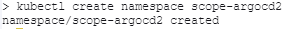
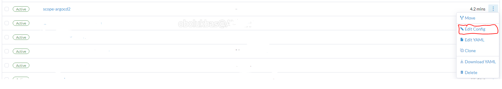
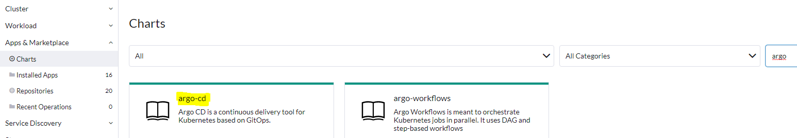
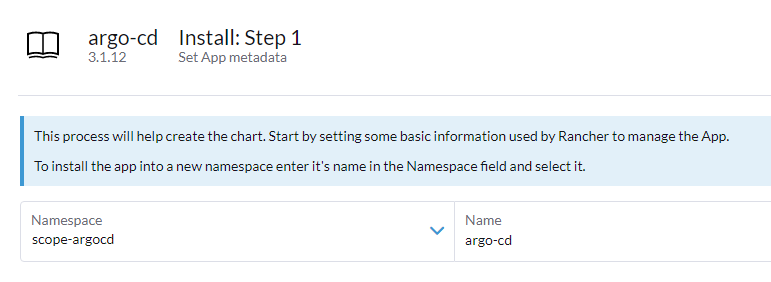
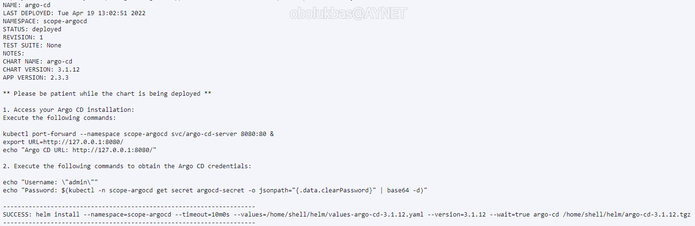
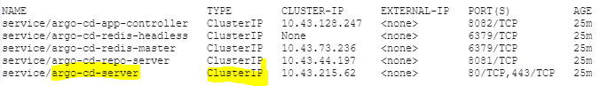
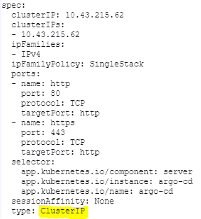
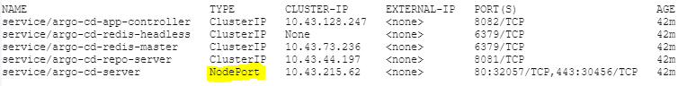
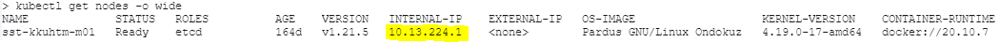
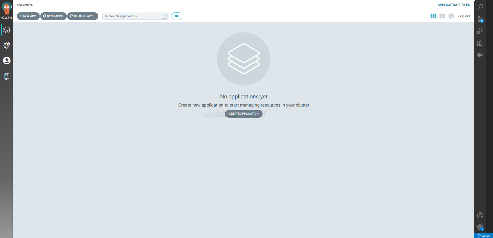

## Kurulum (Bulut)

### Bu başlık altında K8s cluster'ına Argo CD'nin nasıl kurulacağı anlatılacaktır. Adımlar şu şekilde

### 1 - Rancher'a bağlanılıp sağ üstteki buton ile terminal çalıştırılır

### 2 - `kubectl create namespace` ile yeni bir namespace oluşturulur

Yeni namespace bir projeye dahil edilmek istenirse sol menüdeki *Cluster*'a, sonra *Projects/Namespaces*'a tıklanır. Sağ üstteki kutucuktan filtreleme yapılıp namespace bulunduktan sonra sağ tarafta yer alan 3 noktaya basılıp *Edit Config* butonuna tıklanır.

Daha sonra ise sağ üstteki *Projects* açılır menüsünden ilgili proje seçilir.

### 3 - Oluşturulan namespace'e Argo CD kurulur

Sol menüdeki *Apps & Marketplace* altındaki *Charts* butonuna tıklanır ve açılan ekrandan sağ üstteki filtreleme kutusu ile argo cd filtrelenip çıkan kutucuğa tıklanır.

Daha sonra çıkan dokümanın sağ üzerinde yer alan mavi *Install* butonuna tıklanır.

Ekrana gelen yükleme adımında daha önceden oluşturduğumuz namespace seçilip uygulamaya bir isim verilir.

Sağ alttaki *Next* butonu ile devam edilir ve sonrasında *Install* butonu ile kurulum işlemi başlatılır.

Kurulum başarı ile tamamlandığında terminalde şu şekilde çıktılar oluşacaktır:

Bu komutları kullanarak ileride uygulamamıza ve ilk şifremize erişeceğiz. O yüzden terminali kapatmamayı tercih etmelisiniz :)

### 4 - Kurulan servisi dışarıdan erişilebilir hale getirilir

`kubectl get all --namespace scope-argocd` komutu ile *scope-argocd* namespace'ine kurulan tüm uygulamalar sıralanır. Şu an bizim için önemli olan *service/* ile başlayanlar.

Buradan *service/argo-cd-server* satırı bulunur. Bu servisin tipi ClusterIP olarak gözükmektedir. Bunu **NodePort**'a çevireceğiz.

`kubectl edit svc argo-cd-server --namespace scope-argocd` komutu ile servisin yaml dosyası **Vi** ile açılmış olunur.

Burada *spec* altındaki *type* anahtarının değeri silinip *NodePort* yazılır ve kaydedilip çıkılır.

Artık servisimiz NodePort olarak gözükecektir:

Yukarıdaki görselde de gözüktüğü üzere artık *Port(s)* kısmında servisin port'ları "80/TCP,443/TCP" olarak görünmeyip **"80:32057/TCP,443:30456/TCP"** olarak gözükmektedir. Bu da şu anlama gelmektedir: **Herhangi bir worker node'un IP'sini tarayıcımıza yazıp bu port ile bağlandığımızda Argo CD uygulamamızın UI'ına erişmiş olacağız**

`kubectl get nodes -o wide` komutu ile node'larımızı listeliyoruz.

Herhangi birinin *INTERNAL-IP* bilgisini alıp tarayıcımıza yazıyoruz ve yukarıdaki adımda oluşan iki yeni port'tan birini yazıyoruz, örneğin; **"10.13.224.1:30456"**

Çıkan ekrandan Advanced'e tıklayıp sonrasında ise Proceed'e tıklayarak Argo CD uygulamasının UI'ına nihayetinde erişiyoruz :)

### 5 - İlk şifrenin elde edilmesi

Argo CD kurulurken yetkili kullanıcıyı ve şifresini kendi oluşturup base64 ile decode edip opaque secret olarak saklamaktadır. Bu secret'ı elde edip decode ederek ilk şifremize ulaşmış olacağız.

Hatırlayacağımız üzere Argo CD kurulumu terminalden bize gösterilirken kurulum tamamlandıktan sonra ekranda bazı komutlar belirmişti. İşte bu komutu kullanarak şifremizi doğrudan elde edip UI ekranından giriş yapacağız. Root username'i **admin** olan kullanıcımızın şifresi ise şu komutla elde edilmektedir: `echo "$(kubectl -n scope-argocd get secret argocd-secret -o jsonpath="{.data.clearPassword}" | base64 -d)"`
Bu şifreyi ekrana girip uygulamaya erişim sağlanabilinmektedir.

