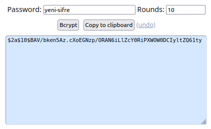

## Kurulum (Yerel makina)

*Not: Bu uygulama kişisel bilgisayar üzerine yüklenmiş olan Ubuntu 20.04 LTS üzerine kurulmuştur. Farklı işletim sistemleri için bazı adımlar/komutlar değişecektir fakat kurulumun ana mantığu/iskeleti burada tanımlandığı gibidir· Kurulum adımlarına Argo CD'nin [Getting Started](https://argo-cd.readthedocs.io/en/stable/getting_started/) bağlantısından da ulaşabilirsiniz.*

Argo CD uygulaması "minikube" uygulaması üzerinde çalışan Kubernetes cluster'ına kurulmuş ve orada çalıştırılmıştır.

1. Minikube uygulaması başlatılır:

    `minikube start`

    *Eğer minikube kurulu değilse diğer adımlara geçmeden önce [buradaki](https://www.linuxtechi.com/how-to-install-minikube-on-ubuntu/) adımları takip edip kurulumu tamamlamalısınız*

2. Argo CD uygulaması için namespace tanımlanır:

    `kubectl create namespace argocd`

3. Argo CD kurulumu yapılır:

    `kubectl apply -n argocd -f https://raw.githubusercontent.com/argoproj/argo-cd/stable/manifests/install.yaml`

    Not: Load Balancer yapı için farklı kurulum URL'i gerekmektedir.

4. Kurulumun doğru yapılıp yapılmadığını şu şekilde kontrol edebiliriz:

    `kubectl -n argocd get all`

    Eğer kurulum doğru şekilde tamamlanmışsa karşımıza şuna benzer sonuçlar gelecektir:

        NAME                                                       READY   STATUS    RESTARTS   AGE
        pod/argocd-application-controller-***                      1/1     Running   0          3h32m
        pod/argocd-applicationset-controller-***                   1/1     Running   0          3h32m
        pod/argocd-dex-server-***-djnpt                            1/1     Running   0          3h32m
        pod/argocd-notifications-controller-***                    1/1     Running   0          3h32m
        pod/argocd-redis-***                                       1/1     Running   0          3h32m
        pod/argocd-repo-server-***                                 1/1     Running   0          3h32m
        pod/argocd-server-***                                      1/1     Running   0          120m

        NAME                                                       TYPE        CLUSTER-IP       EXTERNAL-IP   PORT(S)                      AGE
        service/argocd-applicationset-controller                   ClusterIP   XX.XX.XX.XX      <none>        7000/TCP                     3h32m
        service/argocd-dex-server                                  ClusterIP   XX.XX.XX.XX      <none>        5556/TCP,5557/TCP,5558/TCP   3h32m
        service/argocd-metrics                                     ClusterIP   XX.XX.XX.XX      <none>        8082/TCP                     3h32m
        service/argocd-notifications-controller-metrics            ClusterIP   XX.XX.XX.XX      <none>        9001/TCP                     3h32m
        service/argocd-redis                                       ClusterIP   XX.XX.XX.XX      <none>        6379/TCP                     3h32m
        service/argocd-repo-server                                 ClusterIP   XX.XX.XX.XX      <none>        8081/TCP,8084/TCP            3h32m
        service/argocd-server                                      ClusterIP   XX.XX.XX.XX      <none>        80/TCP,443/TCP               3h32m
        service/argocd-server-metrics                              ClusterIP   XX.XX.XX.XX      <none>        8083/TCP                     3h32m

        NAME                                                       READY   UP-TO-DATE   AVAILABLE   AGE
        deployment.apps/argocd-applicationset-controller           1/1     1            1           3h32m
        deployment.apps/argocd-dex-server                          1/1     1            1           3h32m
        deployment.apps/argocd-notifications-controller            1/1     1            1           3h32m
        deployment.apps/argocd-redis                               1/1     1            1           3h32m
        deployment.apps/argocd-repo-server                         1/1     1            1           3h32m
        deployment.apps/argocd-server                              1/1     1            1           3h32m

        NAME                                                       DESIRED   CURRENT   READY   AGE
        replicaset.apps/argocd-applicationset-controller-***       1         1         1       3h32m
        replicaset.apps/argocd-dex-server-***                      1         1         1       3h32m
        replicaset.apps/argocd-notifications-controller-***        1         1         1       3h32m
        replicaset.apps/argocd-redis-***                           1         1         1       3h32m
        replicaset.apps/argocd-repo-server-***                     1         1         1       3h32m
        replicaset.apps/argocd-server-***                          0         0         0       3h32m
        replicaset.apps/argocd-server-***                          1         1         1       120m

        NAME                                                       READY   AGE
        statefulset.apps/argocd-application-controller             1/1     3h32m

5. Cluster'da pod'da çalışan uygulamaya erişebilmek için servis tanımlanması gerekmektedir.Load Balancer, ingress gibi farklı seçenekler mevcut. Biz bu anlatımda *Port Forwarding* kullanacağız:

    `kubectl port-forward svc/argocd-server -n argocd 8080:443`

    Bu komut ile Argo CD'nin API sunucusuna <https://localhost:8080> bağlantısını kullanarak erişebilmiş olacağız.

    - LoadBalancer için:

        argocd-server servisinin tipini LoadBalancer olarak değiştirmeliyiz:

        `kubectl patch svc argocd-server -n argocd -p '{"spec": {"type": "LoadBalancer"}}'`

    - Ingress için:

        Argo CD'nin ingress ile konfigüre edilmesini anlatan doküman için bağlantı: <https://github.com/argoproj/argo-cd/blob/master/docs/operator-manual/ingress.md>

    **Eğer bu adıma kadar sorunsuz ilerleyebildiysek localhost bağlantısına tıkladığımızda ekranımıza aşağıdaki gibi bir sayfa gelecektir.**

6. Varsayılan kullanıcı adı olarak "admin" ile gelen Argo CD uygulaması, kullanıcı şifresini ise kurulum anında oluşturmaktadır. Initial password'e ise şu şekilde ulaşılabilir:

### **Argo CD versiyon 1 için:**

    - Aşağıdaki komut ile argocd namespace'indeki tüm kurulumları listeyelim pod'lardan *argocd-server* olanını filtreliyoruz.

    `kubectl -n argocd get all | grep pod/argocd-server`

    Çıktı olarak bize dönecek sonuç:

       pod/argocd-server-77b597bc68-w52zp      1/1     Running     0     148m

    Burada "pod/" kısmından sonraki kısım bizim initial password'ümüzdür.

    **Dikkat!!**

    Muhtemelen versiyon farkından kaynaklanan nedenlerden dolayı artık initial password'e bu şekilde ulaşılamamaktadır, onun yerine direkt bu şifreyi kendi istediğimiz şifre ile değiştirebiliriz.

    `kubectl -n argocd patch secret argocd-secret \\n  -p '{"stringData": {\n    "admin.password": "XXXXXXXXXXXXX",\n    "admin.passwordMtime": "'$(date +%FT%T%Z)'"\n  }}'`

    Buradaki *admin.password* 'den sonra *XXX* ile belirtilen yere kendi **encrypt edilmiş** şifremizi yazmamız gerekmektedir.

    Şifrenin **Bcrypt** şifreleme yöntemi kullanılarak şifrelenmesi gerekmektedir. Bunu yapabilmek için [browserling](https://www.browserling.com/tools/bcrypt) adresine gidip Password kısmına belirlediğimiz şifreyi yazıp **Bcrypt** butonuna basarak şifreleme işlemini gerçekleştirebiliriz.

  Oluşturulan bu şifreyi kopyalayıp yukarıdaki komuttaki "XXXXXXXXXXXXX" kısmının yerine yazıp çalıştırdığımızda şifre değiştirme işlemi başarıyla tamamlanmış olacaktır.

  Şifre değiştiği için Argo CD uygulamasının servide deployment'ını yeniden başlatmamız gerekmektedir:

  `kubectl -n argocd rollout restart deployment argocd-server`

  Yeniden başlatma nedeniyle durmuş olan *port-forwarding* işlemini yeniden başlatıyoruz:

  `kubectl port-forward svc/argocd-server -n argocd 8080:443`

  Bu komuttan sonra şu şekilde bir çıktı oluşacaktır:

    deployment.apps/argocd-server restarted

### **Argo CD versiyon 2 için:**

  Şifre yine otomatik olarak *"argocd-initial-admin-secret"*  isminde bir secret olarak oluşturulmuştur.

  `kubectl get secret argocd-initial-admin-secret -n argocd -o yaml` komutunu çalıştırıp *data* -> *password* altında şifremizin base64 ile encode edilmiş halini görebiliriz.

  `echo <encoded-sifre> | base64 --decode` komutu ile de şifremizi decode edip çıktısını doğrudan terminalde görebiliriz. '%' işaretinden önceki kısım şifremizdir, **'%' karakterini kopyalamamaya dikkat ediniz!**

7. Bu aşamaları sıkıntısız geçebildiysek artık localhost:8080 ile yeniden uygulamamıza erişip kendi belirlediğimiz ve bcrypt ettiğimiz şifre ile giriş yapabilmemiz gerekmekte. Giriş işlemi başarıyla sonuçlanırsa karşımıza şu şekilde bir ekran gelecektir:

8. Tebrikler. Kurulum işlemini başarıyla tamamladınız. Bir sonraki adımda bu boş ekranı uygulamalarla doldurup biraz hareketlendireceğiz :)
