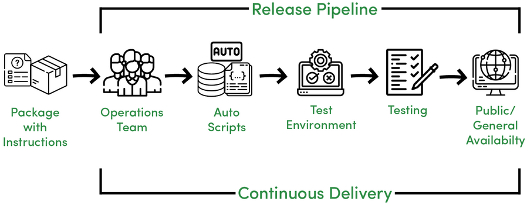

## What's the difference between CI and CD (and the other CD)?

The acronym CI/CD has a few different meanings. The "CI" in CI/CD always refers to continuous integration, which is an automation process for developers. Successful CI means new code changes to an app are regularly built, tested, and merged to a shared repository. It’s a solution to the problem of having too many branches of an app in development at once that might conflict with each other.

The "CD" in CI/CD refers to continuous delivery and/or continuous deployment, which are related concepts that sometimes get used interchangeably. Both are about automating further stages of the pipeline, but they’re sometimes used separately to illustrate just how much automation is happening.

Continuous delivery usually means a developer’s changes to an application are automatically bug tested and uploaded to a repository (like GitHub or a container registry), where they can then be deployed to a live production environment by the operations team. It’s an answer to the problem of poor visibility and communication between dev and business teams. To that end, the purpose of continuous delivery is to ensure that it takes minimal effort to deploy new code.

Continuous deployment (the other possible "CD") can refer to automatically releasing a developer’s changes from the repository to production, where it is usable by customers. It addresses the problem of overloading operations teams with manual processes that slow down app delivery. It builds on the benefits of continuous delivery by automating the next stage in the pipeline.

It’s possible for CI/CD to specify just the connected practices of continuous integration and continuous delivery, or it can also mean all 3 connected practices of continuous integration, continuous delivery, and continuous deployment. To make it more complicated, sometimes "continuous delivery" is used in a way that encompasses the processes of continuous deployment as well.

In the end, it’s probably not worth your time to get bogged down in these semantics—just remember that CI/CD is really a process, often visualized as a pipeline, that involves adding a high degree of ongoing automation and continuous monitoring to app development.

Case-by-case, what the terms refer to depends on how much automation has been built into the CI/CD pipeline. Many enterprises start by adding CI, and then work their way towards automating delivery and deployment down the road, for instance as part of cloud-native apps.

Our experts can help your organization develop the practices, tools, and culture needed to more efficiently modernize existing applications and to build new ones.

## Continuous integration

You can read it from [here](CI-surecleri.md).

## Continuous delivery

Following the automation of builds and unit and integration testing in CI, continuous delivery automates the release of that validated code to a repository. So, in order to have an effective continuous delivery process, it’s important that CI is already built into your development pipeline. The goal of continuous delivery is to have a codebase that is always ready for deployment to a production environment.

In continuous delivery, every stage—from the merger of code changes to the delivery of production-ready builds—involves test automation and code release automation. At the end of that process, the operations team is able to deploy an app to production quickly and easily.
You can also automate these deployments.

## Continuous deployment

The final stage of a mature CI/CD pipeline is continuous deployment. As an extension of continuous delivery, which automates the release of a production-ready build to a code repository, continuous deployment automates releasing an app to production. Because there is no manual gate at the stage of the pipeline before production, continuous deployment relies heavily on well-designed test automation.

In practice, continuous deployment means that a developer’s change to a cloud application could go live within minutes of writing it (assuming it passes automated testing). This makes it much easier to continuously receive and incorporate user feedback. Taken together, all of these connected CI/CD practices make deployment of an application less risky, whereby it’s easier to release changes to apps in small pieces, rather than all at once. There’s also a lot of upfront investment, though, since automated tests will need to be written to accommodate a variety of testing and release stages in the CI/CD pipeline.

## What’s the difference between continuous delivery and continuous deployment?

Continuous delivery and continuous deployment, while closely related concepts, are sometimes used separately to specify just how much automation is happening.

Continuous delivery usually means a development team’s changes to an application are automatically bug tested and uploaded to a repository (like GitHub or a container registry), where they can then be deployed to a live production environment by the operations team. It’s an answer to the problem of poor visibility and communication between dev and business teams. To that end, the purpose of continuous delivery is to ensure that it takes minimal effort to deploy new code.

Continuous deployment, on the other hand, covers some additional steps through the release process of the new software. It usually includes the process of automatically releasing a developer’s changes from the repository to production, where it is usable by customers. It addresses the problem of overloading operations teams with manual processes that slow down the app delivery process. It builds on the benefits of continuous delivery by automating the next stage in the pipeline.

## How is continuous delivery related to DevOps?

DevOps, a concept that combines the practices of “development” and “operations,” is an approach to culture, automation, and platform design intended to deliver increased business value and responsiveness through rapid, high-quality service delivery.

Continuous delivery is a specific software development practice that’s often applied in connection with DevOps. A DevOps approach is likely to involve the creation of a continuous delivery pipeline.

DevOps describes approaches to speeding up the processes by which an idea (like a new software feature, a request for enhancement, or a bug fix) goes from development to deployment in a production environment where it can provide value to the user. 

With DevOps, developers, usually coding in a standard development environment, work closely with testers and IT operations teams to speed software builds, code commits, unit tests, and releases—without sacrificing reliability.

A major outcome of implementing DevOps is a CI/CD pipeline supported by development and operations teams working together using an agile methodology. 

## GitOps: The Missing Link for CI/CD for Kubernetes

GitOps has emerged as an essential process as organizations evaluate frameworks to optimize CI/CD on Kubernetes. DevOps teams are exploring how GitOps redefines CI/CD, with Git serving as the central, immutable state declaration for faster deployments and more audit-friendly secure environments. GitOps offers teams well-documented improvements in productivity, security, and compliance, which ultimately translate into a better experience for the user.

You can read the details of GitOps from [here](GitOps.md).

## Practise for Continuous Delivery

Argo CD is a declarative, GitOps continuous delivery tool for Kubernetes. It follows the GitOps pattern of using Git repositories as the source of truth for defining the desired application state.

You can read and learn the usage of GitOps via CD tools from [here](./Argo%20CD/Ch.01%20-%20Argo%20CD%20Nedir%3F.md). This document contains both explanation and examples.
