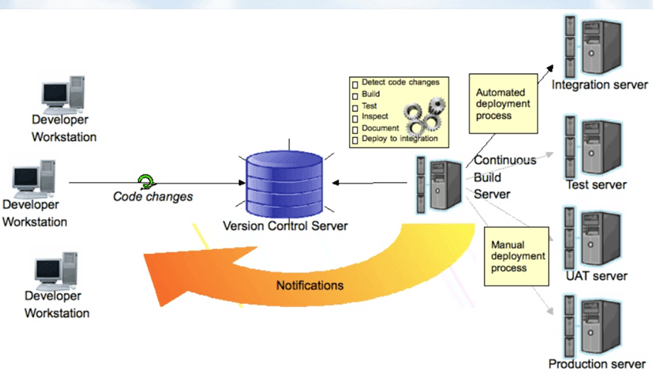

# Introduction to CI

#### Previous Chapter: [00 - Riemann Toplamı](ch00-riemann-toplami.md) | Next Chapter: [02 - Introduction to CD](ch02-introduction-to-cd.md) | Return to [Main Page](README.md)
---

In this document, you can find:

- [What is CI?](#what-is-ci)
- [Development without CI vs. Development with CI](#development-without-ci-vs-development-with-ci)
- [Difference between Compilation and Continuous Integration](#difference-between-compilation-and-continuous-integration)
- [What do you need to conduct CI process?](#what-do-you-need-to-conduct-ci-process)
- [How Continuous integration work?](#how-continuous-integration-work)
- [Features of CI](#features-of-ci)
- [Why Use CI?](#why-use-ci)
- [Best practices of using CI](#best-practices-of-using-ci)
- [Disadvantages of CI](#disadvantages-of-ci)

## What is CI?

Continuous Integration (CI) is the process of automating the build and testing of code every time a team member commits changes to version control. CI encourages developers to share their code and unit tests by merging their changes into a shared version control repository after every small task completion. Committing code triggers an automated build system to grab the latest code from the shared repository and to build, test, and validate the full main, or trunk, branch.

CI emerged as a best practice because software developers often work in isolation, and then they need to integrate their changes with the rest of the team's code base. Waiting days or weeks to integrate code creates many merge conflicts, hard to fix bugs, diverging code strategies, and duplicated efforts.  CI requires the development team's code be merged to a shared version control branch continuously to avoid these problems.

CI keeps the main branch up-to-date. Teams can leverage modern version control systems such as Git to create short-lived feature branches to isolate their work. A developer submits a pull request when the feature is complete and, on approval of the pull request, the changes get merged into the main branch.  Then the developer can delete the previous feature branch. Development teams repeat the process for additional work. The team can establish branch policies to ensure the main branch meets desired quality criteria.

Teams use build definitions to ensure that every commit to the main branch triggers the automated build and testing processes. Implementing CI this way ensures bugs are caught earlier in the development cycle, which makes them less expensive to fix. Automated tests run for every build to ensure builds maintain a consistent quality.

CI is a standard feature in modern DevOps platforms. GitHub users can start implementing CI today through GitHub Actions. Azure DevOps users can get started with Azure Pipelines.

In CI after a code commit, the software is built and tested immediately. In a large project with many developers, commits are made many times during a day. With each commit code is built and tested. If the test is passed, build is tested for deployment. If the deployment is a success, the code is pushed to Production. This commit, build, test, and deploy is a continuous process, and hence the name continuous integration/deployment.

## Development without CI vs. Development with CI

Here are key differences between development using CI or without CI.

| Development without CI         | Development with CI |
|--------------------------------|---------------------|
| Lots of Bugs                   | Fewer bugs |
| Infrequent commits             | Regular commits |
| Infrequent and slow releases   | Regular working releases |
| Difficult integration          | Easy and Effective Integration |
| Testing happens late           | CI testing happens early and often. |
| Issue raised are harder to fix | Find and fix problems faster and more efficiently. |
| Poor project visibility        | Better project visibility |

## Difference between Compilation and Continuous Integration

***Activities in CI***

While compilation only compiles a code, CI does the following activities:

### DB integration

- Ensure DB and code in sync
- Automated creation of DB and test data.

### Code Inspection

- Ensures a healthy codebase
- Identifies problems early and applies best practices

### Automated Deployment

- Allows you to release product anytime
- Continually demo-able state and it works on any machine

### Document generation

- Ensure documentation is current
- Removes burned from the developer
- Produces build reports and metrics

### Compilation

Compilation is the process the computer takes to convert a high-level programming language code into a machine language that the computer able to understand. It ensures a code compiler on every target platform.

### When do I build?

- At every check-in
- Every time a dependency changes

### How do I build?

***CI process***

- Ideally, the build should come from the command line and should not depend on IDE.
- The build should happen continuously using a dedicated Cl server, not a cron job.
- CI built should be triggered on every check-in and not just at midnight
- The build should provide immediate feedback and Require no developer effort
- Identify key metrics and track them visually. More importantly, act on them immediately

## What do you need to conduct CI process?

***CI process***

Here, are the key elements which you need to perfom the entire CI process:

- **Version Control System (VCS):** It offers a reliable method to centralize and preserve changes made to your project over time.
- **Virtual Machine:** You should have a spare server or at least one virtual machine to build your system.
- **Hosted CI Tool Solutions:** To avoid servers or virtual machines, you should go for hosted CI tool solutions. This tool helps in the maintenance of the whole process and offers easier scalability.
- **CI Tools:** If you select a self-hosted variant, you will need to install one of the many CI tools like Jenkins, TeamCity, Bamboo, GitLab, etc.

## How CI work?

***Example of CI***

You are surely aware of the old phone Nokia. Nokia used to implement a procedure called nightly build. After multiple commits from diverse developers during the day, the software built every night. Since the software was built only once in a day, it's a huge pain to isolate, identify, and fix the errors in a large codebase.

Later, they adopted the CI approach. The software was built and tested as soon as a developer committed code. If any error is detected, the respective developer can quickly fix the defect.

## Features of CI

Here, are important features and benefits of CI:

- Allows you to maintain just a single source repository
- You can test the clone of the production CI environment
- The built environment should be close to the production environment.
- One of the advantages of CI is constant availability of a current build
- The complete process of build and testing and deployment should be visible to all the stack holders.

## Why Use CI

Here are important reasons for using CI:

- Helps you to build better quality software
- CI process helps to scale up headcount and delivery output of engineering teams.
- CI allows software developers to work independently on features in parallel.
- Helps you to conduct repeatable testing
- Increase visibility enabling greater communication
- Helps develop a potentially shippable product for fully automated build
- Helps you to reduced risks by making deployment faster and more predictable
- Immediate feedback when issue arrives
- Avoid last-minute confusion at release date and timing

## Best practices of using CI

Here, are some important best practices while implementing

- Commit Early and Commit Often never Commit Broken Code
- Fix build failures immediately
- Act on metrics
- Build-in every target environment Create artifacts from every build
- The build of the software need to be carried out in a manner so that it can be automated
- Do not depend on an IDE
- Build and test everything when it changes
- The database schema counts as everything
- Helps you to find out key metrics and track them visually
- Check-in often and early
- Stronger source code control
- CI is running unit tests whenever you commit code
- Automate the build and test everyone
- Keep the build fast with automated deployment

## Disadvantages of CI

Here, are cons/drawbacks of CI process:

- Initial setup time and training is required to get acquainted with CI server
- Development of suitable test procedures is essential
- Well-developed test-suite required many resources for CI server
- Conversion of familiar processes
- Requires additional servers and environments
- Waiting times may occur when multiple developers want to integrate their code around the same time

## Summary

- Continuous Integration definition: CI is a software development method where members of the team can integrate their work at least once a day
- CI/CD meaning combination of CI and Continuous Delivery or Continuous Deployment.
- Development without CI creates lots of bugs whereas Development with CI offers Fewer bugs
- Important activities of Continous Integration are:

  1. DB integration
  2. Code Inspection
  3. Automated Deployment, Document generation, and Compilation.

- The build should happen continuously using a dedicated Cl server, not a cron job.
- Important elements of CI are 1) Version Control System 2) Virtual Machine 3) Host CI Tool
- solutions 4) Tools
- CI system allows you to maintain just a single source repository
- CI/CD process helps you to build better quality software
- The most important best practices of Azure CI process is to Commit Early
- and Commit Often never Commit Broken Code
- The major drawback of the CICD pipeline process is that well-developed test-suite required
- many resources for Cl server
- Jenkins, Bambook, and Team City are some useful AWS CI tools.

---
#### Previous Chapter: [00 - Riemann Toplamı](ch00-riemann-toplami.md) | Next Chapter: [02 - Introduction to CD](ch02-introduction-to-cd.md) | Return to [Main Page](README.md)
---
