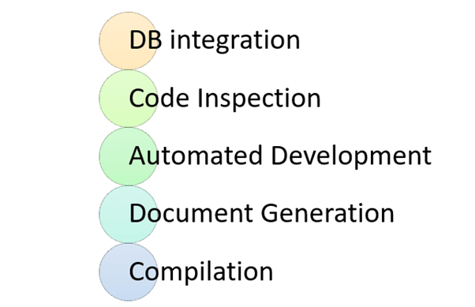

# CI - Continuous Integration

## What is CI?

Continuous Integration (CI) is the process of automating the build and testing of code every time a team member commits changes to version control. CI encourages developers to share their code and unit tests by merging their changes into a shared version control repository after every small task completion. Committing code triggers an automated build system to grab the latest code from the shared repository and to build, test, and validate the full main, or trunk, branch.

CI emerged as a best practice because software developers often work in isolation, and then they need to integrate their changes with the rest of the team's code base. Waiting days or weeks to integrate code creates many merge conflicts, hard to fix bugs, diverging code strategies, and duplicated efforts.  CI requires the development team's code be merged to a shared version control branch continuously to avoid these problems.

CI keeps the main branch up-to-date. Teams can leverage modern version control systems such as Git to create short-lived feature branches to isolate their work. A developer submits a pull request when the feature is complete and, on approval of the pull request, the changes get merged into the main branch.  Then the developer can delete the previous feature branch. Development teams repeat the process for additional work. The team can establish branch policies to ensure the main branch meets desired quality criteria.

Teams use build definitions to ensure that every commit to the main branch triggers the automated build and testing processes. Implementing CI this way ensures bugs are caught earlier in the development cycle, which makes them less expensive to fix. Automated tests run for every build to ensure builds maintain a consistent quality.

CI is a standard feature in modern DevOps platforms. GitHub users can start implementing CI today through GitHub Actions. Azure DevOps users can get started with Azure Pipelines.

### Another answer for "What is Continuous Integration?"

#### **"Continuous Integration is a software development method where team members integrate their work at least once a day. In this method, every integration is checked by an automated build to detect errors. This concept was first introduced over two decades ago to avoid "integration hell," which happens when integration is put off till the end of a project."**

In Continuous Integration after a code commit, the software is built and tested immediately. In a large project with many developers, commits are made many times during a day. With each commit code is built and tested. If the test is passed, build is tested for deployment. If the deployment is a success, the code is pushed to Production. This commit, build, test, and deploy is a continuous process, and hence the name continuous integration/deployment.

In this CI tutorial, you will learn:

- [Development without CI vs. Development with CI](#development-without-ci-vs-development-with-ci)
- [Difference between Compilation and Continuous Integration](#difference-between-compilation-and-continuous-integration)
- [What do you need to conduct CI process?](#what-do-you-need-to-conduct-ci-process)
- [How Continuous integration work?](#how-continuous-integration-work)
- [Features of CI](#features-of-ci)
- [Why Use CI?](#why-use-ci)
- [Best practices of using CI](#best-practices-of-using-ci)
- [Disadvantages of CI](#disadvantages-of-ci)
- [Tools for CI process](#tools-for-ci-process)

## Development without CI vs. Development with CI

Here are key differences between development using CI or without CI.

| Development without CI         | Development with CI |
|--------------------------------|---------------------|
| Lots of Bugs                   | Fewer bugs |
| Infrequent commits             | Regular commits |
| Infrequent and slow releases   | Regular working releases |
| Difficult integration          | Easy and Effective Integration |
| Testing happens late           | Continuous Integration testing happens early and often. |
| Issue raised are harder to fix | Find and fix problems faster and more efficiently. |
| Poor project visibility        | Better project visibility |

## Difference between Compilation and Continuous Integration

<h4 align="center">Activities in Continuous Integration</h4>

While compilation only compiles a code, CI does the following activities:

### DB integration

- Ensure DB and code in sync
- Automated creation of DB and test data.

### Code Inspection

- Ensures a healthy codebase
- Identifies problems early and applies best practices

### Automated Deployment

- Allows you to release product anytime
- Continually demo-able state and it is works on any machine

### Document generation

- Ensure documentation is current
- Removes burned from the developer
- Produces build reports and metrics

### Compilation

Compilation is the process the computer takes to convert a high-level programming language code into a machine language that the computer able to understand. It ensures a code compiler on every target platform.

### When do I build?

- At every check-in
- Every time a dependency changes

### How do I build?

<h4 align="center">CI process</h4>

- Ideally, the build should come from the command line and should not depend on IDE.
- The build should happen continuously using a dedicated Cl server, not a cron job.
- CI built should be triggered on every check-in and not just at midnight
- The build should provide immediate feedback and Require no developer effort•
- Identify key metrics and track them visually. More importantly, act on them immediately

## What do you need to conduct CI process?

Here, are the key elements which you need to perfom the entire CI process:

- **Version Control System (VCS):** It offers a reliable method to centralize and preserve changes made to your project over time.
- **Virtual Machine:** You should have a spare server or at least one virtual machine to build your system.
- **Hosted CI Tool Solutions:** To avoid servers or virtual machines, you should go for hosted CI tool solutions. This tool helps in the maintenance of the whole process and offers easier scalability.
- **Tools:** If you select a self-hosted variant, you will need to install one of the many CI tools like Jenkins, TeamCity, Bamboo, GitLab, etc.

## How Continuous integration work?

<h4 align="center">Example of Continuous Integration</h4>

You are surely aware of the old phone Nokia. Nokia used to implement a procedure called nightly build. After multiple commits from diverse developers during the day, the software built every night. Since the software was built only once in a day, it's a huge pain to isolate, identify, and fix the errors in a large codebase.

Later, they adopted the Continuous Integration approach. The software was built and tested as soon as a developer committed code. If any error is detected, the respective developer can quickly fix the defect.

## Features of CI

Here, are important features and benefits of Continuous Integration:

- Allows you to maintain just a single source repository
- You can test the clone of the production CI environment
- The built environment should be close to the production environment.
- One of the advantages of continuous integration is Constant availability of a current build
- The complete process of build and testing and deployment should be visible to all the stack holders.

## Why Use CI

Here are important reasons for using Continuous Integration:

- Helps you to build better quality software
- CI process helps to scale up headcount and delivery output of engineering teams.
- CI allows software developers to work independently on features in parallel.
- Helps you to conduct repeatable testing
- Increase visibility enabling greater communication
- Helps develop a potentially shippable product for fully automated build
- Helps you to reduced risks by making deployment faster and more predictable
- Immediate feedback when issue arrives
- Avoid last-minute confusion at release date and timing

## Best practices of using CI

- Here, are some important best practices while implementing
- Commit Early and Commit Often never Commit Broken Code
- Fix build failures immediately
- Act on metrics
- Build-in every target environment Create artifacts from every build
- The build of the software need to be carried out in a manner so that it can be automated
- Do not depend on an IDE
- Build and test everything when it changes
- The database schema counts as everything
- Helps you to find out key metrics and track them visually
- Check-in often and early
- Stronger source code control
- Continuous integration is running unit tests whenever you commit code
- Automate the build and test everyone
- Keep the build fast with automated deployment

## Disadvantages of CI

Here, are cons/drawbacks of Continuous Integration process:

- Initial setup time and training is required to get acquainted with Cl server
- Development of suitable test procedures is essential
- Well-developed test-suite required many resources for Cl server
- Conversion of familiar processes
- Requires additional servers and environments
- Waiting times may occur when multiple developers want to integrate their code around the same time

## Summary

- Continuous Integration definition: Continuous integration is a software development method where members of the team can integrate their work at least once a day
- CI/CD meaning combination of Continuous Integration and Continuous Delivery or Continuous Deployment.
- Development without CI creates lots of bugs whereas Development with CI offers Fewer bugs
- Important activities of Continous Integration are

1. DB integration
2. Code Inspection, 3) Automated Deployment, Document generation, and Compilation.

- The build should happen continuously using a dedicated Cl server, not a cron job.
- Important elements of CI are 1) Version Control System 2) Virtual Machine 3) Host CI Tool
- solutions 4) Tools
- Continuous Integration system allows you to maintain just a single source repository
- CI/CD process helps you to build better quality software
- The most important best practices of Azure Continuous Integration process is to Commit Early
- and Commit Often never Commit Broken Code
- The major drawback of the CICD pipeline process is that well-developed test-suite required
- many resources for Cl server
- Jenkins, Bambook, and Team City are some useful AWS Continuous Integration tools.

## What is CD?

The "CD" refers to continuous delivery and/or continuous deployment, which are related concepts that sometimes get used interchangeably. Both are about automating further stages of the pipeline, but they’re sometimes used separately to illustrate just how much automation is happening.

Continuous delivery usually means a developer’s changes to an application are automatically bug tested and uploaded to a repository (like GitHub or a container registry), where they can then be deployed to a live production environment by the operations team. It’s an answer to the problem of poor visibility and communication between dev and business teams. To that end, the purpose of continuous delivery is to ensure that it takes minimal effort to deploy new code.

Continuous deployment (the other possible "CD") can refer to automatically releasing a developer’s changes from the repository to production, where it is usable by customers. It addresses the problem of overloading operations teams with manual processes that slow down app delivery. It builds on the benefits of continuous delivery by automating the next stage in the pipeline.

It’s possible for CI/CD to specify just the connected practices of continuous integration and continuous delivery, or it can also mean all 3 connected practices of continuous integration, continuous delivery, and continuous deployment. To make it more complicated, sometimes "continuous delivery" is used in a way that encompasses the processes of continuous deployment as well.

In the end, it’s probably not worth your time to get bogged down in these semantics—just remember that CI/CD is really a process, often visualized as a pipeline, that involves adding a high degree of ongoing automation and continuous monitoring to app development.

Case-by-case, what the terms refer to depends on how much automation has been built into the CI/CD pipeline. Many enterprises start by adding CI, and then work their way towards automating delivery and deployment down the road, for instance as part of cloud-native apps.

Our experts can help your organization develop the practices, tools, and culture needed to more efficiently modernize existing applications and to build new ones.

## Continuous delivery

Following the automation of builds and unit and integration testing in CI, continuous delivery automates the release of that validated code to a repository. So, in order to have an effective continuous delivery process, it’s important that CI is already built into your development pipeline. The goal of continuous delivery is to have a codebase that is always ready for deployment to a production environment.

In continuous delivery, every stage—from the merger of code changes to the delivery of production-ready builds—involves test automation and code release automation. At the end of that process, the operations team is able to deploy an app to production quickly and easily.
You can also automate these deployments.

## Continuous deployment

The final stage of a mature CI/CD pipeline is continuous deployment. As an extension of continuous delivery, which automates the release of a production-ready build to a code repository, continuous deployment automates releasing an app to production. Because there is no manual gate at the stage of the pipeline before production, continuous deployment relies heavily on well-designed test automation.

In practice, continuous deployment means that a developer’s change to a cloud application could go live within minutes of writing it (assuming it passes automated testing). This makes it much easier to continuously receive and incorporate user feedback. Taken together, all of these connected CI/CD practices make deployment of an application less risky, whereby it’s easier to release changes to apps in small pieces, rather than all at once. There’s also a lot of upfront investment, though, since automated tests will need to be written to accommodate a variety of testing and release stages in the CI/CD pipeline.

## What’s the difference between continuous delivery and continuous deployment?

Continuous delivery and continuous deployment, while closely related concepts, are sometimes used separately to specify just how much automation is happening.

Continuous delivery usually means a development team’s changes to an application are automatically bug tested and uploaded to a repository (like GitHub or a container registry), where they can then be deployed to a live production environment by the operations team. It’s an answer to the problem of poor visibility and communication between dev and business teams. To that end, the purpose of continuous delivery is to ensure that it takes minimal effort to deploy new code.

Continuous deployment, on the other hand, covers some additional steps through the release process of the new software. It usually includes the process of automatically releasing a developer’s changes from the repository to production, where it is usable by customers. It addresses the problem of overloading operations teams with manual processes that slow down the app delivery process. It builds on the benefits of continuous delivery by automating the next stage in the pipeline.

## How is continuous delivery related to DevOps?

DevOps, a concept that combines the practices of “development” and “operations,” is an approach to culture, automation, and platform design intended to deliver increased business value and responsiveness through rapid, high-quality service delivery.

Continuous delivery is a specific software development practice that’s often applied in connection with DevOps. A DevOps approach is likely to involve the creation of a continuous delivery pipeline.

DevOps describes approaches to speeding up the processes by which an idea (like a new software feature, a request for enhancement, or a bug fix) goes from development to deployment in a production environment where it can provide value to the user.

With DevOps, developers, usually coding in a standard development environment, work closely with testers and IT operations teams to speed software builds, code commits, unit tests, and releases—without sacrificing reliability.

A major outcome of implementing DevOps is a CI/CD pipeline supported by development and operations teams working together using an agile methodology.

## GitOps: The Missing Link for CI/CD for Kubernetes

GitOps has emerged as an essential process as organizations evaluate frameworks to optimize CI/CD on Kubernetes. DevOps teams are exploring how GitOps redefines CI/CD, with Git serving as the central, immutable state declaration for faster deployments and more audit-friendly secure environments. GitOps offers teams well-documented improvements in productivity, security, and compliance, which ultimately translate into a better experience for the user.

You can read the details of GitOps from [here](ch08-gitops.md).

## Practise for Continuous Delivery

Argo CD is a declarative, GitOps continuous delivery tool for Kubernetes. It follows the GitOps pattern of using Git repositories as the source of truth for defining the desired application state.

You can read and learn the usage of GitOps via CD tools from [here](ch09-argocd-introduction.md). This document contains both explanation and examples.
