# Building CI Pipeline In Azure DevOps

#### Previous Chapter: [04 - CI/CD Pipeline](ch04-ci-cd-pipeline.md) | Next Chapter: [06 - Converting Classic Pipelines to YAMLs](ch06-converting-classic-pipelines-to-yamls.md) | Return to [Main Page](README.md)
---

In this document, you can find:

- [What is Azure DevOps?](#what-is-azure-devops)
- [What is Azure Pipelines?](#what-is-azure-pipelines)
- [Advantages of Azure Pipelines](#advantages-of-azure-pipelines)
- [How to Build Azure CI Pipeline?](#how-to-build-azure-ci-cd-pipeline)
- [Why Pipeline as Code?](#why-pipeline-as-code)
- [Can We Still Use Classic Editor?](#can-we-still-use-classic-editor)

## What is Azure DevOps?

Azure DevOps is a collection of services given by Microsoft Azure. It provides development services for a team to support, plan, collaborate, build, and deploy applications. It provides integrated features in a browser or an IDE(Integrated Development Environment). 

Some of the services for developers are:

- Azure Repos
- Azure Pipelines
- Azure Boards
- Azure Test Plans
- Azure Artifacts

Azure DevOps is also one of the leading tools that automate CI/CD’s process and, in turn, supports automatic builds and code projects to make them available to others. The Azure pipelines combine Continuous Integration (CI) and Continuous Delivery (CD) to consistently test and build the code and ship it to the target environment.

## What is Azure Pipelines?

The Azure CI/CD pipeline simplifies continuous integration and continuous delivery (CI/CD) in the application development process. You can start from the source stage with existing code on GitHub or on-premise containers. The Azure Repos can maintain a central repository, and the Azure pipelines maintain build and release pipelines for the given project. The Azure DevOps CI/CD process is a crucial process with all the required dev services.

Apart from continuous integration and continuous deployment with Azure DevOps, these pipelines are used to construct build-deploy-test workflows used mainly in continuous testing (CT). This tests the changes in a fast and scalable routine.

Just a reminder about stages of a CI/CD pipeline:

  1. **Source Stage** – In most cases, when a change is attempted to the central repository, a pipeline run is triggered. These triggers are set by the CI/CD pipeline tool in the source stage.
  2. **Build Stage** – The combination of source code and its dependencies when building into a runnable instance corporate to the end-user application. The built-in application languages like Java need compilation too, which is done in the build stage. If docker images are to be constructed, that can also be facilitated in this stage. Failing this stage marks a potential error in the code or its dependencies.
  3. **Test Stage** – This stage corresponds to automated tests running to validate our code and its behavior accordingly. This stage acts as a sieve that prevents the bugs from reaching the end-user. There can be multiple stages, from smoke tests to end-to-end integration tests. Failure at this stage will expose errors in the code.
  4. **Deploy Stage** – Once we have a runnable code, the deployment is processed with all predefined tests passed. There are a lot of stages like “Beta,” “Staging,” etc., for the product team. A “Production” stage for the end-users is also present.

Remember, the stages mentioned above are the basic stages, and different steps can be added to make the CI/CD process more automated. To bring a new life to these stages, we have Azure DevOps CI/CD.

## Advantages of Azure Pipelines

The Azure Pipelines can be multifactored, and in the Azure DevOps CI/CD practice, they provide various advantages:

  1. **Version Control Systems** – Having the code into a version control system is the first step of building an Azure CI/CD pipeline. You can manage your source code in GitHub, Bitbucket, Subversion, or any other Git repository. It also supports Team Foundation Version Control (TFVC).
  
  2. **Programming Languages and Application Types** – You can use different languages with Azure pipelines like Java, Ruby, C, C++, Python, PHP, Go, and JavaScript.
  
  3. **Deployment Targets** – The applications with Azure CI/CD pipelines can be deployed to multiple target environments. This includes Virtual Machines, Containers, or any On-prem or Cloud Platform.

## How to Build Azure CI Pipeline?

This is a step-by-step guide to using Azure Pipelines to build a sample application. This guide uses YAML pipelines configured with the [YAML pipeline editor](https://docs.microsoft.com/en-us/azure/devops/pipelines/get-started/yaml-pipeline-editor?view=azure-devops). If you'd like to use Classic pipelines instead, see [Define your Classic pipeline](https://docs.microsoft.com/en-us/azure/devops/pipelines/release/define-multistage-release-process?view=azure-devops).

### Create the first Java pipeline

1. Open your project's collection on Azure DevOps.

2. Click on the **Pipelines** button which is under the Pipelines in the left panel.

    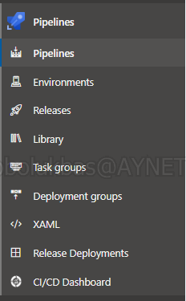

3. If it is the first time to create a pipeline, **"Create your First Pipeline"** screen will come to screen. Click the **"Create Pipeline"** button under this screen.

    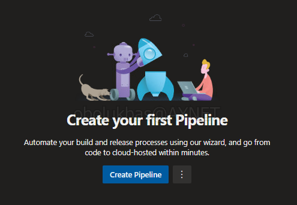

4. New versions of pipelines comes with yaml configuration as default instead of classic pipeline. One yaml file is enough to define the pipeline now.

    *In this document, we also use **Pipeline as Code** approach. Under the [Why "Pipeline as Code?"](#why-pipeline-as-code) section, you can see the details and benefits of this approach*

5. Choose "Azure Repos Git" from "Where is your code?" screen.

    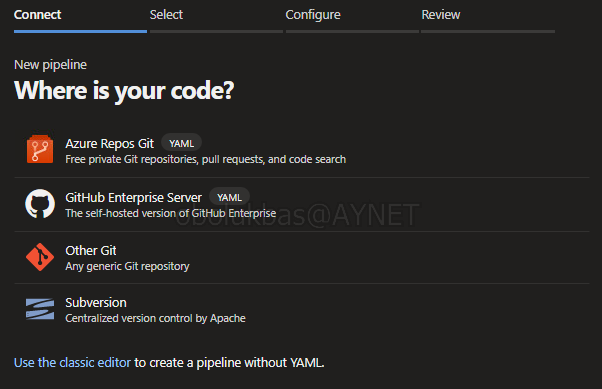

    *You can also continue with classic editor by clicking the "Use the classic editor" in the left-bottom corner but this method is old, not recommended and used in this document.*

6. Choose the repo you want to work and define pipeline on it.

    

7. Choose "Maven" under the "Configure your pipeline" screen. You can also continue with other topics.

8. Now we can see a **template** of **"azure-pipelines.yml"** file which contains our pipeline configurations. The automatically generated file contains this important subtopics:

- **trigger**: This is the place where we define the trigger of the pipeline. It comes "main" as default. It means when a commit comes to "main" branch, the pipelines will be triggered. We can change and use it as "develop", "master", etc.

- **pool**: This is the place where we define the Azure DevOps agent pool. It comes with "default" as default.

- **steps**: This is the place where we define the tasks which will be run in order.

    Here you can see the "azure-pipelines.yml" file below

    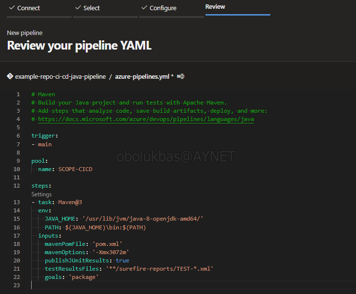

    **If we do not change the pool name which the collection can reach, the pipeline cannot be worked.**

    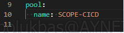

8. After changing the required fields, adding desired commands or steps, click on **"Save and run"** button. A new screen will appear, ask whether to commit directly to the main branch or create a new branch for azure-pipelines.yml file, you can choose which you want.

    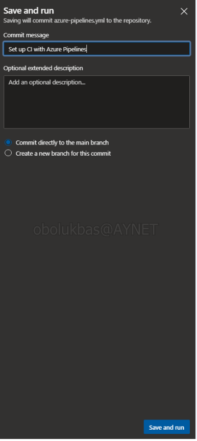

9. Now we can see pipeline job which is in the queue and waiting to be executed by agent from specified agent pool.

    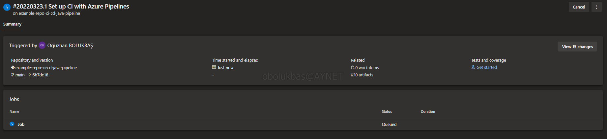

    If you encounter a screen about permissions which is like below, you can solve it with giving required permissions.

    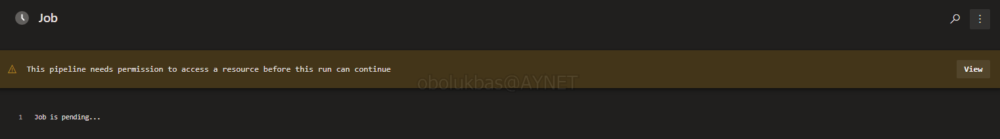
    
    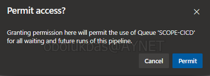

10. After giving permissions, the pipeline steps will be executed in order  and we can see details of each step by only click on them.

    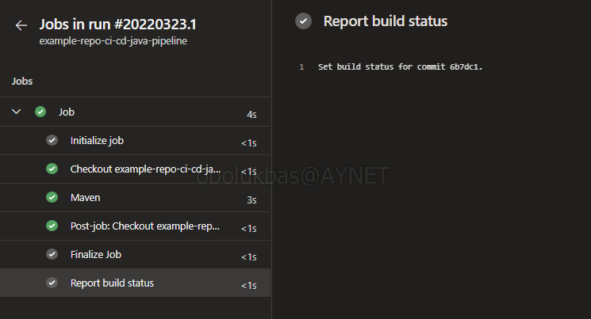

11. We add a new line to the "Demo.java" file and commit again to test our pipeline, which we have set to trigger when the main branch commits comes.

    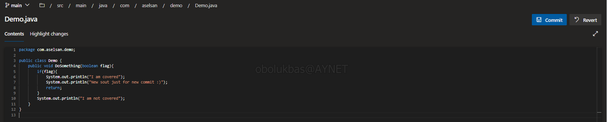
    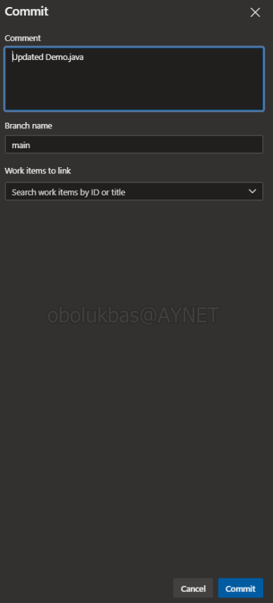

12. By clicking the "Pipelines" button on the left menu, which we used to create the pipeline before, we see our compiled pipeline. This shows us that our pipeline is triggered automatically with the commit came to the main branch. *(The blue icon will turn green when the compilation process is complete.)*

    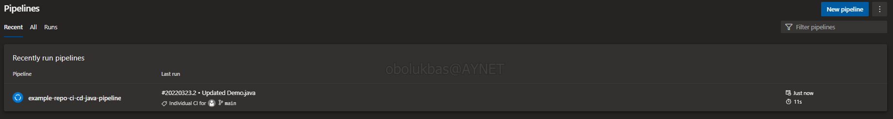
    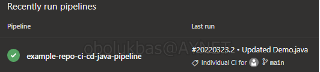

13. When we click on our pipeline that turns into a "tick" icon, we see the previous times that this pipeline was running. There is information about the previous "Runs", how long ago it worked, how long it took to run, whether it ended with an error or successfully:

    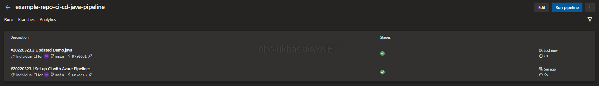

    When a run is entered, more detailed information is given.

    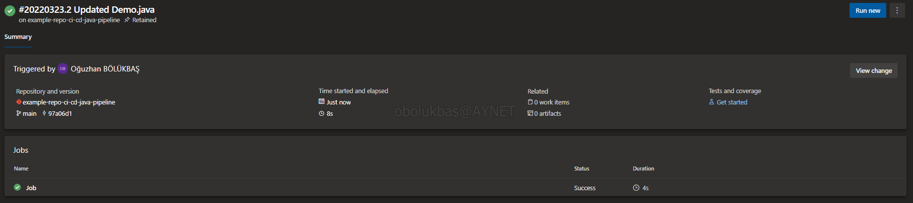

    When we click on "Job" under the "Jobs" heading at the bottom of this new window, the steps of that pipeline that has been run appear and can be examined in detail by clicking on them.

    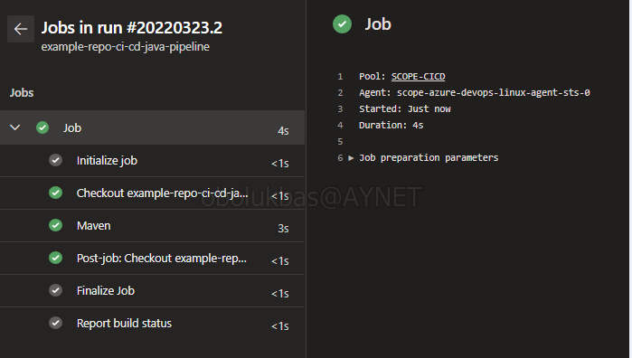

**SUMMARY:** In this example, we have created a build pipeline configured with the "azure-pipelines" file in YAML format for the "example-repo-ci-cd-java-pipeline" repository, which is compiled by agents in the SCOPE-CICD repository and automatically triggered every time a commit comes to the main branch.

## Why Pipeline as Code?

The biggest difference of the **"Pipeline as Code"** approach from the classical pipeline generation system is that this approach will allow us to version the pipelines as well.

Since there is a file in the "azure-pipelines.yml" located in the root ('/') folder of the repo, it is versioned and kept under the Git structure, and the improvements, additions and removals are kept.

In other words, we can see the codes and versions of two years ago, as well as the pipeline versions of those codes. **Code and pipelines will be matched**, *"We need to create the artifact of this time"* When it is said, it will be possible to use the pipeline file created and run for that version of the codes and create the same artifact again.

*NOTE: In the ongoing processes in the software development world, developers also write the pipeline of the code they have developed, developers manage the CI processes, and maintain the pipeline structure with their codes.*

## Can We Still Use Classic Editor?

Azure DevOps platform offers us two kinds of pipeline creation options; classic editor and yaml.
Although the Azure DevOps platform directs us to create a pipeline with yaml by default when we want to create a new pipeline, the classic pipeline structure can be installed with the "Use the classic editor" button, which is also indicated in the image below.

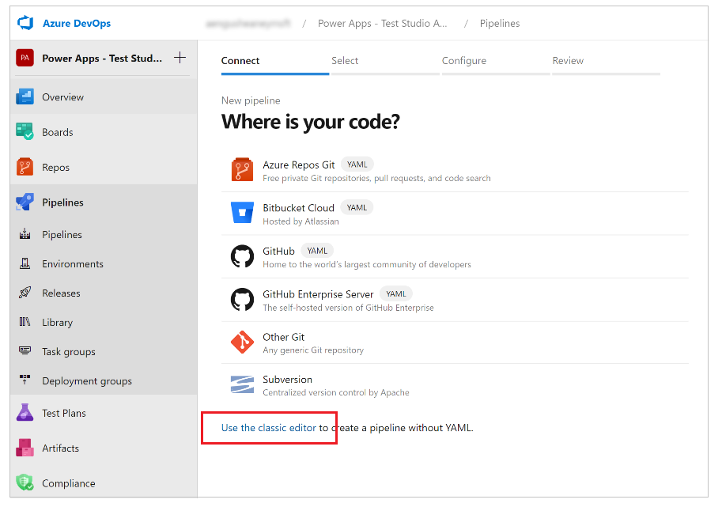

As you can continue with the template, you can also continue with the "Empty job" and the desired more specific tasks can be selected and ordered to create a pipeline.

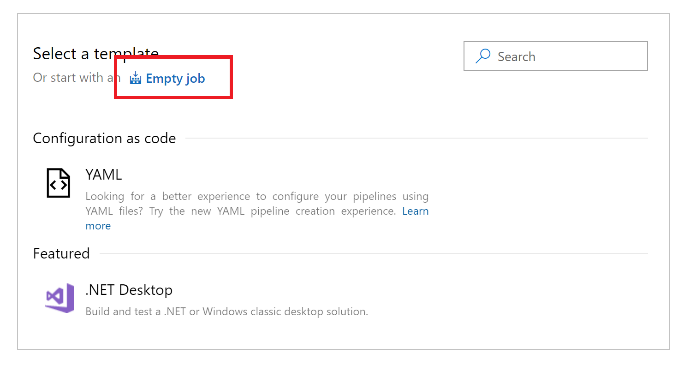

As seen in the image below, a new slot can be opened to the agent with the "+" button, and a pipeline can be created by adding the appropriate tasks through the search window.

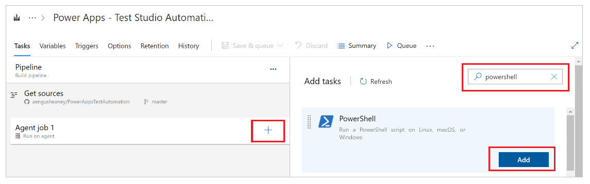

---
#### Previous Chapter: [04 - CI/CD Pipeline](ch04-ci-cd-pipeline.md) | Next Chapter: [06 - Converting Classic Pipelines to YAMLs](ch06-converting-classic-pipelines-to-yamls.md) | Return to [Main Page](README.md)
---
