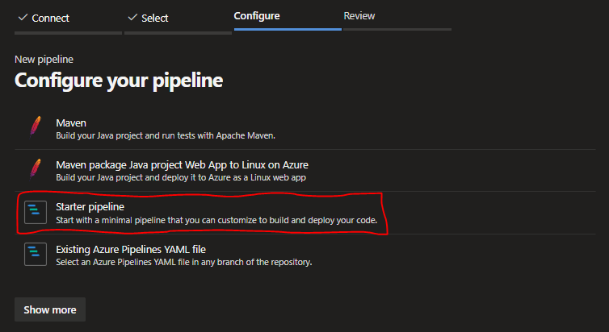
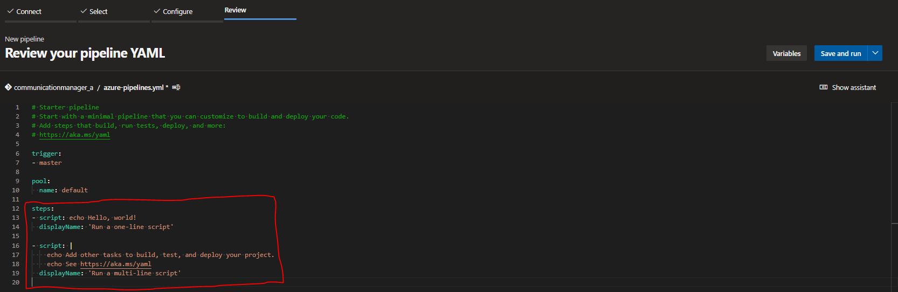
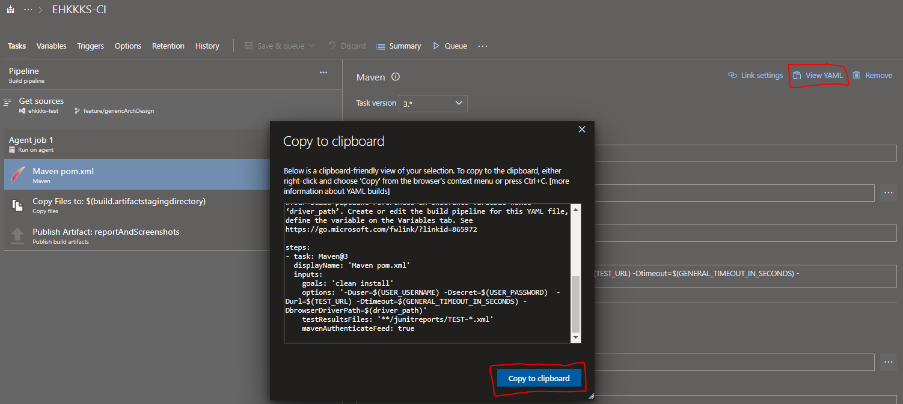
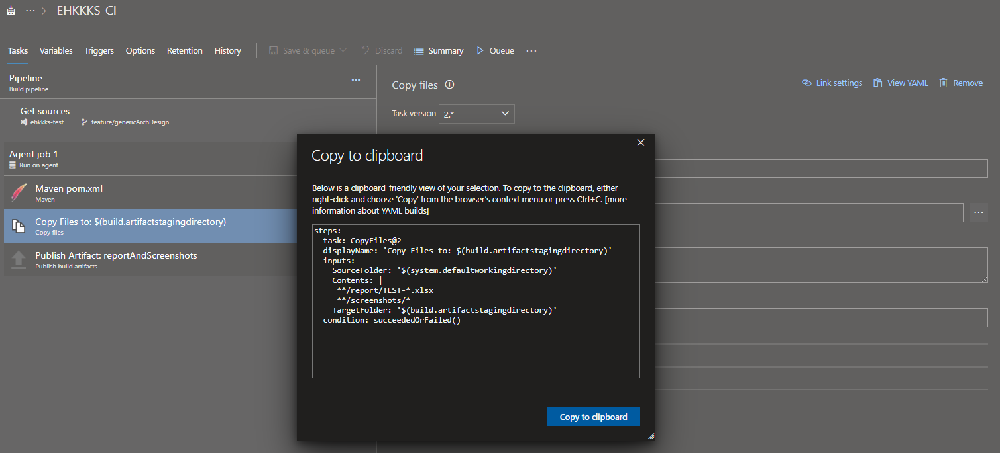
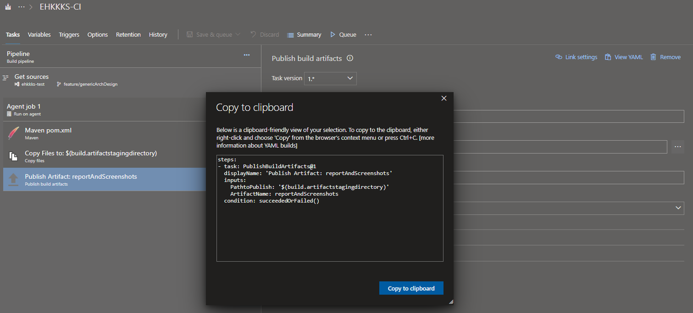
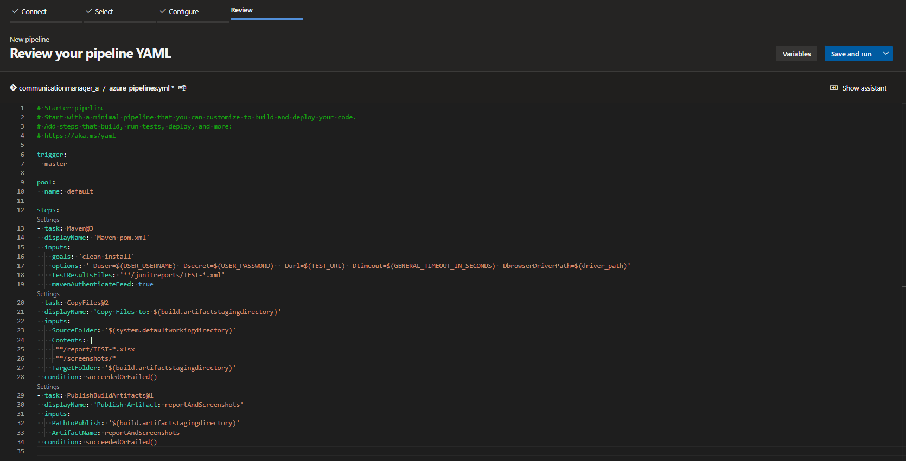
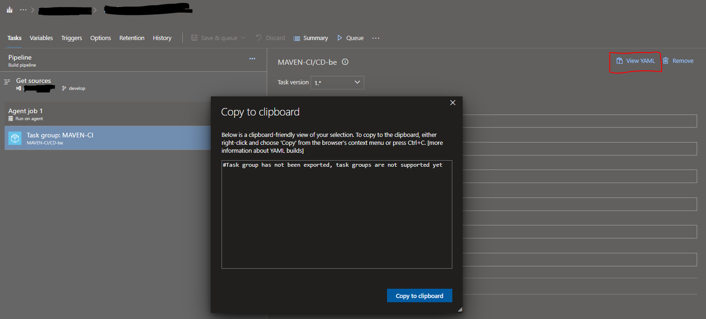

# Converting Classic Pipelines to YAMLs

#### Previous Chapter: [05 - Building CI Pipeline In Azure DevOps](ch05-building-ci-pipeline-in-azure-devops.md) | Next Chapter: [07 - CI Tools](ch07-ci-tools.md) | Return to [Main Page](README.md)
---

## How can we convert the classic pipelines to yaml pipelines?

As we mentioned before, using yaml files to develop our pipelines gives us huge benefits (skipped because explained before). So, how can we convert our traditional, classic pipelines to yaml? Let's see:

1. Go to your project, click "Pipelines" button from the left menu, click "New pipeline", then choose "Azure Repos Git", choose the repo which you wanted to convert pipelining method, then you will see the "Configure your pipeline" topic, choose "Starter pipeline".

    

2. You will see "azure-pipelines.yml" template which includes "trigger", "pool" and "steps" parts. Trigger is "Which branch you choose to trigger the pipeline when a new commit comes?". Pool is "What is the Azure DevOps agent pool name?". Steps is where we define our pipeline steps.

    

3. Open a new tab on the browser and go to your old, classic pipeline. Click on it and click the "Edit" on the top-right of the screen.

4. Now you can see steps of the pipeline. Click the first step from the left panel then click the "View YAML" button on the top-right. Now a new window "Copy to clipboard" comes to screen which contains yaml type of the step of the pipeline. Copy it.

    

5. Open the yaml file which we generated before and still open in the previous tab of the browser. Delete the lines after "steps" subtopic and paste it below.

    Do it for every step of the pipeline.

    

    

6. Now you have a "azure-pipelines.yml" file which contains all the information of the previous, classic type pipeline. Save it and run it.

    

7. Go to your classic pipeline and delete it or pause it to avoid running two pipelines. In fact, if you edit and change the pipeline yaml file, old pipeline will still remains the same and it will cuase the problem. I think deleting the old pipeline is the best right after becoming sure about the yaml pipeline.

    **Warning:** "View YAML" option is not supported yet for task groups. You need to copy the step to a classic pipeline, then click the "View YAML" button.

    

---
#### Previous Chapter: [05 - Building CI Pipeline In Azure DevOps](ch05-building-ci-pipeline-in-azure-devops.md) | Next Chapter: [07 - CI Tools](ch07-ci-tools.md) | Return to [Main Page](README.md)
---
