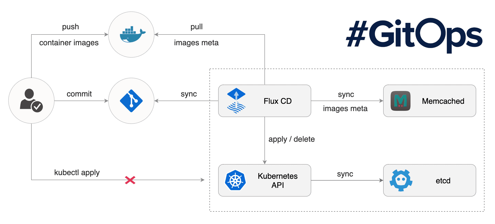

# Tools for the CD processes are

## 1 - Argo CD

[GitHub Homepage](https://argoproj.github.io/cd/) | [Alternative Homepage](https://argo-cd.readthedocs.io/en/stable/)

Argo CD is a declarative, GitOps continuous delivery tool for Kubernetes. It follows the GitOps pattern of using Git repositories as the source of truth for defining the desired application state.

**Giving info about Argo CD in here is curtailed. Detailed documentation, setup instractions and examples can be found [here](Argo-CD.md).**

## 2 - Flux CD

[Homepage](https://fluxcd.io/) | [Flux Documentation](https://fluxcd.io/docs/) | [Use Cases](https://fluxcd.io/docs/use-cases/) | [Installation](https://fluxcd.io/docs/installation/) | [GitHub](https://github.com/fluxcd/flux)

Flux is a set of continuous and progressive delivery solutions for Kubernetes that are open and extensible.

The latest version of Flux brings many new features, making it more flexible and versatile.

Flux is a CNCF Incubating project.

### Flux in short

## 🤝

Flux provides GitOps for both apps and infrastructure
Flux and Flagger deploy apps with canaries, feature flags, and A/B rollouts. Flux can also manage any Kubernetes resource. Infrastructure and workload dependency management is built in.

## 🤖

Just push to Git and Flux does the rest
Flux enables application deployment (CD) and (with the help of Flagger) progressive delivery (PD) through automatic reconciliation. Flux can even push back to Git for you with automated container image updates to Git (image scanning and patching).

## 🔩

Flux works with your existing tools
Flux works with your Git providers (GitHub, GitLab, Bitbucket, can even use s3-compatible buckets as a source), all major container registries, and all CI workflow providers.

## 🔒

Flux is designed with security in mind
Pull vs. Push, least amount of privileges, adherence to Kubernetes security policies and tight integration with security tools and best-practices. Read more about [our security considerations](https://fluxcd.io/docs/security).

## ☸️

Flux works with any Kubernetes and all common Kubernetes tooling
Kustomize, Helm, RBAC, and policy-driven validation (OPA, Kyverno, admission controllers) so it simply falls into place.

## 🤹

Flux does Multi-Tenancy (and “Multi-everything”)
Flux uses true Kubernetes RBAC via impersonation and supports multiple Git repositories. Multi-cluster infrastructure and apps work out of the box with Cluster API: Flux can use one Kubernetes cluster to manage apps in either the same or other clusters, spin up additional clusters themselves, and manage clusters including lifecycle and fleets.

## 📞

Flux alerts and notifies
Flux provides health assessments, alerting to external systems, and external events handling. Just “git push”, and get notified on Slack and [other chat systems](https://fluxcd.io/docs/components/notification/provider/).

## 👍

Users trust Flux
Flux is a CNCF Incubating project and was categorised as "Adopt" on the [CNCF CI/CD Tech Radar](https://radar.cncf.io/2020-06-continuous-delivery) (alongside Helm).

## 💖

Flux has a lovely community that is very easy to work with!
We welcome contributors of any kind. The components of Flux are on Kubernetes core controller-runtime, so anyone can contribute and its functionality can be extended very easily.

## Jenkins X

[Homepage](https://jenkins-x.io/) | [Get Started](https://jenkins-x.io/v3/) | [What is Jenkins X?](https://jenkins-x.io/v3/about/what/) | [How it works](https://jenkins-x.io/v3/about/how-it-works/) | [Creating projects](https://jenkins-x.io/v3/develop/create-project/)

Jenkins X provides pipeline automation, built-in GitOps, and preview environments to help teams collaborate and accelerate their software delivery at any scale.

### Features

1. Jenkins X Pipelines - Automated CI/CD

   Rather than having to have deep knowledge of the internals of Jenkins X Pipeline, Jenkins X will default awesome pipelines for your projects that implements fully CI and CD.

2. Environments - Environment Promotion via GitOps

   Each team gets a set of Environments. Jenkins X then automates the management of the Environments and the Promotion of new versions of Applications between Environments via GitOps

3. Preview Environments - Pull Request Preview Environments

   Jenkins X automatically spins up Preview Environments for your Pull Requests so you can get fast feedback before changes are merged to master

4. Feedback - Feedback on Issues and Pull Requests

   Jenkins X automatically comments on your Commits, Issues and Pull Requests with feedback as code is ready to be previewed, is promoted to environments or if Pull Requests are generated automatically to upgrade versions.
