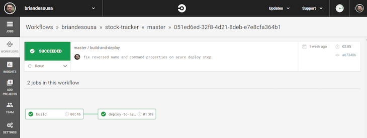
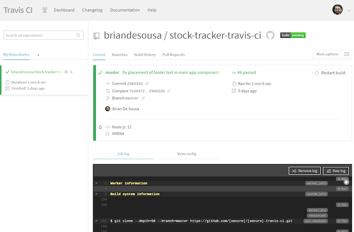
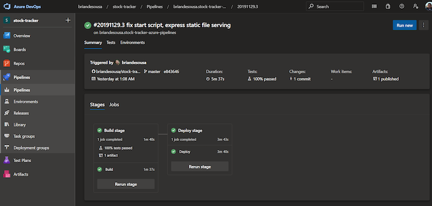
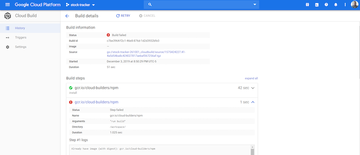
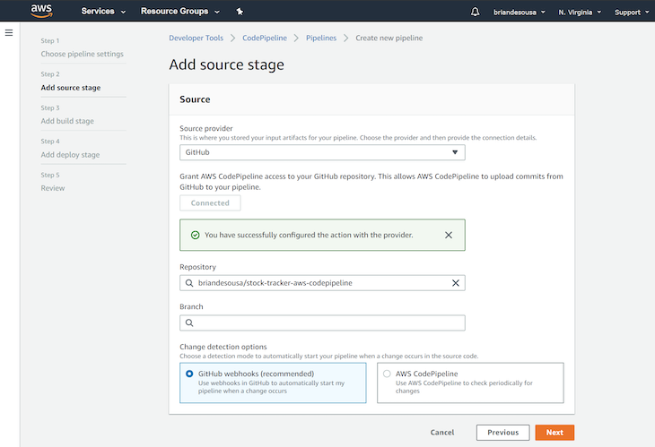

# Comparisons of CI Tools

#### Previous Chapter: [07 - CI Tools](ch07-ci-tools.md) | Next Chapter: [09 - CD Tools](ch09-cd-tools.md) | Return to [Main Page](README.md)
---

In this document, you can find:

- [Azure DevOps Pipelines vs Jenkins](#azure-devops-pipelines-vs-jenkins)
- [Azure DevOps Pipelines vs Travis CI](#azure-devops-pipelines-vs-travis-ci)
- [Purpose Driven Tools, CircleCI vs Travis CI](#purpose-driven-tools-circleci-vs-travis-ci)
- [CSP tools-Azure Pipelines, Google Cloud Build, and AWS CodePipeline](#csp-tools-azure-pipelines-google-cloud-build-and-aws-codepipeline)
- [Comparing purpose-driven tools to CSP tools](#comparing-purpose-driven-tools-to-csp-tools)

## Azure DevOps Pipelines vs Jenkins

Developers describe **Azure DevOps** as "Services for teams to share code, track work, and ship software". Azure DevOps provides unlimited private Git hosting, cloud build for continuous integration, agile planning, and release management for continuous delivery to the cloud and on-premises. Includes broad IDE support. On the other hand, **Jenkins** is detailed as "An extendable open source continuous integration server". In a nutshell Jenkins CI is the leading open-source continuous integration server. Built with Java, it provides over 300 plugins to support building and testing virtually any project.

Azure DevOps and Jenkins are primarily classified as **"Project Management"** and **"Continuous Integration"** tools respectively.

Some of the features offered by Azure DevOps are:

- Agile Tools: kanban boards, backlogs, scrum boards
- Reporting: dashboards, widgets, Power BI
- Git: free private repositories, pull requests

On the other hand, Jenkins provides the following key features:

- Easy installation
- Easy configuration
- Change set support

**"Complete and powerful"** is the primary reason why developers consider Azure DevOps over the competitors, whereas **"Hosted internally"** was stated as the key factor in picking Jenkins.

Jenkins is an open source tool with **13.3K** GitHub stars and **5.48K** GitHub forks. Here's a link to Jenkins's open source repository on GitHub.

**Facebook**, **Netflix**, and **Instacart** are some of the popular companies that use Jenkins, whereas Azure DevOps is used by **Schlumberger**, **Poq**, and **simplement-e**. Jenkins has a broader approval, being mentioned in **1775** company stacks & **1529** developers stacks; compared to Azure DevOps, which is listed in **79** company stacks and **68** developer stacks.

## Azure DevOps Pipelines vs Travis CI

**Azure Pipelines**: Continuously build, test, and deploy to any platform and cloud. Fast builds with parallel jobs and test execution. Use container jobs to create consistent and reliable builds with the exact tools you need. Create new containers with ease and push them to any registry;
**Travis CI**: A hosted continuous integration service for open source and private projects. Free for open source projects, our CI environment provides multiple runtimes (e.g. Node.js or PHP versions), data stores and so on. Because of this, hosting your project on travis-ci.com means you can effortlessly test your library or applications against multiple runtimes and data stores without even having all of them installed locally.

Azure Pipelines and Travis CI can be categorized as **"Continuous Integration"** tools.

Some of the features offered by Azure Pipelines are:

- Any language, any platform
- Containers and Kubernetes
- Extensible

On the other hand, Travis CI provides the following key features:

- Easy Setup- Getting started with Travis CI is as easy as enabling a project, adding basic build instructions to your project and committing code.
- Supports Your Platform- Lots of databases and services are pre-installed and can simply be enabled in your build configuration, we'll launch them for you automatically. MySQL, PostgreSQL, ElasticSearch, Redis, Riak, RabbitMQ, Memcached are available by default.
- Deploy With Confidence- Deploying to production after a successful build is as easy as setting up a bit of configuration, and we'll deploy your code to Heroku, Engine Yard Cloud, Nodejitsu, cloudControl, OpenShift, and CloudFoundry.

**Lyft**, **Heroku**, and **Rainist** are some of the popular companies that use Travis CI, whereas Azure Pipelines is used by **CodeCarrot**, **HTML/CSS to Image**, and **Planetarium**. Travis CI has a broader approval, being mentioned in **670** company stacks & **625** developers stacks; compared to Azure Pipelines, which is listed in **7** company stacks and **8** developer stacks.

## Purpose Driven Tools, CircleCI vs Travis CI

CircleCI and Travis CI are both heavyweights in the CI/CD tool arena. Each of these tools have unique capabilities and cater to slightly different audiences.

### CircleCI

CircleCI offers a hosted tool called CircleCI Cloud and a self-hosted tool called CircleCI Server. These tools have many similarities as well as a few key differences.

Both tools allow you to build using a variety of languages and runtimes on Linux. Only CircleCI Cloud supports Windows or Mac builds, which means CircleCI Server drops support for .NET, Swift, and Objective-C builds. Both allow you to specify a container that you want your build to run in as well.

CircleCI generally refers to CI/CD pipelines as “workflows,” which let you wire together multiple build jobs with a nice visual representation. CircleCI Cloud supports adding “Orbs” to a workflow. Orbs are prepackaged, reusable build steps that allow you to quickly integrate many third-party capabilities, such as sending notifications to Slack channels or deploying to AWS. Unfortunately, CircleCI Server does not support Orbs.

### Travis CI

Travis CI also offers a hosted tool, as well as a self-hosted tool called Travis CI Enterprise. Both tools allow you to build using a variety of languages and runtimes on Linux, Windows, or macOS.

You can also define “build matrices” in both tools. A build matrix essentially allows you to run a build multiple times in parallel against different versions of languages, runtimes, environments, and/or package versions. This capability is powerful and unique when compared to all other tools covered in this article.

The Travis CI hosted tool focuses on open-source community support and even includes free usage tiers and testing for all open-source projects. On the other hand, Travis CI Enterprise focuses on adding features that large enterprises typically require, such as GitHub Enterprise integration (which comes with Active Directory integration) and on-premises server setup with high availability and load balancing.

### Comparing CircleCI and Travis CI

As you have seen so far, the self-hosted versions of CircleCI and Travis CI are considerably different. Another big difference is in how you define your CI/CD pipeline in code for each tool.

The CircleCI config.yml file can contain multiple jobs with whatever steps (commands) you want to run on whatever container you choose. You can also define workflows to string together your jobs into a pipeline.

On the other hand, the Travis CI travis.yml file is much more structured. You specify a build language at the top of the YAML file. Each build language has a well-defined job lifecycle, with named phases and logical default steps (commands) if you don’t explicitly specify any steps.

## CSP tools-Azure Pipelines, Google Cloud Build, and AWS CodePipeline

Now let’s take a look at the tools from the three big cloud service providers. It should come as no surprise that each of these tools is tightly integrated into its respective cloud platform.

### Azure Pipelines

Azure Pipelines is advertised as a complete CI/CD system that can build anything and deploy anywhere. While it certainly is capable of supporting deployments to other cloud providers, the documentation and examples focus on deployment to Azure. It offers deep integration with the larger Azure DevOps platform and a rather large marketplace with extensions that can add new integrations to your pipeline.

It also contains an intelligent web-based pipeline creation wizard that detects the technologies your app uses and then generates a detailed azure-pipelines.yml file as a starting point. This wizard may not be the fastest setup experience compared to other tools, but it does a great job of producing a customized pipeline to suit your application out of the box.

Azure pipelines are extremely flexible with respect to where builds can run. A pipeline can have multiple jobs that run on different build agents running different operating systems (Linux, Windows, or macOS), with support for a variety of languages and runtimes.

Build agents can be Microsoft-hosted or self-hosted. Builds can run directly on the build agent or in a container spun up on the build agent, and the entire Azure Pipelines product itself can be run on-premises using a self-hosted option.

### Google Cloud Build

Google Cloud Build is a newer tool compared to its peers. This tool focuses primarily on building containerized applications. There are a few characteristics and limitations that differentiate this tool from the others.

Builds run within a “cloud builder,” which is essentially a container. There are several officially supported cloud builders that run Linux and support a variety of common languages and runtimes. Unfortunately, there are no Windows or macOS cloud builders.

Google Cloud Build is primarily focused on continuous integration. If you want to continuously deploy your application to an environment, you will need to integrate with other tools like Spinnaker or Jenkins. That being said, there is a fair amount of documentation on how you can integrate some of these popular tools into your build.

The Google Cloud SDK (CLI) can be used to trigger builds remotely or even run builds locally for testing and debugging purposes.

### AWS CodePipeline

AWS CodePipeline is one of several Amazon tools that are tightly integrated together and necessary to build a CI/CD pipeline. CodeBuild and CodeDeploy are the two other tools that you will most likely want to set up. In fact, Amazon has done a great job making sure all of its AWS tools and services are given first-class treatment.

There are also a large number of third-party integrations to other CI/CD tools, including CircleCI, Travis CI, GitHub Enterprise, and more. The number of third-party integrations that are available may even rival Azure Pipelines.

In AWS CodePipeline, builds run within containers. There are three Amazon-managed containers that provide Linux or Windows builds, each of which comes pre-installed with a variety of runtimes and languages ready to use. You can also use other containers from other registries like DockerHub, and on-premises build agents are possible using a CodeBuild agent script provided by AWS.

Given the componentized nature of AWS CodePipeline, you are free to use other CI or CD tools as part of your pipeline instead of CodeBuild or CodeDeploy. For example, if you prefer the Travis CI experience, there are instructions readily available to set up a Travis CI instance in AWS and integrate it with your pipeline.

## Comparing purpose-driven tools to CSP tools

### How does the pipeline setup experience compare between tools?

Each of the tools in this article offers different ways to get a new CI/CD pipeline set up, including hand-coding a YAML file or running through a visual web-based wizard. If you are not familiar with each tool’s YAML syntax, the visual wizard can be very helpful.

The purpose-driven tools offer fast, straightforward, web-based interfaces for setting up new pipelines. The hosted versions of CircleCI and Travis CI authenticate users by their existing GitHub account and pull a list of GitHub repositories to activate a pipeline.

CircleCI collects some additional information and provides a sample YAML file to start with, based on your responses. On the other hand, Travis CI requires you to hand-code the YAML file up front following the documentation.

Depending on how standard your build process is, the Travis CI YAML file may be very simple if you are able to go with the logical defaults it provides. For example, if you are building a typical Node.js application, you can specify the language and node_js properties, and Travis CI will assume that you use npm install and npm test to install, build, and test your application. Both tools also provide out-of-the-box email notifications when your pipeline succeeds or fails.

The cloud service provider tools include web-based interfaces that are a little more detailed and allow you to design your pipeline a bit more at the outset. The Azure Pipelines interface is particularly powerful, given how it tries to detect what tools and configurations your application uses based on your source code.

The AWS CodePipeline interface is quite detailed, giving the user the opportunity to thoroughly customize the pipeline and optionally set up other AWS tools such as CodeBuild and CodeDeploy at the same time.

Google Cloud Build offers the least polished experience of the three cloud service providers. Developers ultimately hand-code the YAML configuration file following Google’s documentation.

Unfortunately, only Azure Pipelines provides out-of-the-box email notifications when your pipeline succeeds or fails. AWS CodePipeline and Google Cloud Build require additional configuration to get any sort of automated notifications set up.

For a fast and easy pipeline setup process, CircleCI wins with its nice YAML configuration generator that lessens the up-front research required to produce a pipeline YAML file. For a thorough, developer-friendly pipeline setup process that gives you the opportunity to design your pipeline up front, Azure Pipelines wins.

### How scalable is the tool as your organization grows?

Scalability in the context of CI/CD tools is measured by more than just infrastructure scalability. Let’s take a look at a few scalability factors for growing organizations.

#### User management

As your organization onboards more users, you need to be able to quickly provision those users, organize them into teams, and restrict access where necessary.

Both CircleCI (Cloud and Server) and Travis CI (Enterprise only) integrate with GitHub Enterprise, which provides LDAP connectivity to internal user directories, meaning you will not need to create new accounts for your existing users when using these tools.

Likewise, both CircleCI and Travis CI Enterprise integrate with GitHub organizations for grouping users. CircleCI provides some limited permission settings to control who can make changes to a CircleCI project’s settings. Travis CI Enterprise can sync its permission settings from GitHub Enterprise.

Each of the CSP tools tap into their own well-established and robust identity management and organization services. Azure Pipelines is integrated with Azure DevOps, which supports user-level permissions, organizations, and integration with Azure AD to map users to accounts in other user directories.

Google Cloud Build has a limited set of user roles for controlling access to individual cloud builds and integration with the Google Cloud IAM to map users to accounts in other user directories.

AWS CodePipeline has fine-grained user-level access controls, integration with AWS IAM to map users to accounts in other user directories, and tools for analyzing the level of access individual users have to your organization’s pipelines.

AWS CodePipeline edges out the competition with its robust access controls and tools for analyzing access. Azure Pipelines (and Azure DevOps) comes in a close second.

#### Infrastructure

As your organization develops more applications on a growing variety of platforms, you need scalable infrastructure behind the scenes to run your builds and run more pipelines concurrently.

Both CircleCI Cloud and Travis CI have limited infrastructure that is shared across all users (not just users in your organization). While both of these tools strive to ensure they have enough capacity, it is possible for pipelines to be delayed when there are usage spikes.

In fact, CircleCI documentation indicates there is a “run queue” that is triggered when servers are maxed out across all customers. CircleCI Server and Travis CI Enterprise allow organizations to have self-hosted, dedicated infrastructure that is as scalable as it needs to be. Travis CI Enterprise has a slight edge over CircleCI given its support for high availability and load balancing.

The CSPs mostly have the advantage in this space given that their tools run on their own expansive cloud platforms. Azure Pipelines can scale to virtually as many hosted build agents as you need, and the number of concurrent pipelines that can run is really only limited to what you pay for.

AWS CodePipeline is very similar to Azure Pipelines, except that there is an artificial upper limit of 300 pipelines per region per user account. Google Cloud Build allows you to use as many cloud builders as necessary in your builds. However, there is a fairly restrictive limit of 10 parallel builds per account.

Azure DevOps wins the infrastructure scalability battle given its virtually limitless capacity, pipeline concurrency, and ability to host build agents directly in Azure or on-premises.

#### Cost

Cost is a very important consideration when the size of your development teams and number of pipelines grows unpredictably.

CircleCI Cloud and Travis CI have a per-user pricing model. Given that each of these providers controls the amount of available hosted infrastructure capacity and limits the number of concurrent pipelines, they have no need to charge at the infrastructure level. CircleCI Server and Travis CI Enterprise also have a per-user pricing model, and infrastructure costs are dealt with separately by your organization.

Azure Pipelines has a per-user pricing model as well as additional costs for enabling additional parallel pipelines. There is a cost for build agents, and Microsoft-hosted build agents cost more than self-hosted build agents. There may be additional costs if you use other pipeline features such as artifact storage or testing capabilities.

Google Cloud Build charges for by the minute for time spent using cloud builders. There are no additional costs for parallel builds, but there may be additional costs if you use other features such as artifact storage.

AWS CodePipeline costs are a bit more complex. There is a monthly cost for each pipeline created in AWS CodePipeline. There are size- and region-dependent costs for the infrastructure that your builds run on in AWS CodeBuild. There are costs for deploying your code to on-premises servers using AWS CodeDeploy (deployments to AWS servers are free), and there may be additional costs if you use other pipeline features such as storage.

The usage-based pricing models offered by AWS CodePipeline and Google Cloud Build could be cheaper for your organization. However, given the unpredictable nature of your development team size and the number of pipelines, the per-user pricing models used by Azure Pipelines, CircleCI, and Travis CI allow for more predictable spend.

Azure Pipelines has a slight edge given the flexibility to scale your pipeline concurrency up and down in order to manage costs. You could scale down the number of concurrent pipelines to save some money at the cost of potentially slowing down teams during peak usage periods.

#### On-premises or regional requirements

Your organization may have regulatory requirements or other needs for international or on-premises CI/CD servers. Almost all of the tools provide an on-premises solution, with the exception of Google Cloud Build.

CircleCI Cloud and Travis CI do not allow you to control which region your builds run in, but CircleCI Server and Travis CI Enterprise self-hosted options can be run wherever you choose.

Azure Pipelines and AWS CodePipeline allow you to choose the location of your build servers in one of their many worldwide locations, and on-premises build servers can be located wherever you choose. Google Cloud Build does not allow you to choose which regions your cloud builders run in.

With the exception of Google Cloud Build, all the tools we’ve reviewed should be able to meet your organization’s on-premises and/or regional requirements.

#### How flexible and extensible is the tool?

Your applications and their CI/CD pipelines will evolve and become more complex over time — you may need to introduce new custom steps into your pipeline, for example. Regardless, you’ll want your CI/CD tools to allow you to set up the pipeline in a way that suits your operations. Let’s take a closer look at how flexible and extensible these tools are.

All five tools include some form of a REST API you can use to access your pipeline programmatically. The CircleCI API only allows you to read project information, while the other four tools have APIs that allow you to read, interact with, and in some cases modify parts of the pipeline programmatically.

All five tools include a command-line interface (CLI) to interact with the tool remotely. The CLIs for CircleCI, Google Cloud Build, and AWS allow you to test your build locally rather than in the cloud, where you may be using paid resources. You will have to install Travis CI or an Azure build agent locally to do the same for those tools.

Pipeline YAML files can grow pretty quickly depending on the complexity of your pipeline. Being able to break up your YAML file into multiple files, or even reuse common steps across pipelines, may help you design pipelines that are easier to maintain.

Travis CI allows you to move complex scripts into separate scripts stored in the same code repository. CircleCI allows you to create your own custom Orbs, which can contain a group of steps or even an entire job in a reusable format. Azure Pipelines allows you to break up your YAML file into separate files and even share common pieces across multiple pipelines. Google Cloud Build and AWS CodePipeline do not allow you to split up your YAML files.

New cloud hosting services are appearing every day, and all five tools provide some extensible means of deploying to a remote host. CircleCI has a collection of managed and open-source Orbs that can deploy to a variety of targets. Travis-CI has a list of over 40 built-in deployment targets that cover some of the major services available, and if your service is not in that list, you can still write a custom script for your deployment.

Google Cloud Build relies completely on integrating with a variety of third-party tools to enable continuous deployment. AWS CodePipeline has a large number of CD tools it integrates with. Azure Pipelines allows extensions to be installed from a marketplace, which you can use to deploy to many different targets directly from your pipeline.

Azure Pipelines wins the flexibility and extensibility award due to its extension marketplace, splitting and sharing of configuration across pipelines, and robust REST API.

#### Should you be concerned with vendor lock-in?

You will always feel a little bit locked in with any CI/CD tool you use, given the proprietary YAML syntax and unique capabilities that are not necessarily available on all tools. That being said, some of these tools definitely make you feel a little less tied down.

If you are using CircleCI or Travis CI but also want to take advantage of capabilities in one of the CSP platforms, you could always move to a self-hosted version of either, host it directly on your CSP’s infrastructure, and have full control over your pipelines. Azure and AWS make it particularly easy to host instances of CircleCI Server or Travis CI Enterprise.

The CSP tools definitely make you feel more locked into their cloud platforms, given how well integrated their CI/CD tools are with their other cloud tools and services. Of the three, Azure feels like you are the least locked in. The Azure Pipelines product is a fairly standalone tool with plenty of documentation on how to use it with other Azure services and a marketplace that lets you find extensions to integrate with many third-party tools.

The CI portion of Google Cloud Build feels restrictive, though there is an open-source community that creates cloud builders to integrate with other third-party tools. On the other hand, the CD portion of Google Cloud Build is wide open to third-party tools.

AWS CodePipeline gives the greatest feeling of vendor lock-in. While setting up a pipeline, you will need to integrate with several other separately managed AWS services. You may even learn a little more about the AWS compute infrastructure and pricing models than you would care to know, assuming you haven’t previously used AWS.

If CircleCI or Travis CI offers the capabilities and scale that your organization requires, it is likely a safer bet to start with them. If your organization is already using Azure, AWS, or Google Cloud, it likely makes more sense to leverage their respective CI/CD tools due to the tight integration and plethora of docs and support available — at the risk of feeling further locked in, of course.

### Why might you want to use CSP tools instead of purpose-driven tools?

I have already explored a few reasons why you might want to use cloud service provider tools over purpose-driven tools, but let’s summarize a few of them:

- It is hard to beat the level of documentation and support you will get from setting up a CI/CD pipeline with a CSP if you already deploy your applications to that same provider’s cloud
- If your organization doesn’t want to manage its own CI/CD infrastructure but you also have requirements for running your builds and storing your code in specific regions, then Azure Pipelines and AWS CodePipeline are the best choices
- If you require fine-grained access controls, advanced user and group management capabilities, and integration with internal user directories, again, Azure Pipelines and AWS CodePipeline are the best choices

---
#### Previous Chapter: [07 - CI Tools](ch07-ci-tools.md) | Next Chapter: [09 - CD Tools](ch09-cd-tools.md) | Return to [Main Page](README.md)
---
