# GitOps

#### Previous Chapter: [10 - Comparisons of CD Tools](ch10-comparisons-of-cd-tools.md) | Next Chapter: [12 - Argo CD - Introduction](ch12-argocd-introduction.md) | Return to [Main Page](README.md)
---

In this document, you can find:

- [What is GitOps?](#what-is-gitops)
- [Using IaC the Wrong Way](#using-iac-the-wrong-way)
- [Solution for IaC](#solution-for-iac)
- [Push based vs Pull based Deployment Models for CD Pipelines](#push-based-vs-pull-based-deployment-models-for-cd-pipelines)
- [Easy Rollback](#easy-rollback)
- [Single Source of Truth](#single-source-of-truth)
- [Increasing Security](#increasing-security)
- [Wrap Up](#wrap-up)

## What is GitOps?

Short explanation of GitOps is **"Infrastructue as code(IaC), done right"**.

Inftastructue as code means defining the infrastructure as code instead of creating it manually.

What it brings to us? -> reproducing the same infrastructure easily.

Other "... as code" approaches are:

- Pipeline as Code
- Network as Code
- Policy as Code
- Configuration as Code
- Security as Code

For example, instead of manually creating servers and network and all the configuration around it on cloud service i.e., AWS and creating Kubernetes(k8s) cluster with certain components we define all of these in a Terraform code or Ansible code and k8s manifest files and we have a bunch of yaml files or other definition files that descirebe our infra our platform and its configuration"

## Using IaC the Wrong Way

As old fashion way, we can write the files and test them in locally and store them in locally. New fashion is to store files in Git repository. It gives us version controlling for IaC files and store them centrally, where everyone has access to it.

**But:**

- No **Pull Requests** (Merge Requests): When we make any changes to the code we may not have a defined procedure like pull requests.
- Committing directly into Main Branch: We may just have a main branch and when we change the code, we commit it directly into the main branch. As well as if someone else in the team changes the code, they can commit directly into the main branch. So:

  - **No Code Reviews**
  - **No Collaboration**

   on the changes.

Also, when we commit infras's code changes into the repository, no automated tests are running to test these code changes. Maybe we committed **invalid YAML files** or we made a typo and the attribute names are wrong or maybe the code changed will break something in the infrastructure or the application environment.

## Solution for IaC

We need to use GitOps Flow for IaC approach.

<h4 align="center">GitOps Flow</h1>

### Steps

1. Create Pull/Merge Request: Make changes to the code, collaborate with other team members on that pull request.

2. Run CI Pipeline: It gives us the opportunity to validate the config files and test them just like we test application code changes.

3. Approve changes: After testing these commits, other team members can approve the final changes. This way we have a tested and well-reviesed config changes before they get applied in any environment.

4. Run CD Pipeline: Only after the Step #3, changes will be merged back into main branch and through a CD pipeline, get deployed to the environment. Whether it's changing something in k8s cluster or updating the underlying infrastructure i.e., AWS.

So we have an automated process which is more transparent and produces high quality infra or config code where multiple person collaborate on the change and things get tested. Rather than one engineer doing all the stuff from their laptop manually that others do not see or cannot review.

## Push-based vs Pull-based Deployment Models for CD Pipelines

There are two different approaches how a CI/CD pipeline can implement the changes you want to make:

- **Push-based**
  
  The pipeline is started and runs tools that make the changes in the platform. Changes can be triggered by a commit or merge request.
    
- **Pull-based**
  
  An agent watches the git repository for changes and compares the definition in the repository with the actual running state. If changes are detected, the agent applies the changes to the infrastructure.

As we see in GitOps Flow, once merged into the main branch, the changes will be automatically applied to the infrastructure through a CD pipeline. In GitOps, we have two ways of applying these changes; these are push or pull based deployments.

### Push-based Deployment

It is what we traditionally know from the application pipeline on Jenkins or GitLab CI/CD etc. Application is build

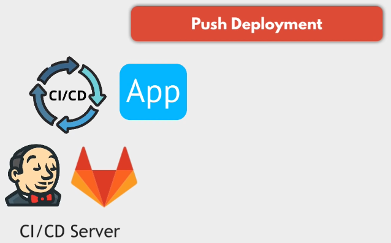

and pipeline executes command to deploy the new application version into the environment.

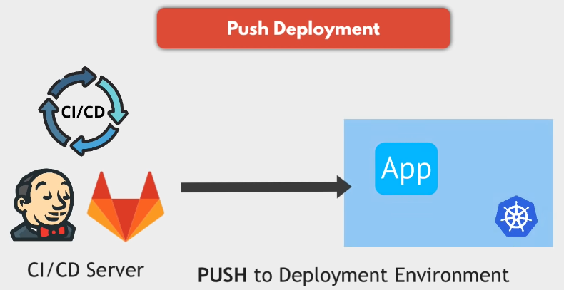

### Pull-based Deployment

Here we have an agent installed in the environment like in k8s cluster, that actively pulls the changes from the Git repository itself.

The agent will check regularly what is the state of the infrastructure code in the repository

and compare it to actual state in the environment where it's running. If it sees there is a difference in the repository, it will pull and apply these changes to get the environment from the actual state to the desired state defined in the repository.

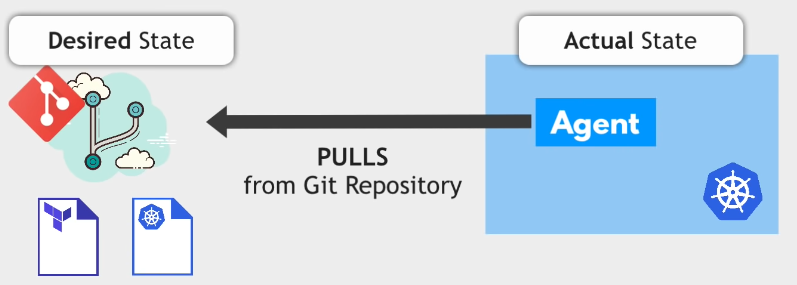

Examples of GitOps tools that work with the pull-based model are Argo CD, Flux CD and Jenkins X.

## Easy Rollback

Infra is breaked because of a new commit:
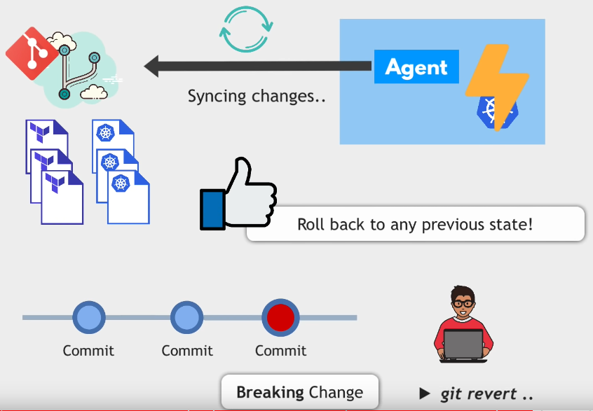
<h4 align="center">Breaked  </h1>

Roll-backing and fixing via `git revert ...` command:
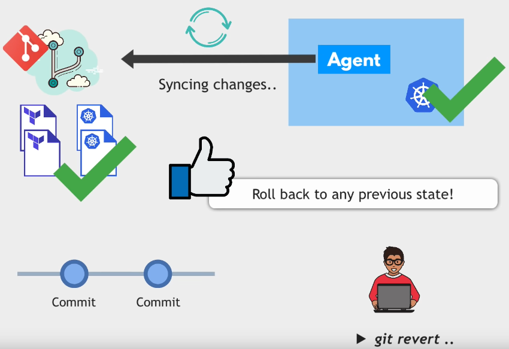
<h4 align="center">Fixed  </h1>

When we have version control for our code and the changes in our repository are automatically synced to the environment, we can easily rollback the environment to any previous state in our code. It gives us another big advantage, for example, if we make changes that break sth in the environment, so our cluster does not work anymore, we can just do git revert to undo the latest changes and get the environment back to the last working state.

## Single Source of Truth

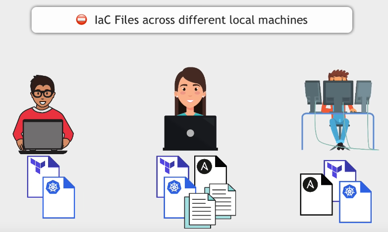

Instead of spreading our infrastructure as code and configuration as code etc. in different places and machines and basically having those files lying around on our computers, everything is stored centrally in a Git repository.

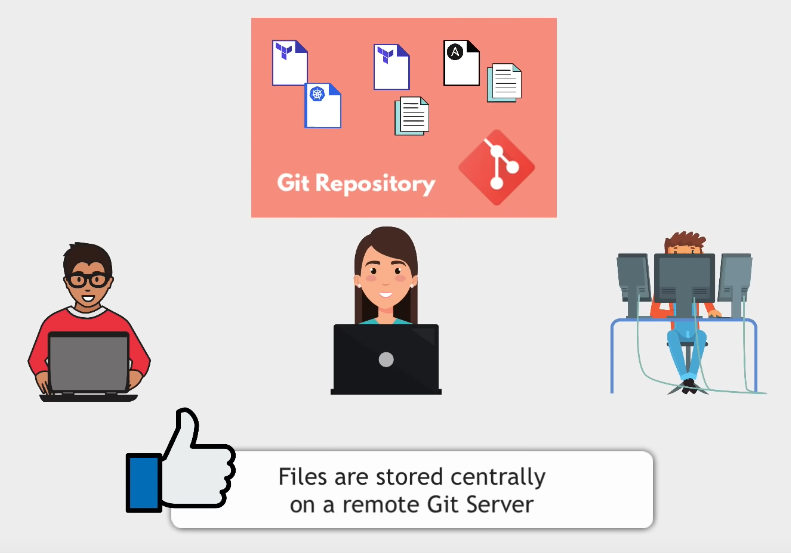

The environment is always synced with what's defined in that repository.

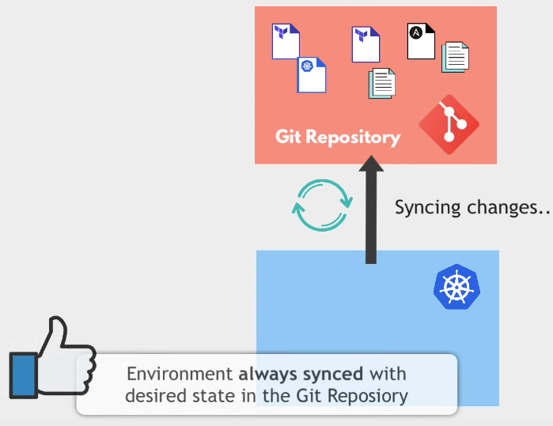

This means that Git repository becomes the single source of truth for your environment and this makes managing our infrastructure or our platform way easier.

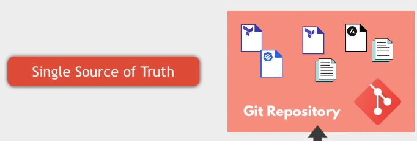

## Increasing Security

GitOps also increases the security because now we do not have to give direct access to everyone in the team who needs to change sth on the infra or in k8s cluster in order to execute the changes

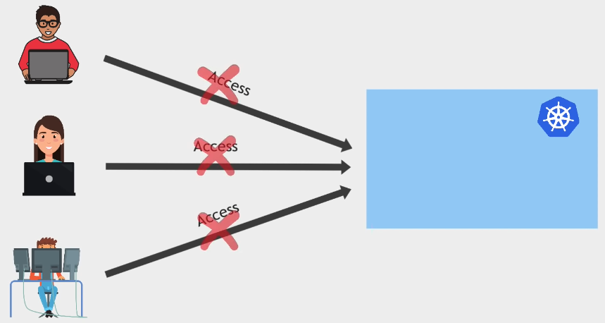

Because it is the CD pipeline that deploys the changes, not individual team members from their laptops.

But anyone on the team can propose changes to the infra in the Git repository through pull requests and once it is time to merge that pull request and apply those changes, we can have much narrower group of people who are allowed to approve and merge those changes into the main branch so that it gets applied.

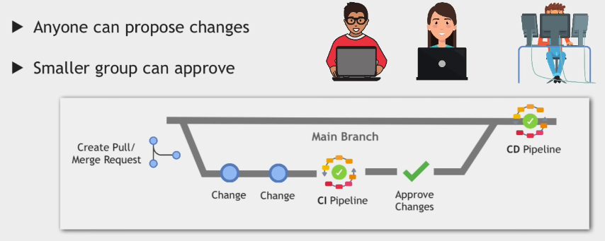

So as a result; we have
- Less permissions to manage
- More secure environment

## Wrap Up

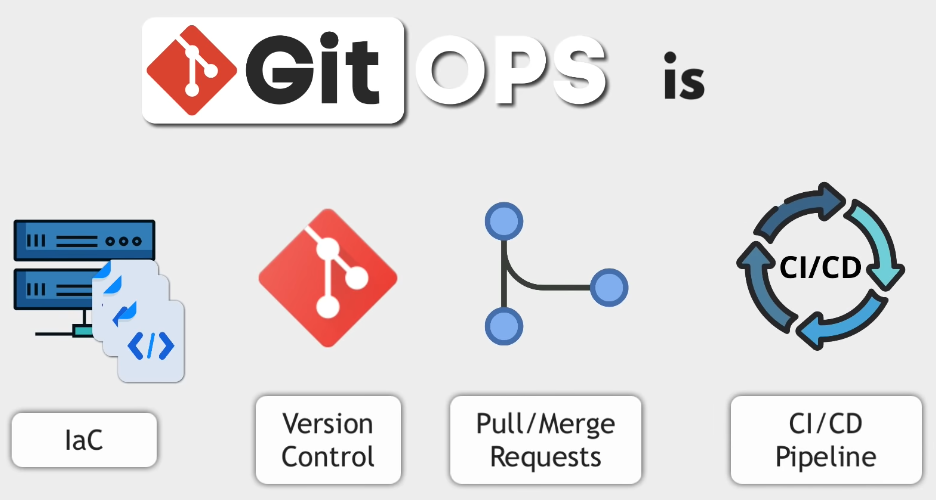

To summarize, GitOps is an **Infrastructure as Code** with **Version Control**, **Pull/Merge Requests** and **CI/CD Pipeline**.

---
#### Previous Chapter: [10 - Comparisons of CD Tools](ch10-comparisons-of-cd-tools.md) | Next Chapter: [12 - Argo CD - Introduction](ch12-argocd-introduction.md) | Return to [Main Page](README.md)
---
