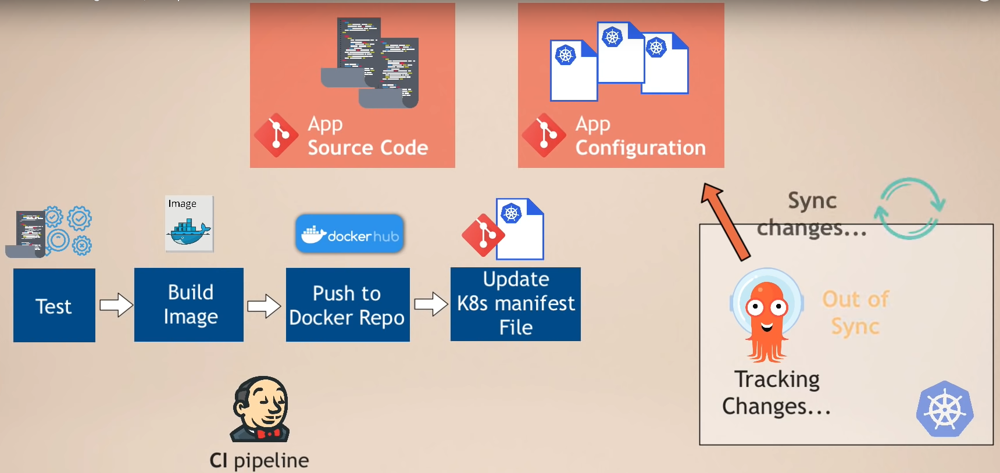
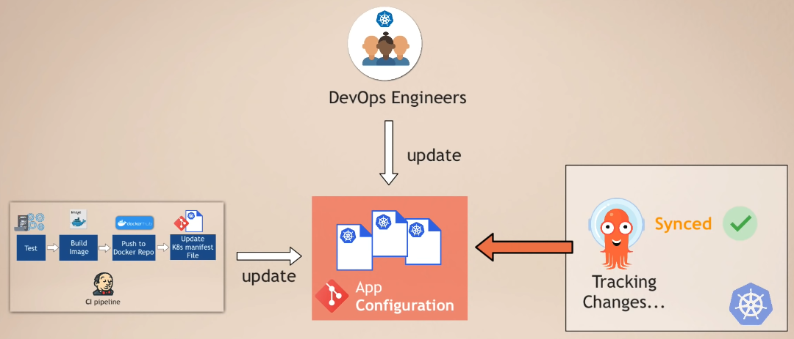
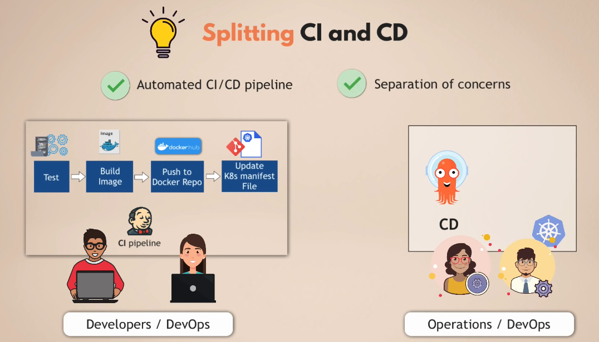
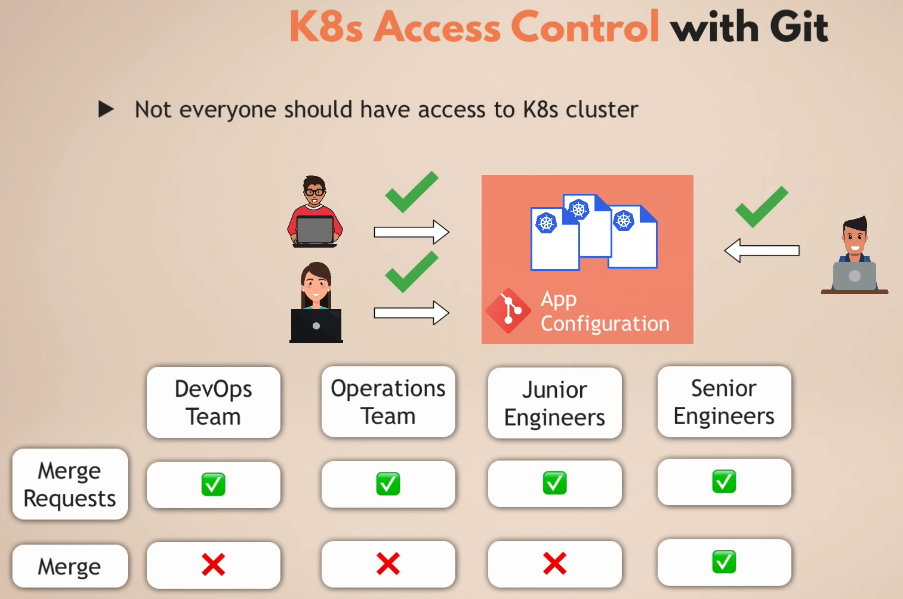
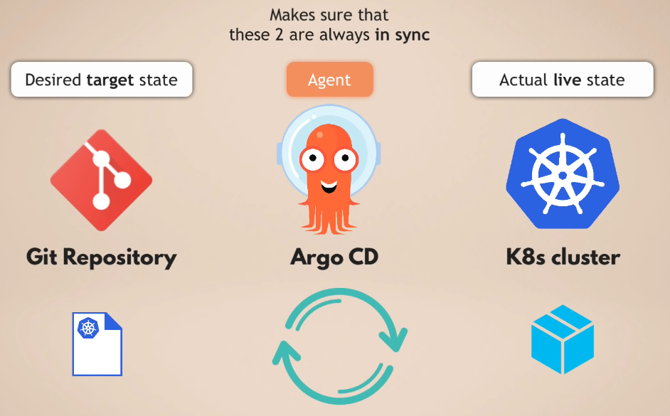

# Argo CD - Introduction

#### Previous Chapter: [11 - GitOps](ch11-gitops.md) | Next Chapter: [13 - Argo CD - Installation to Local Machine](ch13-argocd-installation-to-local-machine.md) | Return to [Main Page](README.md)
---

In this document, you can find:

- [What is Argo CD?](#what-is-argo-cd)
- [Why Argo CD?](#why-argo-cd)
- [How CD is used in many projects?](#how-cd-is-used-in-many-projects)
- [Executing the CD Process with Argo CD](#executing-the-cd-process-with-argo-cd)
- [Benefits](#benefits)
- [Recovering the Cluster](#recovering-the-cluster)
- [Access Control of k8s with Git](#access-control-of-k8s-with-git)
- [Argo CD as k8s Add-on](#argo-cd-as-k8s-add-on)

## What is Argo CD?

Argo CD is a declerative, **GitOps** CD tool for Kubernetes.

**Attention!** Before reading what is Argo CD, if you don't know what GitOps is, you should read our [GitOps document](ch10-gitops.md) first, then this article will be more understandable. After reading the GitOps article, you should have been able to immediately understand why the phrase "GitHub Repo" is included in the architecture and should be included.

## Why Argo CD?

Application definitions, configurations, and environments should be declarative and version controlled. Application deployment and lifecycle management should be automated, auditable, and easy to understand.

Before we understand Argo CD, we need to understand how CD is added and applied to projects.

## How CD is used in many projects?

Let's imagine that we have many microservices like the one on the first image below and we move them to the Kubernetes(k8s) cluster as in the second image.

And then let's say we make changes to the source code of our application (like adding new features or making bugfixes) and pushing it to the Git repo.

After this change and push, Jenkins etc. installed on our system and mapped to this Git repos. CI pipeline of our applications will be triggered automatically.

This triggered pipeline process will automatically test our application, create a new Docker image if it does not encounter any errors, and push it to the Docker Repo and complete the CI process.

Now we have a new question: *"How will this newly created Docker image be deployed to the k8s cluster?"*

1. We update the k8s deployment YAML file by typing the new version number of the Docker image.

    

2. We apply the modified YAML file to k8s.

    **While all the steps up to pushing the Docker image to Docker Repo create the CI process, applying the updated YAML file to the k8s cluster creates the CD process.**

    

    **Challenges and frustrations of this CI/CD process:**

    - In order to be able to access the k8s cluster and make changes, tools such as kubectl, helm must be installed in the *Build Automation Tool* that we assume as Jenkins in this example

    - Access to k8s is also required because kubectl is only k8s client tool and "credentials" must be defined in order to access k8s. If we are using cloud servers such as AWS, we also need to define credentials to access them.

    - These credential definitions not only put effort into configuration, but also raise the issue of security. We also need to export cluster credentials to external services and tools. For example, if we have 33 applications, each application requests a separate credential for itself. Only in this way, each application will be able to access the application resources defined for itself in the cluster. If we do not have a single cloud service but also have other clusters, credential definitions will still be required for each of them.

    - **The most important problem** is that Jenkins, which deploys applications to k8s or makes a change in k8s configurations, cannot have information about the status of these deployments. Once the "`kubectl apply ...`" command is run, Jenkins actually has no information about the status of this execution. "Is the application installed?", "Is the application status healty?", or "Is the application failed during startup?" Jenkins cannot follow the answers to such questions.

    **Due to these situations, we see that the CD part of the CI/CD process can be improved.**

    Considering these special cases, Argo CD was developed on the basis of GitOps principles so that k8s clusters can be *"delivery"* more effectively. We can say **"CD for Kubernetes"** for Argo CD.

## Executing the CD Process with Argo CD

First of all, instead of being a tool that accesses the k8s cluster from outside, like Jenkins, it is an application installed and running in this cluster. So Argo CD is part of the k8s cluster.

The biggest advantage of having a k8s cluster built in this way is: **Pulls changes instead of pushing them to k8s like Jenkins**. Since it is already in the k8s cluster, it actually pulls the change in the modified k8s manifest file from the Git repo and forwards this new file to the k8s cluster.

So how can we do this:

  1. First, we deploy the Argo CD application to the k8s cluster.

  2. We connect the Argo CD to the Git repo that we want it to follow and make it follow the changes in that repo instantly.

  3. When there is a change in this repo, the Argo CD application that we install in the k8s cluster and tell it to follow this repo will automatically detect this change and automatically pull it into the k8s cluster.

When we look at the process from the beginning, we can summarize it as follows:

 1. The developer pushes the changes she made on the code to the Git repo by making a development or a bug fix.

 2. The CI process, which is defined in Jenkins and similar tools, is automatically activated and by following the steps we mentioned above, it creates a new Docker image and makes changes to the k8s manifest files, for example deployment.yml.

 3. Argo CD detects this change and pulls the new manifest file to k8s cluster..

**Best Practice for Git Repository**: We should separate the Git repo into *application source code* and *application configuration* (k8s manifest files). We even have to create a separate repo for *system configuration*.

So why should we take this approach? Because:

- The application's configuration codes can be written not only in the deployment file, but also in configmap, secret, service, ingress and similar files and may be required for the application to run in the cluster.

- k8s manifest files are source code independent. For example, when we make a change in the service.yml file of the application, we do not want the whole CI process to start over because no changes have been made to the codes.

- If we add k8s manifest files to the CI pipeline process, we will create a complex pipeline process.

- The Argo CD application, which we have told to follow the *App Configuration* Git repo only, will automatically run and pull it into the k8s cluster after the Jenkins application completes the CI process which changes the k8s manifest file (for example Deployment.yml) and pushes it to this repo.

Argo CD supports k8s manifest files "Plain(k8s) YAML Files", "Helm Charts", "Kustomize Files" or other template files that create other k8s manifest files.

The repo with these files, which we call *App Configuration*, actually became the GitOps repo and we are telling Argo CD to listen here. Files in this repo can be changed by the Jenkins CI process or directly by DevOps engineers.

After Argo CD installation and use, we now separate our CI and CD pipelines. 

The advantage of this for us is to enable developers who develop the CI processes to carry out the CI processes and to follow the packaging of the codes they have written. At the same time, people who are more interested in operational work can focus on receiving the packages produced as a result of the pipelines organized by the developers and ensuring that they work correctly. Thus, two different teams with different focuses will be able to focus on their own processes.

Using the Git repo as a "Single Source of Truth" also ensures that the k8s cluster is completely transparent because the applications running in the cluster, their settings, etc. all information is clearly defined by code and logged in Git repo. Needless to say version control already :)

In cases where the cluster needs to be updated very quickly, the automatic synchronization of Argo CD can be turned off and made open to manual changes and in case of manual change, a signal/warning can be sent to the outside and this change is provided to be made in the code.

## Benefits

- All k8s config files are defined as code and kept in Git repo

- Instead of commands like "`kubectl apply ...`", "`helm install ...`" that everyone runs from their own computer, it is now possible to modify the files in the common Git repo and update the k8s cluster in this way.

- Ensuring that all people in the team can make changes with the same interface. Executing the command "`git commit ...`" will suffice.

- **The biggest benefit is -> "Single Source of Truth"**. If a team member connects to the k8s cluster from their own computer and makes a change (such as increasing the number of replicas of an application from 1 to 2), it compares the instant status with the definitions in the files in the Git repo containing Argo CD configurations. accordingly it will notice the manual change and undo it.

## Recovering the Cluster

Having the source codes of the applications we developed in the Git repo saves the codes safely, saves us in case of a problem in the local machine / the system crashes / the machine is lost, as well as with the configuration files that we repo' with this method in case the computer running the cluster has problems. We will be able to revolt our country in the same way. If manual changes had been made, all previous adjustments would have to be remembered and redone, if that is possible.

Actually, this is not something that Argo CD brings, it is one of the benefits of GitOps. Argo CD helps us to implement GitOps principles.

## Access Control of k8s with Git

We will not need to define *"Cluster Role"* and *"User resources"* for k8s clusters that we manage with Git repo. We will be able to manage cluster accesses directly with Git. For example, as in the image above, while the whole team can be authorized to open a "merge request", we can assign the "merge" authority only to "Senior Engineers".

We will be able to continue our operations more securely without defining the team's access to the k8s cluster by only giving the team access to the Git repo.

We will also apply this to "non-human users". For example, build automation tools like Jenkins will not need to define k8s access directly because Argo CD is already running inside the cluster and it will be the only one that applies the different changes to the cluster.

**In summary**, cluster credentials no longer need to be outside the cluster because the agent is already running inside the cluster. This also allows us to simplify the management of the security of all clusters.

## Argo CD as K8s Add-on

Argo CD is not just an application deployed to the k8s cluster, if it were, there would be no difference since Jenkins could be deployed in the same way. What differentiates Argo CD here is that it is actually an extension of the k8s API. In fact, Argo CD adds and enriches the functions of the k8s, rather than rebuilding things, reintroducing all the functions. It also uses the functions of k8s to do its own operations, for example it uses *"etcd"* to store data.

One of the things that makes Argo CD give us a big advantage is that it actually uses the controllers of the k8s. In this way, it can monitor the instantaneous status of k8s and compare the desired status with the instantaneous status. In this way, it can also offer "Visibility in the cluster", which Jenkins cannot offer us. When a new application is deployed, we will be able to monitor the creation status of the pod, the health status of the application, the failure of the pod, whether it needs rollback, with Argo CD UI.

If we look at the big picture, we actually have our Git repo on one side, the k8s cluster on the other, and Argo CD in the middle of the two. Git repo indicates **desired state** here, k8s cluster **actually running state**. Argo CD is responsible for making sure that these two are synchronized. In case of separation/difference between the two, it updates at the first opportunity.

---
#### Previous Chapter: [11 - GitOps](ch11-gitops.md) | Next Chapter: [13 - Argo CD - Installation to Local Machine](ch13-argocd-installation-to-local-machine.md) | Return to [Main Page](README.md)
---
