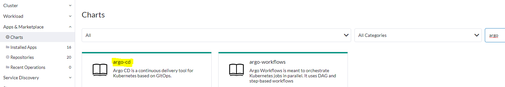
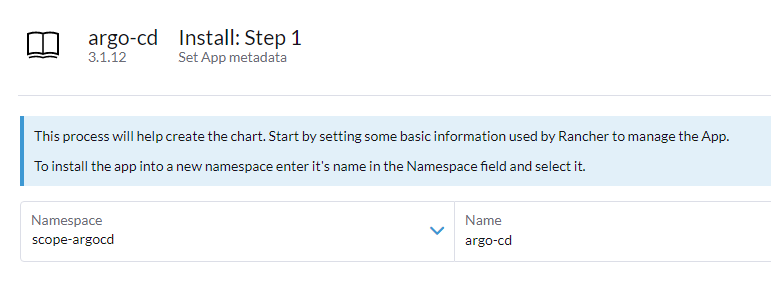
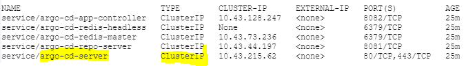
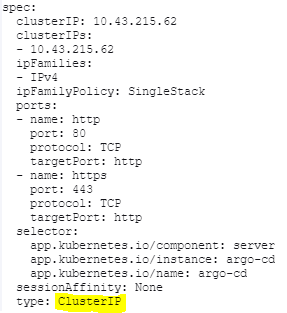
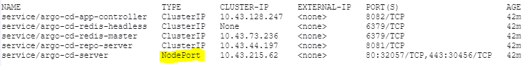
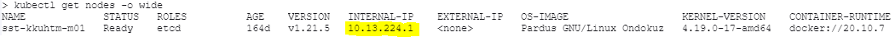
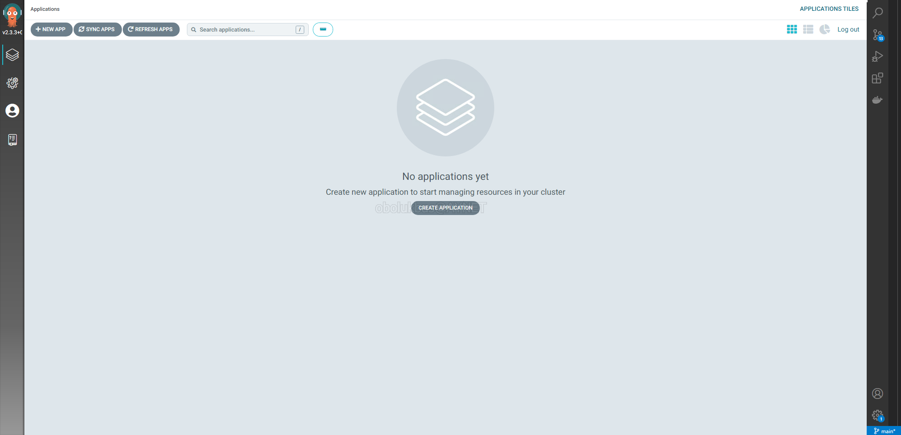

# Installation (Cloud)

## Under this heading, how to install Argo CD to K8s cluster will be explained. Here are the steps

### 1 - Connect to Rancher and run terminal with the button on the top right

### 2 - A new namespace is created with `kubectl create namespace`

If you want to include a new namespace in a project, click *Cluster* in the left menu, then click *Projects/Namespaces*. After filtering from the upper right box and finding the namespace, press the 3 dots on the right and click the *Edit Config* button.

Then, the relevant project is selected from the *Projects* drop-down menu at the top right.

### 3 - Argo CD is installed in the created namespace

Click on the *Charts* button under *Apps & Marketplace* in the left menu and click on the filtering box on the upper right and the box that appears after filtering slang cd.

Then, click on the blue *Install* button on the right of the output document.

In the installation step that appears on the screen, the namespace we created before is selected and a name is given to the application.

Continue with the *Next* button at the bottom right, and then the installation process is started with the *Install* button.

When the installation is completed successfully, the following outputs will appear on the terminal:

Using these commands we will access our application and initial password in the future. So you should prefer not to close the terminal :)

### 4 - Make the installed service accessible from outside

With the command

`kubectl get all --namespace scope-argocd`

all applications installed in the *scope-argocd* namespace are listed. What's important to us right now is the ones that start with *service/*.

Here is the *service/argo-cd-server* line. The type of this service appears to be ClusterIP. We will convert this to **NodePort**.

`kubectl edit svc argo-cd-server --namespace scope-argocd`

With the command, the yaml file of the service is opened with the **Vi** program.

Here, the value of the *type* key under *spec* is deleted and *NodePort* is written and saved and exited.

Now our service will appear as NodePort:

As can be seen in the image above, the ports of the service do not appear as "80/TCP,443/TCP" in the *Port(s)* section, but as **"80:32057/TCP,443:30456/TCP"**. This means: **When we type the IP of any worker node in our browser and connect with this port, we will have access to the UI of our Argo CD application**

`kubectl get nodes -o wide` komutu ile node'larımızı listeliyoruz.

We take the *INTERNAL-IP* information of any of the nodes and write it to our browser and write one of the two new ports created in the above step, for example; **"10.13.224.1:30456"**

We finally access the UI of the Argo CD application by clicking Advanced on the screen and then clicking Proceed :)

### 5 - Obtaining the first password

While installing Argo CD, it creates the authorized user and password by itself, decodes it with base64 and stores it as an opaque secret. By obtaining and decoding this secret, we will reach our first password.

As we will remember, while the Argo CD installation was shown to us from the terminal, some commands appeared on the screen after the installation was completed. Here, using this command, we will obtain our password directly and log in from the UI screen. The password of our user whose root username is **admin** is obtained with the following command:

`echo "$(kubectl -n scope-argocd get secret argocd-secret -o jsonpath="{.data.clearPassword}" | base64 -d )"`

You can access the application by entering this password on the screen.

