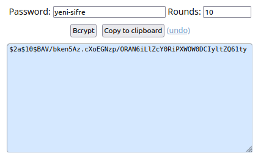
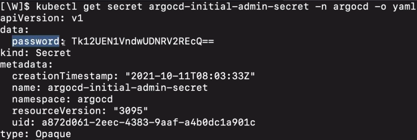

# Argo CD - Installation to Local Machine

#### Previous Chapter: [12 - Argo CD - Introduction](ch12-argocd-introduction.md) | Next Chapter: [14 - Argo CD - Sample Project](ch14-argocd-sample-project.md) | Return to [Main Page](README.md)
---

*Note: This application is installed on Ubuntu 20.04 LTS installed on the PC. Some steps/commands will vary for different operating systems, but the main logic/skeleton of the installation is as described here. You can also access the installation steps from Argo CD's [Getting Started](https://argo-cd.readthedocs.io/en/stable/getting_started/) link.*

The Argo CD application was installed and run in the Kubernetes cluster running on the "minikube" application.

Installation steps:

1. The Minikube application is launched:

    `minikube start`

    *If you don't have minikube installed, you must follow the steps [here](https://www.linuxtechi.com/how-to-install-minikube-on-ubuntu/) and complete the installation before proceeding to the next steps*

2. The namespace is defined for the Argo CD application:

    `kubectl create namespace argocd`

3. Argo CD is installed:

    `kubectl apply -n argocd -f https://raw.githubusercontent.com/argoproj/argo-cd/stable/manifests/install.yaml`

    Note: Different installation URL is required for Load Balancer build.

4. We can check if the installation is done correctly as follows:

    `kubectl -n argocd get all`

    If the installation is completed correctly, we will see results similar to the following:

        NAME                                                       READY   STATUS    RESTARTS   AGE
        pod/argocd-application-controller-***                      1/1     Running   0          3h32m
        pod/argocd-applicationset-controller-***                   1/1     Running   0          3h32m
        pod/argocd-dex-server-***-djnpt                            1/1     Running   0          3h32m
        pod/argocd-notifications-controller-***                    1/1     Running   0          3h32m
        pod/argocd-redis-***                                       1/1     Running   0          3h32m
        pod/argocd-repo-server-***                                 1/1     Running   0          3h32m
        pod/argocd-server-***                                      1/1     Running   0          120m

        NAME                                                       TYPE        CLUSTER-IP       EXTERNAL-IP   PORT(S)                      AGE
        service/argocd-applicationset-controller                   ClusterIP   XX.XX.XX.XX      <none>        7000/TCP                     3h32m
        service/argocd-dex-server                                  ClusterIP   XX.XX.XX.XX      <none>        5556/TCP,5557/TCP,5558/TCP   3h32m
        service/argocd-metrics                                     ClusterIP   XX.XX.XX.XX      <none>        8082/TCP                     3h32m
        service/argocd-notifications-controller-metrics            ClusterIP   XX.XX.XX.XX      <none>        9001/TCP                     3h32m
        service/argocd-redis                                       ClusterIP   XX.XX.XX.XX      <none>        6379/TCP                     3h32m
        service/argocd-repo-server                                 ClusterIP   XX.XX.XX.XX      <none>        8081/TCP,8084/TCP            3h32m
        service/argocd-server                                      ClusterIP   XX.XX.XX.XX      <none>        80/TCP,443/TCP               3h32m
        service/argocd-server-metrics                              ClusterIP   XX.XX.XX.XX      <none>        8083/TCP                     3h32m

        NAME                                                       READY   UP-TO-DATE   AVAILABLE   AGE
        deployment.apps/argocd-applicationset-controller           1/1     1            1           3h32m
        deployment.apps/argocd-dex-server                          1/1     1            1           3h32m
        deployment.apps/argocd-notifications-controller            1/1     1            1           3h32m
        deployment.apps/argocd-redis                               1/1     1            1           3h32m
        deployment.apps/argocd-repo-server                         1/1     1            1           3h32m
        deployment.apps/argocd-server                              1/1     1            1           3h32m

        NAME                                                       DESIRED   CURRENT   READY   AGE
        replicaset.apps/argocd-applicationset-controller-***       1         1         1       3h32m
        replicaset.apps/argocd-dex-server-***                      1         1         1       3h32m
        replicaset.apps/argocd-notifications-controller-***        1         1         1       3h32m
        replicaset.apps/argocd-redis-***                           1         1         1       3h32m
        replicaset.apps/argocd-repo-server-***                     1         1         1       3h32m
        replicaset.apps/argocd-server-***                          0         0         0       3h32m
        replicaset.apps/argocd-server-***                          1         1         1       120m

        NAME                                                       READY   AGE
        statefulset.apps/argocd-application-controller             1/1     3h32m

5. In order to access the application running on the pod in the cluster, a service must be defined. For this, there are different options such as loadbalancer and ingress. We will use *Port Forwarding* in this document:

    `kubectl port-forward svc/argocd-server -n argocd 8080:443`

    With this command, we will be able to access Argo CD's API server using the <https://localhost:8080> link.

    - For LoadBalancer:

        We have to change the type of argocd-server service to LoadBalancer:

        `kubectl patch svc argocd-server -n argocd -p '{"spec": {"type": "LoadBalancer"}}'`

    - For Ingress:

        Link for the document describing how to configure Argo CD with ingress: <https://github.com/argoproj/argo-cd/blob/master/docs/operator-manual/ingress.md>

**If we have been able to proceed smoothly until this step, when we click on the [localhost link](https://localhost:8080), a page like the one below will appear on our screen.**

<p align="center"></p>

6. Argo CD application, which comes with "admin" as the default user name, creates the user password at the time of installation. The initial password can be accessed as follows:

    #### **For Argo CD version 1:**

    With the command below, we list all the installations in the argocd namespace and filter the *argocd-server* pods.

   ```kubectl -n argocd get all | grep pod/argocd-server```

    The result that will return us as output:

       pod/argocd-server-77b597bc68-w52zp      1/1     Running     0     148m

    Here, the part after "pod/" is our initial password.

    **Attention!!**

    Using the code below, we can change this password to the one we want.

    `kubectl -n argocd patch secret argocd-secret \\n  -p '{"stringData": {\n    "admin.password": "XXXXX",\n    "admin.passwordMtime": "'$(date +%FT%T%Z)'"\n  }}'`

    After *admin.password* here, we need to write our own **encrypted** password in the place indicated with *XXXXX*.

    The password must be encrypted using the **Bcrypt** encryption method. In order to do this, we can perform the encryption process by going to [browserling](https://www.browserling.com/tools/bcrypt) and typing the password we have determined in the Password field and pressing the **Bcrypt** button.

    <p align="center"></p>

    When we copy this created password, replace the "XXXXX" part in the above command and run it, the password change process will be completed successfully.

    Since the password has changed, we need to restart the servide deployment of the Argo CD application:

    `kubectl -n argocd rollout restart deployment argocd-server`

    We restart the *port-forwarding* process that has stopped due to a reboot:

    `kubectl port-forward svc/argocd-server -n argocd 8080:443`

    After this command, the output will be like this:

       deployment.apps/argocd-server restarted

    #### **For Argo CD version 2:**

    The password is also automatically created as a secret named *"argocd-initial-admin-secret"*.
  
    We can see the base64 encoded version of our password under *data* -> *password* by running the
    
    `kubectl get secret argocd-initial-admin-secret -n argocd -o yaml`
    
    command.

    <p align="center"></p>

    `echo <encoded-password> | base64 --decode` command, we can decode our password and see the output directly on the terminal. The part before the '%' sign is our password, **Be careful to not to copy the '%' character!**

    <p align="center"></p>

7. If we were able to pass these stages without any problems, we should be able to access our application again with [localhost:8080](https://localhost:8080) and log in with the password we set and bcrypt. If the login process is successful, the following screen will appear:

<p align="center"></p>

8. Congratulations. You have successfully completed the installation process. In the next step, we will fill this empty screen with applications and animate it a little :)

---
#### Previous Chapter: [12 - Argo CD - Introduction](ch12-argocd-introduction.md) | Next Chapter: [14 - Argo CD - Sample Project](ch14-argocd-sample-project.md) | Return to [Main Page](README.md)
---
