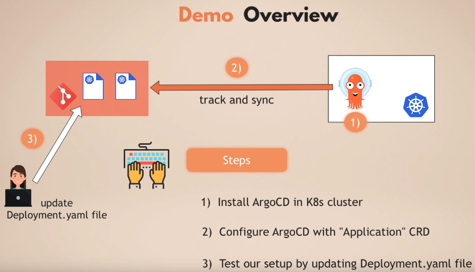
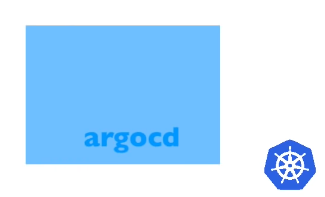
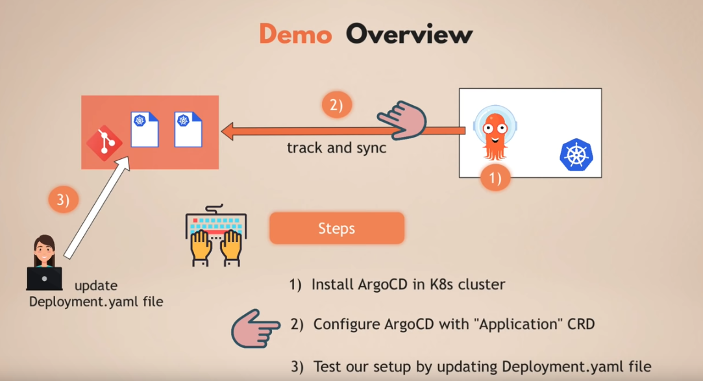
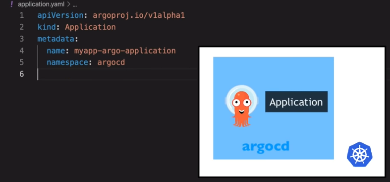
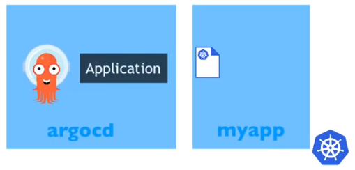
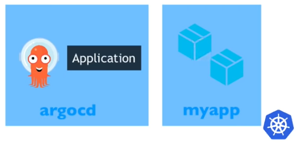
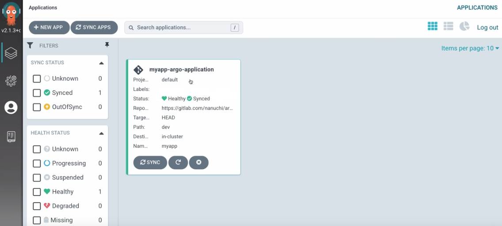
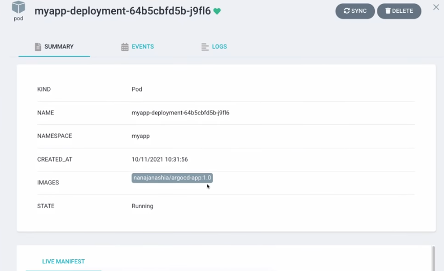
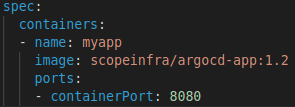

# Argo CD - Sample Project

#### Previous Chapter: [13 - Argo CD - Installation to Local Machine](ch13-argocd-installation-to-local-machine.md) | Next Chapter: [15 - Argo CD - Installation to K8s Cluster](ch15-argo-cd-installation-to-k8s-cluster.md) | Return to [Main Page](README.md)
---

## *In this example we will see how to install and run the fully automated CD pipeline with the Argo CD application for K8s configuration changes*

### In this sample application we need

- Git repo with "deployment" and "service" yaml files,

- Docker Hub repo containing the Docker images to be used in the example

- Minikube cluster

### Steps to complete this example

1. Install Argo CD in K8s cluster

2. Configuring Argo CD with "Aplication" CRD

3. Testing the installation by updating the *deployment.yaml* file

### Step 1 - Install ArgoCD in K8s cluster

- We create the Argo CD namespace inside the K8s cluster:

  `kubectl create namespace argocd`

  

- We install the Argo CD application in Namespace

  `kubectl apply -n argocd -f https://raw.githubusercontent.com/argoproj/argo-cd/stable/manifests/core-install.yaml`

  

  In order to see the installation result, we can run the
  
  `kubectl get pod -n argocd`
  
  command and see the output.

  

  We have to wait for all pods to be operational. With the command
  
  `kubectl get pod -n argocd -w`
  
  we can easily go to the watch position and follow it easily.

 

#### Accessing the Argo CD UI

  When we examine the services running in the K8s cluster with the
  
  `kubectl get svc -n argocd`
  
  command, we can observe that the *80* and *443* ports of the *argocd-server* service are open.

  

  By forwarding these ports to the ports of our own machine, we will be able to access the UI.

  `kubectl port-forward -n argocd svc/argocd-server 8080:443`

  With this command, we are now able to access this service over localhost.

  

  Now we can access the service with the addresses [localhost:8080](https://localhost:8080) or [127.0.0.1:8080](https://127.0.0.1:8080)

  In case of an getting unsafe connection warning as below, we will be able to access the connection by making progress as *Advanced -> Proceed to 127.0.0.1 (unsafe)*.

  

  Now the UI of the Argo CD application will appear:

   | base64 --decode`

  

## Step 2 - Configure Argo CD with "Application" CRD

In this step, we will write the configuration file that will connect the Git repo with the configuration files to Argo CD and complete the connection (Argo CD's configuration file will also be in this configuration repo.)

Config repo: [https://github.com/Scope-Infrastructure-Calismalari/argocd-app-config](https://github.com/Scope-Infrastructure-Calismalari/argocd-app-config)

Docker repo: [https://hub.docker.com/repository/docker/scopeinfra/argocd-app](https://hub.docker.com/repository/docker/scopeinfra/argocd-app)

We can start by writing the Argo CD configuration. Our file name is application.yaml. The configuration is actually very simple. For custom components (or Custom Resource Definitions - CRDs), apiVersion will be the project's own version.

**Attention: The version identified as `argoproj.io/v1alpha1` in this example should be changed as new versions of the Argo CD project are released, so this field should be checked and refreshed whenever this example is tried!**

For version control, the file under the *Applications* heading under the link [Declarative Setup](https://argo-cd.readthedocs.io/en/stable/operator-manual/declarative-setup/) can be taken as an example.

The first lines of our file are as follows. With these lines, the components of the application will be created under the namespace where the Argo CD application is running.

We continue to write the codes with *spec*. *project* under the spec allows us to group multiple applications. If this is not important to us, we can write *default* and continue. If we do not write this line at all, then it will be accepted as *default*.

After that, we move on to the two necessary steps when creating all Argo CD applications. Firstly; The Git repo to which Argo CD will connect and synchronize, and secondly, the destination(K8s cluster) information to apply the definitions found in the Git repo.

**Source**

- *repoURL* defines the connection of Git repo.
- *targetRevision: HEAD* definition ensures that Argo CD always takes the last commit.
- *path: dev* allows us to define a specific path in the repo that we want to synchronize or follow. In our example this is the *dev* folder.

**Destination**

- *server* Where we define the own address of the K8s cluster. The address `https://kubernetes.default.svc` is the internal address of the K8s API server.

*Note: Since Argo CD runs inside the K8s cluster, the internal IP address is sufficient for the cluster to access the API server, there is no need for an external cluster endpoint. Since Argo CD can access the cluster from outside or manage multiple clusters, there is such a definition, but in our example, the internal address is sufficient.*

- With the *namespace* field, we define where Argo CD will apply the configuration files found in the Git repo. When we define it as *myapp*, we ensure that all configurations are created in the namespace named myapp.

We did not define a namespace named myapp before, in this case Argo CD will get an error when it tries to deploy the application. To prevent this, we made sure that this namespace will be in the destination cluster with *- CreateNamespace=true* under *syncOptions* under *syncPolicy*.

**Attention: Although Argo CD application is constantly described as "Automatically listens to Git repo" in this document, this feature is deactivated by default, we open it as follows:**

Two settings can be defined under the *"automated"* title. With *"selfHeal"* it is possible to undo or overwrite all manual changes applied to Argo CD application. This will make "*Single Source of Truth*" happen. In other words, only the information in the repo will be valid for Argo CD, manual changes will be removed and the original will be restored.

Argo CD, which we set with *automated*, will check the Git repo every 3 minutes and if there is a difference with its instant status, it will correct these differences and configure itself according to the settings in the Git repo.

*Note: "Git webhook" can be used for this if we want Argo CD to be notified of the change immediately instead of waiting for 3 minutes.*

So why are features such as automatic synchronization, self-healing, and pruning turned off?

Although I don't know the exact answer, these are probably decisions that were thought and implemented under "security". Thus, as a result of accidental deletion of some things, we will not need to enable it from the outside, and in some cases, the settings we tried will be deleted due to automatic synchronization, preventing us from doing trial and error.

After we finish and complete the writing of our **aplication.yaml** file, we will apply this yaml file to the cluster with the command we need to run for the first and last time. As we can see from the output below, the application component has been created.

Our application is currently running in the cluster.

If we have successfully completed the steps so far, when we access the Argo CD application on localhost, a screen like the one below will welcome us and our application installed in the cluster will appear:

When we click on the installation, we will be able to see all the components that have been installed:

We will see two pods connected to the "replica set" denoted by "rs" at the bottom of Deployment:

This is due to the fact that we defined the "replicas: " field as "2" under the "spec" heading in the *"deployment.yaml"* file. In this way, the replicas created according to the number we gave were seen on the UI at this stage.

When we click on one of the pods, we will be able to see the "main data" information, which Docker image the pod is running with, and the "actual state manifest (live manifest)" information. We can also find the events performed by the pod and their log information from this window.

## Step 3 - Test our setup by updating Deployment.yaml file

The changes we will make in *deployment.yaml* under the *dev* folder in our Git repo will be automatically reflected in the application because Argo CD is synchronized with this repo.

For example, update the line *"scopeinfra/argocd-app:1.0"* in the *image* line under *containers:* under *spec:* in this file from **1.0** to **1.2** and push it back to the GitHub repo's.

After this change, Argo CD needs to detect this change and change the application we deploy. We can wait for 3 minutes for this, or we can trigger the synchronization manually by pressing the "Sync" button on the Argo CD application page.

After triggering, a new *replica set (rs)* will be created and two new pods will be connected to it. These new pods will stand up with the **1.2** version of the scopeinfra/argocd-app Docker image as we set with the deployment.yaml in the Git repo, and the other two pods using the old image tag will be removed. it has been observed that the rs to which it is attached is not deleted, the reason should be investigated and its deletion adjusted).

With the command

`kubectl edit deployment -n myapp myapp`

we can edit the deployment information, increase the number of replicas from 2 to 4. This manual change we make will be reversed or overwritten as a result of synchronization, and the number of replicas will be 2 again.

---
#### Previous Chapter: [13 - Argo CD - Installation to Local Machine](ch13-argocd-installation-to-local-machine.md) | Next Chapter: [15 - Argo CD - Installation to K8s Cluster](ch15-argo-cd-installation-to-k8s-cluster.md) | Return to [Main Page](README.md)
---
