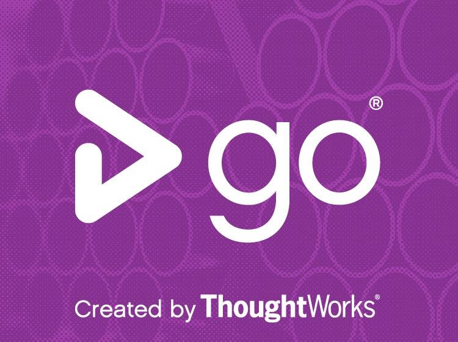
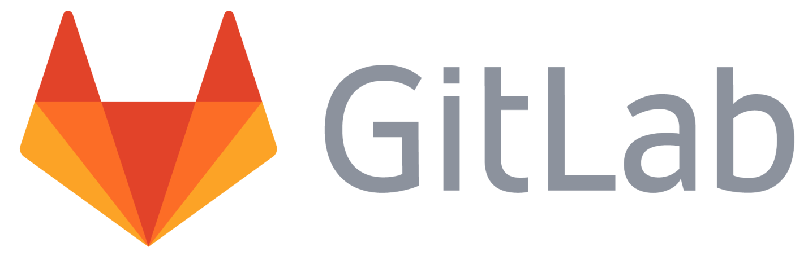
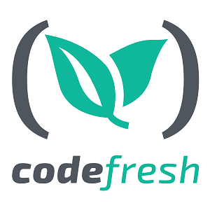
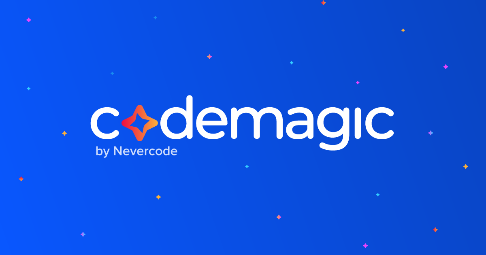
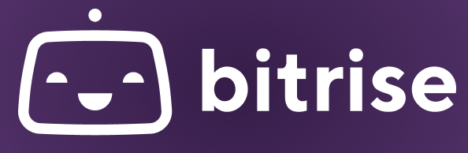
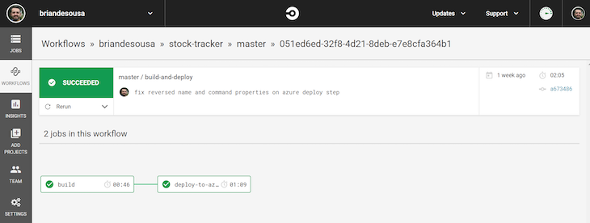
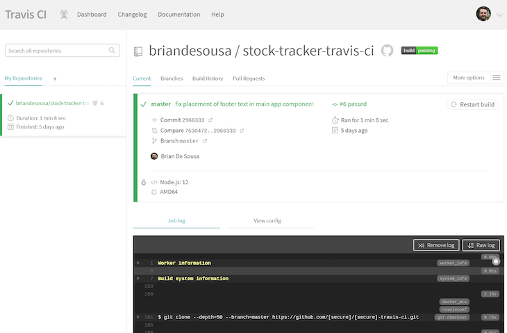
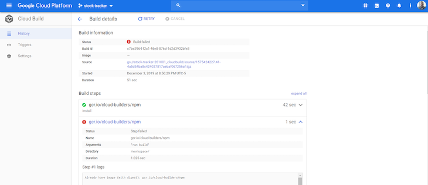

# CI Tools

Continuous Integration (CI) and Continuous Delivery (CD) (or CI/CD) has become an integral part of software development and DevOps testing. It provides developers the necessary features so that they can deploy the code continuously. It detects bugs at an early stage and avoids integration problems due to frequent committing of source code. With so many CI/CD tools available in the market, it becomes essential to choose the best CI/CD tools that suit the budget and project requirements. To make it easy for you, we have created this list, which we hope will help you choose the best CI/CD tool.

In this CI tutorial, you will learn:

- [1-Jenkins](#1-jenkins)
- [2-TeamCity](#2-teamcity)
- [3-CircleCI](#3-circleci)
- [4-Travis CI](#4-travis-ci)
- [5-Bamboo](#5-bamboo)
- [6-GoCD](#6-gocd)
- [7-CodeShip](#7-codeship)
- [8-GitLab CI](#8-gitlab-ci)
- [9-Jenkins X](#9-jenkins-x)
- [10-Shippable](#10-shippable)
- [11-Buildkite](#11-buildkite)
- [12-Concourse CI](#12-concourse-ci)
- [13-Codefresh](#13-codefresh)
- [14-Buddy](#14-buddy)
- [15-Buildbot](#15-buildbot)
- [16-Semaphore](#16-semaphore)
- [17-Wercker](#17-wercker)
- [18-Integrity](#18-integrity)
- [19-Weave Flux](#19-weave-flux)
- [20-Codemagic](#20-codemagic)
- [21-AutoRABIT](#21-autorabit)
- [22-CruiseControl](#22-cruisecontrol)
- [23-Bitrise](#23-bitrise)
- [24-Drone CI](#24-drone-ci)
- [25-UrbanCode](#25-urbancode)
- [26-Strider](#26-strider)
- [27-FinalBuilder](#27-finalbuilder)
- [28-GitHub Actions](#28-github-actions)
- [29-Azure DevOps](#29-azure-devops)
- [30-Terraform](#30-terraform)
- [31-Tekton](#31-tekton)
- [32-Spacelift](#32-spacelift)

## 1-Jenkins

[Jenkins](https://www.jenkins.io/) is a Java-based cross platform, open-source CI/CD tool. It offers continuous integration, along with facilitating continuous delivery. It also enables real-time testing and reporting. Jenkins can be installed by just downloading its executable in the .war format and starting the same from the terminal.

Jenkins Pipeline provides a set of tools that can be used for modeling delivery pipelines ‘as code.’ Jenkins implements the pipeline using DSL (Domain Specific Language). It is one of the widely used and best CI/CD tools as it is open-source and has existed for a long time.

### Salient features of Jenkins

- Available for Windows, Linux, and macOS platforms.
- Free and open-source hence, it is preferable for startups as well as large-scale organizations.
- 16.3K Star & 6.5k Forked Repo on GitHub.
- Highly extensible.
- It has a thriving plugin ecosystem (1500+ plugins) and a best-in-class community.
- Integrates with popular cloud platforms such as AWS, Google Cloud, Azure, Digital Ocean, and more.
- Can be leveraged for performing work in parallel and realizing complex CD requirements.
- The installer in the .war format that is a stand-alone Java application and works out of the box.

Check out the [Best Jenkins Pipeline Tutorial For Beginners [Examples]](https://www.lambdatest.com/blog/jenkins-pipeline-tutorial/)

## 2-TeamCity

[TeamCity](https://www.jetbrains.com/teamcity/) is a server based CI/CD pipeline tool in Java. It is developed and maintained by JetBrains, the company behind the development of several useful tools like PyCharm, IntelliJ Idea, and more. It is available for installation on Windows and Linux Servers.

TeamCity is free to use for open-source projects and offers small teams an easy option to integrate with Azure DevOps and Jira Software Cloud. It also supports launching build agents in the Kubernetes cluster.

### Salient features of TeamCity

- Highly extensible and can be customized for reusing settings of a project to the sub-project.
- It can run parallel builds, thereby providing the flexibility to run builds simultaneously on different builds and environments.
- Pipelines in TeamCity are defined using Kotlin-based DSL (Domain Specific Language).
- Integrates with Docker, Visual Studio Team Services, Maven, NuGet, and more.
- Its on-premise variant integrates with popular cloud platforms like Google Cloud, AWS, VMWare vSphere, and more.
- It provides powerful features that enable running history, viewing test progress (and history) reports on-the-fly, and adding builds to favorites.

## 3-CircleCI

[CircleCI](https://circleci.com/) is one of the best CI/CD tools that is suited for realizing CI/CD for open-source projects and large-scale projects. CircleCI Cloud is its cloud-based offering whereas CircleCI Server is its on-premise (or self-hosted) solution.

It supports languages that can be built on Windows, Linux, and macOS platforms. It is easy to set up and uses a proprietary YAML syntax for its pipelines. In 2019, Forrester Wave named CircleCI as a leader in Cloud Native continuous integration.

### Salient features of CircleCI

- Easy to set up and can be used with popular version-controlling systems like GitHub, Bitbucket, and more.
- It offers CI/CD pipelines as ‘Workflows.’
- It supports the majority of the popular programming languages out of the box.
- For reducing the build time, builds can be split and balanced across multiple containers.
- Parallel testing in CircleCI helps in running tests in parallel across different executors.
- Tests can be separated using timing data that further helps in reducing the time involved in test execution.
- CircleCI Server, which is CircleCI’s on-premise offering, can be integrated with popular third-party tools like GitHub Enterprise, LambdaTest, Coveralls, and more.
- CircleCI Server supports widely-used cloud platforms like AWS, Google Cloud, Azure, and more.
- CircleCI Orbs, which are reusable snippets of code, help in automating repetitive processes and accelerating the integration with third-party tools.

## 4-Travis CI

Like Jenkins, [Travis CI](https://travis-ci.org/) is also one of the early movers in the CI/CD pipeline tools market. It was initially rolled-out only for open-source projects and later migrated to support closed-source projects as well.

Written in the Ruby programming language, Travis CI is one of the best CI/CD tools for open-source & enterprise-level projects, if your projects are in GitHub or Bitbucket. Like CircleCI, Travis CI also has different offerings for the open-source community and enterprises that intend to use Travis CI on their private Cloud (or self-hosted platform).

### Salient features of Travis CI

- Travis CI supports a whole range of programming languages (i.e., a total of 30 in number), including Java, C#, Julia, Python, and more.
- Enterprises looking for more privacy and secured solutions can opt for Travis CI Enterprise, a self-hosted tool that offers seamless integration with GitHub and Bitbucket.
- CI/CD pipelines use a proprietary YAML syntax, with seamless integration with GitHub Enterprise tools.
- You can use the Cloud (or SaaS) variant of Travis CI for open-source projects and enterprises with small team sizes.
- It provides runtimes on popular platforms like Linux, macOS, and Windows.
- The build matrix feature in Travis CI lets you perform parallel builds on a range of combinations comprising different environments, languages, and runtimes.
- Travis CI Enterprise supports integration with popular cloud platforms like AWS, Google Cloud, Kubernetes, Azure, and more.
- Integration with a cross-browser testing tool like LambdaTest helps perform testing across different combinations of browsers, platforms, and devices (emulators).

Comparing The Best CI/CD Tools: [CircleCI vs Travis CI](https://www.lambdatest.com/blog/circleci-vs-travis/)

## 5-Bamboo

[Bamboo](https://www.atlassian.com/software/bamboo) is a popular tool for Continuous Integration (CI). It is an enterprise product developed by Atlassian, the organization behind the creation of Jira that provides the facility for performing builds, tests, and releases in a single window.

It only works seamlessly with Jira but also works with popular SCM tools like Bitbucket. It is available for deployment on popular platforms like Windows, Linux, and macOS. Like other popular CI/CD pipeline tools, Bamboo also supports many programming languages, along with technologies like AWS, SVN, Git, and more.

### Salient Features of Bamboo

- Bamboo offers seamless migration from an open-source CI/CD option like Jenkins to its platform.
- It has built-in integration with Jira Software and Bitbucket server.
- Bamboo can integrate with popular tools (or platforms) like Docker, AWS, and more.
- It can realize parallel builds by executing builds on remote build agents. It can support up to 100 remote build agents and parallel test batches on the agents.
- Bamboo is available in self-hosted and cloud-based variants.
- Based on changes in the repository, Bamboo can trigger the builds, and you can subsequently send push-notifications from Bitbucket.

## 6-GoCD

[GoCD](https://www.gocd.org/download/) is an open-source Continuous Integration server from the folks at Thoughtworks. In comparison to the other CI/CD DevOps tools, its major differentiator is the [Value Stream Map](https://www.gocd.org/getting-started/part-3/#value_stream_map) (VSM) feature. VSM is a full end-to-end view across pipelines, and it successfully maps it to the concept of ‘Deployment Pipeline’ or ‘Continuous Delivery Pipeline.’

The provision to chain pipelines helps in reducing the interdependence between teams.

### Salient features of GoCD

- It is easy to configure dependencies in GoCD.
- Unlike other CI/CD pipeline tools that only support YAML format for describing pipelines, GoCD lets you implement ‘pipeline as code’ in YAML and JSON formats.
- VSM in GoCD gives a complete real-time visualization of the end-to-end implementation of the workflow.
- GoCD still has an evolving plugin ecosystem even though its plugin ecosystem is not as extensive as Jenkins.
- GoCD handles user authentication and user authorization.
- It is one of the best CI/CD tools, as it can work with Windows, macOS, Docker, and more.
- Like other CI/CD pipeline tools, it is easy to configure dependencies in GoCD. It also supports parallel execution, which is a must-have feature for DevOps testing.

## 7-CodeShip

[CodeShip](https://codeship.com/) is a hosted Continuous Integration platform. If your organization uses GitHub for version controlling systems, CodeShip could be a huge value-add. The primary reason being its capability to enable testing, build, and deployment directly from GitHub projects.

It follows a freemium pricing model where 100 builds per month are free for unlimited projects. CodeShip’s simple UI and turnkey environment make it super easy to get builds & deployments in a few minutes.

### Salient Features of CodeShip

- Using CodeShip, developers have tight control over the design of CI/CD systems. Also, they can customize the environment and workflow as per their requirements.
- It supports a wide range of integrations options – security scanning tools, on-premise SCMs, deployment tools, and notification tools.
- It provides a simple web interface that makes setting up CI/CD super easy.
- It comes in two versions – CodeShip Basic and CodeShip Pro.
- It supports [Parallel test pipelines](https://codeship.com/features/basic/parallel-test-pipelines) on both the variants of CodeShip, and the implementation happens in codeship.yml.
- It provides the flexibility to set up teams and assign permissions to teams (or a set of team members).
- You can debug the builds from the CI environment itself by using SSH
- You can declare Caching per service, preventing the Docker image from building from scratch each time, thus speeding up the CI/CD process.
- Multi-stage builds are suitable for the easy creation of builder workflows. It also aids in reducing the image size of the final Docker image.

## 8-GitLab CI

[GitLab CI](https://docs.gitlab.com/ee/ci/) is a tool that is built into GitLab. It is one of the best CI/CD tools since it offers a host of features like code reviews, CI/CD, continuous deployment, and more within a single dashboard.

For using GitLab CI/CD, you need to host the codebase in a Git repository and specify the scripts for performing a build, test, and deployment in a YAML file named .gitlab-ci.yml, which should be present in the root directory. The scripts group into jobs, and together they are referred to as a pipeline. The [GitLab runner](https://docs.gitlab.com/runner/) tool detects the scripts and runs the same.

### Salient Features of GitLab CI

- GitLab CI offers developer APIs – using which third-party developers can create a deeper integration into their products.
- It is available for widely-used platforms like Windows, Linux, and macOS.
- GitLab CI’s web application has a user-friendly interface.
- GitLab CI issues parallel builds by splitting a single build into multiple machines to minimize the build time.
- The caching mechanism in GitLab CI is instrumental in saving time when jobs are running. You can share the cache across the same branch and different branches, and it is also possible to disable cache on specific jobs. With so many GitLab CI options, it is possible to leverage the caching mechanism on a need basis.
- Jobs in GitLab CI can run sequentially in parallel. It also offers the option to define a custom pipeline.
- It is easy to migrate from a tool like Jenkins or CircleCI to GitLab CI.
- GitLab CI is easy to use as builds can be triggered through GitLab CI’s shell executor (which is very much similar to any terminal-based program).

See how to [Build An Automated Testing Pipeline With GitLab CI/CD & Selenium Grid](https://docs.gitlab.com/runner/)

This GitLab Tutorial for beginners and professionals will help you learn how to use GitLab, one of the most popular CI/CD tools used in DevOps.

## 9-Jenkins X

[Jenkins X](https://jenkins-x.io/) is an open-source project that primarily offers automated CI/CD for cloud-native applications on Docker and Kubernetes. Jenkins X is not here to replace Jenkins.

Though it is relatively new compared to Jenkins, it has still garnered interest from the developer community. Its architecture follows the DevOps model of loosely coupled architectures. Jenkins X is designed to deploy several distributed microservices in a repeatable fashion across distributed teams.

### Salient features of Jenkins X

- Supports Automation using the pipeline.
- The built-in GitOps methodology manages the environment. Hence, you can create different virtual environments for development, staging, production, etc. Each environment has its specific configuration and applications stored in the Git repository.
- Jenkins X creates ‘Preview Environments’ for each pull-request. This helps the team in better collaboration and accelerating their software delivery, as they can have the opportunity to look at the effect of their changes before merging them in the repository.

## 10-Shippable

[Shippable](https://www.shippable.com/) is one of the leading CI/CD tools developed by the software firm – Jfrog. The DevOps team can use it for making software releases predictable, frequent, and error-free. Moreover, it helps to achieve the same by connecting the DevOps tools and activities into an event-driven & state-based workflow.

You can integrate it with popular tools in categories such as testing (e.g., Cucumber, JUnit, xUnit, Nose, etc.), source control (e.g., GitHub, GitHub Enterprise, Bitbucket, etc.), deployment (e.g., Docker, Amazon ECS, Google Container Engine, Kubernetes, etc.), notifications (e..g Slack, HipChat, etc.), and more.

The Shippable SaaS variant can be deployed on the public Cloud, whereas Shippable Server can be deployed on a private cloud (or self-hosted platform).

### Salient features of Shippable

- It is available for popular platforms like Windows, Linux (e.g., Ubuntu, CentOS, etc.).
- Shippable is available in a SaaS variant and Enterprise variant (which is suited for enterprises that are looking for CI/CD pipeline tools on a self-hosted platform).
- It integrates with a range of DevOps tools and repositories.
- Its automation platform with Docker support simplifies provisioning, building, testing, and deploying any application anywhere.
- Shippable, which is available in JFrog as [JFrog Pipelines](https://jfrog.com/pipelines/) accelerate features & product shipment, as it automates everything from CI, CD, infrastructure, and more. Pipelines are available for use in Shippable SaaS as well as Shippable Server.

## 11-Buildkite

[Buildkite](https://buildkite.com/) is a CI/CD pipeline tool that lets developers run fast, secure, and scalable pipelines with on-premises infrastructure. It is free for open-source projects, students, and teaching organizations.

Organizations also have the option to run [open-source Buildkite](https://github.com/buildkite) agents on their infrastructure. You can install it on popular platforms such as Windows, Linux, macOS, and Docker. In Buildkite, build’s jobs can be run parallelly by running multiple agents and running the job in parallel over all the agents.

### Salient Features of Buildkite

- Buildkite can be installed on Windows, Linux, and also as a Docker image.
- It has a growing [plugin](https://buildkite.com/plugins) ecosystem.
- It is used for major programming languages.
- Parallel testing is possible by scaling the Buildkite agents and running the job in parallel across the agents.
- Buildkite Enterprise also offers in-depth auditing as logging keeps a track record of the actions taken by the users in the organization.
- Buildkite’s centralized platform provides improved visibility into the company’s engineering and the provision to create internal tools using GraphQL APIs.
- You can integrate with popular tools like HipChat, Slack, Campfire, and more.
- Prioritized Support and private consultations (for Buildkite Enterprise customers) with guaranteed response times for high-priority issues.

## 12-Concourse CI

[Concourse CI](https://concourse-ci.org/) is another CI/CD tool from the stable of open-source CI/CD tools. The build is triggered over Docker containers. It comes with a web interface with intuitive UI that makes it easy to analyze the dashboard and check if there are any issues with the build execution.

Built on the mechanics of tasks, jobs, and resources, it handles every task (in a job) in a separate container, thereby ensuring that dependencies are controlled and builds do not interfere with each other.

### Salient Features of Concourse CI

- Concourse CI when used with Git, can be configured to set automatically, update, and archive pipelines using the set_pipeline step.
- Every job in the Concourse pipeline has a building plan with detailed information about the job’s dependencies.
- The intuitive web UI makes it easy to visualize the pipeline, and a single click will fetch details about the failed job.
- Every task runs in containers, which ensures a clean environment on every run.
- Troubleshooting flaky builds in Concourse CI is super easy with the fly_intercept command that gives detailed insights into your build’s containers.
- Concourse CI follows a simple plugin system with immense focus on the resource (or single strong abstraction) implemented by [resource_types](https://concourse-ci.org/resource-types.html).

## 13-Codefresh

[Codefresh](https://codefresh.io/) is a CI/CD platform built on Kubernetes. It is built for achieving superior speed and unlimited scalability. It comes with complete GitOps support.

With the Kubernetes Dashboard offered by Codefresh, it is easy to monitor all the clusters for deployment, execution, and more. It provides improved visibility into the build process, features like a release dashboard with 1-click rollbacks, a built-in chart repository, etc. to manage Helm releases in a simplified way.

Its CLI called [‘Codefresh Runner’](https://codefresh.io/features/codefresh-runner/) provides a secure and scalable way to run and deploy on a Kubernetes cluster. Like other CI/CD pipeline tools, Codefresh also offers a cloud variant and an on-premise variant.

### Salient Features of Codefresh

- Codefresh can be deployed on AWS, Azure, Kubernetes, and more.
- Each step in Codefresh is a container. Hence, you can rescue the same step across pipelines without being worried about dependencies.
- Built-in step libraries make it easy to add and remove services on a need basis.
- Along with integration with popular tools like GitHub, Bitbucket, GitLab, Slack, etc.; Codefresh can be integrated with Terraform, Pulumi, Puppet, and more.
- In line with the best CI/CD tools, Codefresh also supports parallelism in build and testing. However, Codefresh is one of the selected CI/CD tools that provides built-in tools for debugging pipelines. This can be done by putting breakpoints in the CI/CD pipeline. Live debugging of the pipeline makes it easy to rectify pipeline issues and test the CI/CD pipeline after making necessary changes in the pipeline.

## 14-Buddy

[Buddy](https://buddy.works/) is a web-based CI/CD pipeline tool that can be used to build, test, and deploy websites and apps with code from GitHub, Bitbucket, and GitLab. It is easy to create workflows in Buddy.

Being available in [public Cloud and on-premise variants](https://buddy.works/pricing), the Cloud and on-premise solutions include Docker layer caching, concurrent pipelines & steps, parallel building & testing, repository & artifacts caching, and vCPU & RAM scaling. Along with integration with Docker, Kubernetes, you can use it with Blockchain technology. All the builds and commands in Buddy run in isolated Docker containers.

Buddy also supports integration with popular cloud providers like AWS, Digital Ocean, Kubernetes, Microsoft Azure, Rackspace, and more.

### Salient Features of Buddy

- Buddy provides several actions (akin to CircleCI Orbs) that help create triggers and actions that developers can use to integrate and automate the app.
- There are actions for cloud providers like AWS, Digital Ocean, Google Cloud, build actions for .NET, Angular, Python, Ruby, Cypress, etc.; actions for Kubernetes, Android, etc.; actions for notifications like Slack, Email, etc. [Actions in Buddy](https://buddy.works/actions) helps in accelerating the build, test, and deployment process.
- Pipeline setup in Buddy is easy, as the configuration can be done via the GUI. There is a facility for instantly exporting the pipeline configuration to a YAML file (for using Pipeline as Code).
- It offers top-notch performance since dependencies, and Docker layers are cache in isolated containers.
- Configuration can be done using the GUI and YAML files, making it easy for non-technical folks to create and manage pipelines.

## 15-Buildbot

[Buildbot](https://buildbot.net/) is a Python-based Continuous Integration testing framework. It acts more like a job scheduling system where it queues jobs, executes jobs (as and when the necessary resources are available), and generates the reports.

It can be used on popular platforms like Windows, Linux, macOS, etc. and integrates with popular version control systems. It also offers parallel execution of jobs across the supported platforms.

### Salient Features of Buildbot

- Along with supporting Continuous Integration testing, Buildbot also provides automation of complex build systems, application deployment, and software release management.
- The setup and installation process of Buildbot is super easy.
- Buildbot can be used with Docker images.
- The availability of command-line tools like [buildbot and buildbot-worker](http://docs.buildbot.net/current/manual/cmdline.html) makes it easy to handle Buildbot master and Buildbot worker.
- Testing can be performed on multiple platforms, and code changes in one platform do not hinder the tests being executed on other platforms.
- Buildbot can accelerate the build and testing process through distributed and parallel execution of jobs.
- Advanced users of Buildbot can leverage its range of [customizations](http://docs.buildbot.net/current/manual/customization.html) for realizing customized build applications.

## 16-Semaphore

[Semaphore](https://semaphoreci.com/) is one of the best CI/CD tools that allows continuous integration and deployment on the Cloud. Like Travis CI and CircleCI, this CI/CD tool also comes with seamless integration with GitHub.

Using CI/CD pipelines offered by Semaphore, iOS developers can test and deploy their apps in an accelerated manner. Like other CI/CD tools, Semaphore also provides programmable pipelines for sequential builds and parallel builds.

### Salient Features of Semaphore

- Semaphore can be used for automating build, test, and deployment activities on platforms like Linux, Android, and macOS.
- With Semaphore, you can run CI/CD in any Docker image and speed up deployment to Kubernetes on the Cloud.
- It supports a range of programming languages like C#, Python, Java, PHP, Ruby, Rust, and iOS & Android apps.
- It provides seamless integration with popular SCM tools like GitHub and Bitbucket.
- With Semaphore, failures can be debugged in seconds by using its CLI for inspecting logs. SSH can also be used for getting insights into the running jobs.
- The on-premise variant of Semaphore is under development and might release soon.

## 17-Wercker

[Wercker](https://devcenter.wercker.com/) by Oracle is a Docker-based Continuous Delivery platform that helps developers accelerate the build and deployment of their apps and microservices. Build and Deploy pipelines can be executed using [Wercker’s CLI](https://github.com/wercker/wercker). Wercker triggers the pipeline when any new code is committed.

Wercker can be integrated with Git and popular notification systems like HipChat, Slack, and Email. Before using Wercker, the user needs to create a [user account on Wercker](https://app.wercker.com/) (which can also be done through GitHub) or sign-in using an Oracle Cloud account. Wercker offers two plans – a free plan and a virtual private cloud plan.

### Salient Features of Wercker

- Wercker supports integration with popular tools in the CI/CD marketplace (e.g., Slack, HipChat, etc.).
- It can be integrated with popular versioning systems like GitHub, GitLab, Bitbucket, and more.
- The web-based dashboard has a simple and friendly user interface.
- The SaaS offering from Wercker can be operated from the local machine using CLI from Wercker.
- The Steps Marketplace consists of standard task templates that can fetch easily through the Steps Registry. This ensures that developers spend time on development activities that matter to the project.

## 18-Integrity

[Integrity](http://integrity.github.io/) is a Continuous Integration server built using Ruby. It works only with GitHub. If you are using SCM tools (other than GitHub), Integrity can be used by mirroring the repositories (i.e., GitHub mirrors the other SCM). On successful mirroring, Integrity can use the project.

The only downside with this approach is that any change in the SCM repository requires an update in the GitHub mirrors. Hence, mirrored repositories have to be updated continuously.

### Salient Features of Integrity

- It works seamlessly with Git but requires extra effort to make it work with other SCM tools.
- Integrity builds and runs the code once the code is committed.
- It immediately generates reports and sends notifications to the user.
- It is easy to install, as it is a command-line installation.

## 19-Weave Flux

[Weave](https://www.weave.works/oss/flux/) by Flux enables continuous delivery of container images. It ensures that deployment is reproducible, auditable, and revertible by following version control at every step.

Flux acts like an operator in a cluster for triggering deployments inside Kubernetes. It ensures that the state of the clusters matches the config that is available in Git. The CI tool named fluxctl can be used by the developer to set up automation tasks (e.g., automatically updating the container whenever a new image has been pushed to the container registry).

### Salient Features of Weave Flux

- Flux is a prominent, continuous deployment tool used at the end of the Continuous Delivery pipeline.
- Flux ensures that the new images and the config changes have propagated to the cluster.
- It increases speed and reliability by providing version control for Kubernetes manifests and accordingly modifies them to include all the pushed image versions.

## 20-Codemagic

Another CI/CD tool in our best CI/CD tools list is Codemagic. It is a CI/CD tool for mobile applications that supports the development of Flutter, React Native, Ionic, Cordova, Native Android, and Native iOS apps. With Codemagic CI/CD, you can set up the pipeline to create your app using your preferred framework via the YAML pipeline.

Codemagic was the first CI/CD tool designed specifically for Flutter. Now it also supports non-Flutter apps that use *codemagic.yaml*. It enables it to create, test, and deploy native Android and iOS apps with Flutter modules.

### Salient Features Of Codemagic

- Codemagic is a scalable CI/CD tool that provides 500 minutes of free build time. If your build minutes are exhausted, your builds will simply stop until the next month arrives and your 500 minutes are renewed.
- It offers a solid Slack support channel where you can ask questions and get assistance. If your build fails, even if you are a free user, you can still ask questions and get help from the Codemagic team.
- Codemagic has flexible pricing if you wish to upgrade your existing plan. Also, Codemagic has an updated tech stack.

## 21-AutoRABIT

If your organization is looking for a complete CI/CD tool that works seamlessly (or is tailor-made) for the Salesforce platform, you have to check out [AutoRABIT](https://www.autorabit.com/).

It delivers the fastest CI/CD solution for Salesforce and [Salesforce Testing](https://www.lambdatest.com/testing-cloud/salesforce-testing), and can be scaled to cater to large teams and handle complexities in coordinating across multiple Salesforce centers.

### Salient features of AutoRABIT

- AutoRABIT is a CI/CD pipeline tool custom-made for Salesforce.
- With one-click deployments, AutoRABIT can deploy differences 30x times faster as it avoids the necessity to take manual snapshots.
- AutoRABIT is tailor-made for Salesforce; hence, setting up this CI/CD tool is easy since it eliminates the extra effort involved in installing Salesforce specific tools in developer’s systems.
- It supports more than 120+ metadata types leading to faster deployments.
- It enhances the Salesforce DX experience due to its friendly user-interface.
- AutoRABIT works with effective version control systems. It fetches changes from the version control system, thereby synchronizing releases across geographically disparate sandboxes.

## 22-CruiseControl

[CruiseControl](http://cruisecontrol.sourceforge.net/) is a Java-based Continuous Integration tool as well as an extensible framework. It is primarily used for creating a custom build process. The project is hosted on SourceForge, and the project is licensed under a BSD-style license.

It offers a simple and user-friendly interface that provides information about the current build and the previous builds. It also provides a wide range of plugins in source control, building technologies, and notification schemes.

### Salient Features of CruiseControl

- It is an open-source CI/CD pipeline tool that has a user-friendly interface.
- It offers many [plugins](http://cruisecontrol.sourceforge.net/main/configxml.html) that can help in accelerating the CI/CD process.
- Multiple projects can be built on a single server using CruiseControl.
- It supports several builders like Ant, Maven, NAnt, Phing, Rake, and Xcode.
- It can be integrated with popular SCM tools like Git, SVN, ClearCase, Perforce, and more.

## 23-Bitrise

[Bitrise] is one of the best CI/CD tools that offer mobile-first features instrumental in building, testing, and deploying mobile apps at an accelerated pace. It is a cloud-based CI/CD tool that eliminates the need to invest in expensive hardware. It is free to use for individual mobile-app developers and open-source projects.

It can run builds on macOS and Linux machines. Bitrise supports major programming languages (including languages for building mobile apps) like Kotlin, Swift, Objective C, Cordova, Iconic, Reactive Native, Flutter, and more.

### Salient Features of Bitrise

- Bitrise can work seamlessly with the public, private, and ad-hoc Git service(s), including GitLab, GitHub, GitHub Enterprise, GitLab Enterprise, Bitbucket, and more.
- The [Bitrise CLI](https://app.bitrise.io/cli/) helps in running workflows from Bitrise from the local machine. A single terminal command can be used for automating the local development process.
- Bitrise offers Bitrise Enterprise Build Platform (Bitrise EBP), a private cloud solution for enterprises looking for advanced security, flexibility, and high-availability in the CI/CD platform.
- It allows [integrations with popular tools](https://www.bitrise.io/integrations/steps) for Access control (e.g. connect to OpenVPN Server, activate SSH key, etc.), Deployment (e.g. deploy to Amazon S3, sync Amazon S3 bucket, etc.), notifications (e.g. comment on GitHub pull request, Flowdock notification, etc.), code signing (e.g. certificate and profile installer, Android signing, etc.), and more.

## 24-Drone CI

[Drone CI](https://drone.io/) is one of the best and modern CI/CD pipeline tools. It not only provides Continuous Integration but also provides a distributed CI/CD pipeline. This feature is not available in other open-source CI/CD tools like Jenkins. Using a powerful cloud-native pipeline engine, Drone lets you automate build, test, and release workflows.

Drone CI is a cloud-native, scalable & flexible, and DevOps friendly CI/CD tool. Each pipeline step in Drone CI is executed in an isolated Docker container downloaded during runtime. It can be used with popular operating systems like Windows, Linux, and macOS. It also supports the ARM architecture (which is predominantly used in mobile phones).

It offers Cloud (or Open Source) variant, free for use, and Drone Enterprise that can be deployed on popular platforms like Google Cloud, Open Stack, Amazon EC2, and more.

### Salient Features of Drone CI

- Pipelines are executed in isolated Docker containers ensuring that builds do not conflict with each other.
- Drone CI (Cloud and Enterprise) can be seamlessly integrated with popular SCM tools like GitHub, GitHub Enterprise, Bitbucket, and GitLab.
- Drone CI can work with any programming language, database, or service to run inside a Docker container.
- It supports parallel building and testing, including cross-browser testing through integration with LambdaTest.
- Drone CI can be installed within minutes, as it only requires downloading the official Docker image and installing the same.
- Drone Cloud is entirely free for open-source projects.
- Drone CI (Cloud and Enterprise) has a growing [plugin ecosystem](http://plugins.drone.io/) where you can find plugins for cloud integration, reporting, testing, notifications, and more.

## 25-UrbanCode

[UrbanCode](http://www.urbancode.com/) from IBM is a CI/CD tool that is suited for enterprises that require a range of tools for effective management of their complex builds. It enables continuous delivery through a more stringent process that comprises a combination of on-premises, Cloud, and mainframe applications.

[UrbanCode Build](https://www.urbancode.com/product/build/) is a Continuous Integration (CI) and build management server optimized for usage by enterprises. The building infrastructure configuration and management can be scaled to plugin development, testing, and release tooling seamlessly.

On the other hand, [UrbanCode Deploy](https://www.urbancode.com/product/deploy/) is a Continuous Deployment (CD) tool used to automate application deployments through your environment. UrbanCode Deploy provides improved visibility about the deployment along with automated provisioning & de-provisioning of cloud environments.

### Salient Features of UrbanCode

- It is one of the best suited CI/CD tools for large-scale enterprises.
- UrbanCode (Build and Deploy) can be integrated with several [tools](https://www.urbancode.com/plugins/) like Bitbucket server, Box, ClearCase SCM, Cucumber, and more.
- It also supports integration with cloud providers like Amazon EC2, AWS, Azure DevOps, and more.
- UrbanCode Deploy (i.e. CD tool) can be integrated with middleware, provisioning, and service virtualization.
- It provides enterprise-level security and scalability.
- UrbanCode provides project templates that make it easy to manage different configurations.

## 26-Strider

[Strider](https://strider-cd.github.io/) is one of the widely used open-source CI/CD pipeline tools. It is written using NodeJS/JavaScript. MongoDB is used as the back-end database storage. Like Jenkins, Strider is also extensible and has a thriving plugin ecosystem.

Extensions in Strider are npm packages containing additional metadata available in a file named strider.json. Strider extensions can be loaded using the [Strider Extension Loader](https://github.com/Strider-CD/strider-extension-loader). Strider can be integrated with popular tools such as GitHub, GitLab, GitHub Enterprise, Heroku, Bitbucket, and more. It also provides the facility to test hosted repositories by connecting the GitHub and Bitbucket accounts to Strider.

### Salient Features of Strider

- Strider deployment is supported by popular languages such as NodeJS, Python, and Ruby.
- The functionalities offered by Strider can be extended and customized by integrating plugins.
- It supports Docker
- It supports integration with version control tools (e.g., GitHub, GitHub Enterprise, Bitbucket, etc.).
- It can be easily integrated with Heroku, making it easy to deploy the tested code to Heroku. Slack can be leveraged for receiving notifications.

## 27-FinalBuilder

[FinalBuilder](https://www.finalbuilder.com/downloads/finalbuilder) uniqueness is that it is categorized as an ‘Automated Build Tool’ rather than a specific CI/CD DevOps tool. For automating the build process, FinalBuilder provides an interface that lets you define and debug build scripts. There is no need to edit XML files or YAML files like we have seen in other CI/CD tools.

The scripts created using the graphical interface can be scheduled using a Windows scheduler, or it can be integrated with the best CI/CD tools like Jenkins, Continua CI (a CI tool by VSoft), or any other CI tool of your choice. Automating the build process using FinalBuilder is efficient and easy, as the easy-to-use graphical interface gives a clear-cut visual outline of the build process.

### Salient Features of FinalBuilder

- The easy-to-use graphical interface makes it easy to automate the build process.
- It can be integrated with popular CI tools like Jenkins, Continua CI, or other CI/CD DevOps tools.
- FinalBuilder provides an extensive library of 600+ pre-written scripts, which are called actions. It can be integrated with popular version control systems, testing tools, as well as compilers.
- Its tight integration with the Windows Scheduling Service lets you schedule builds on a need basis.

## 28-GitHub Actions

Introduced in 2018, [GitHub Actions](https://github.com/features/actions) is a comparatively new tool to perform the CI/CD. With GitHub Actions, you can easily create custom SDLC workflows in your GitHub Repo directly. This can be done using different tasks/actions, which can further run on certain events automatically. Below are some more reasons why developers would love using this tool.

### Salient Features of GitHub Actions

- You can create, share, reuse, and fork your software development practices.
- It is fully integrated with GitHub, making it manageable from a single place.
- You can perform multi-container testing by adding support for Docker.
- You can choose from multiple CI templates or even create your own.
- Include 2000 free build minutes/month for all your private repositories.

## 29-Azure DevOps

[Azure DevOps](https://azure.microsoft.com/en-in/services/devops/) by Microsoft Azure presents a simple process for creating a continuous integration (CI) and continuous delivery (CD) pipeline to Azure. It includes advanced capabilities that are streamlined to accelerate the software development process. These capabilities include features from Azure DevOps services like Azure Pipelines, Visual Studio Team Services (VSTS), Software Delivery Services, and more.

### Salient Features of Azure DevOps

- It has all of the tools that you need for Continuous Integration/Continuous Delivery.
- Providing features like Version Control Systems, code repository management, build automation, and integration with Visual Studio Team Services.
- It also integrates with the code of different programming languages and application types.
- The application can be deployed to different environments such as Virtual Machines or Containers.

Start running your Selenium tests in Azure DevOps pipeline.
## 30-Terraform

[Terraform](https://www.terraform.io/) by HashiCorp provides a way to codify APIs into declarative configuration files and manage changes to those cloud resources across different providers. Terraform treats cloud infrastructure as code, enabling you to manage 1000s of cloud resources with the reliability and reproducibility of software.

### Salient Features of Terraform

- Define infrastructure as code to create new resources, manage existing ones, and destroy those no longer needed.
- Codify your application infrastructure.
- Create and Manage infrastructure across clouds.
- Installable modules.
- Plan and predict changes.
- Dependency graphing.
- State management.
- Terraform Registry with 500+ providers.

## 31-Tekton

[Tekton](https://tekton.dev/) is an opinionated framework that takes the guesswork out of building a modern CI/CD system, so you can get back to building your product. At its core, Tekton powers some of the largest Kubernetes-native deployments on Azure and AWS. From its simple declarative syntax, you can express multi-stage build processes with parallel execution, use templates to manage complexity and describe your immutable infrastructure in code, define complex validations for your pipeline that will be checked at build-time, and a lot more.

### Salient Features of Tekton

- Standardize your CI/CD tooling
- Built-in best practices for Kubernetes
- Run on hybrid or multi-cloud
- Get maximum flexibility

## 32-Spacelift

Spacelift is the most flexible CI/CD tool for Infrastructure-as-Code (IaC) and Policy-as-Code (PaaC). Spacelift makes it easy to build, deploy, and manage infrastructure; whether it is on-prem or in the cloud.

It works with existing toolsets like Terraform, Chef, Ansible, Packer, SaltStack, Docker, etc.; thereby providing a unified workflow for any infrastructure environment. The provision of web-based interface and command-line tools makes it easy to get started with Spacelift.

The most common use of Spacelift is that of a deployment system that interacts with other CI/CD systems such as Jenkins or Bamboo. This helps to trigger automated builds and tests before changes are deployed to the production environment.

### Salient Features of Spacelift

- Spacelift is an automated build system, mostly driven by Git push and tag events. It can also be customized using policies
- It provides out-of-the-box SAML 2.0 SSO support. This makes it easy to connect your application to any identity provider.
- It uses Policy-as-Code that helps you declare your infrastructure’s access, use Git workflows, state changes, and relationships between projects.
- It can be easily integrated with GitHub, Bitbucket, GitLab, etc. for easy management of repositories.
- Plugin-based architecture of Spacelift makes it extensible with specific source control systems, build tools, and more.

# Comparisons of CI Tools

## Azure Pipeline vs Jenkins

Developers describe **Azure DevOps** as "Services for teams to share code, track work, and ship software". Azure DevOps provides unlimited private Git hosting, cloud build for continuous integration, agile planning, and release management for continuous delivery to the cloud and on-premises. Includes broad IDE support. On the other hand, **Jenkins** is detailed as "An extendable open source continuous integration server". In a nutshell Jenkins CI is the leading open-source continuous integration server. Built with Java, it provides over 300 plugins to support building and testing virtually any project.

Azure DevOps and Jenkins are primarily classified as **"Project Management"** and **"Continuous Integration"** tools respectively.

Some of the features offered by Azure DevOps are:

- Agile Tools: kanban boards, backlogs, scrum boards
- Reporting: dashboards, widgets, Power BI
- Git: free private repositories, pull requests

On the other hand, Jenkins provides the following key features:

- Easy installation
- Easy configuration
- Change set support

**"Complete and powerful"** is the primary reason why developers consider Azure DevOps over the competitors, whereas **"Hosted internally"** was stated as the key factor in picking Jenkins.

Jenkins is an open source tool with **13.3K** GitHub stars and **5.48K** GitHub forks. Here's a link to Jenkins's open source repository on GitHub.

**Facebook**, **Netflix**, and **Instacart** are some of the popular companies that use Jenkins, whereas Azure DevOps is used by **Schlumberger**, **Poq**, and **simplement-e**. Jenkins has a broader approval, being mentioned in **1775** company stacks & **1529** developers stacks; compared to Azure DevOps, which is listed in **79** company stacks and **68** developer stacks.

## Azure Pipelines vs Travis CI: What are the differences?

**Azure Pipelines**: Continuously build, test, and deploy to any platform and cloud. Fast builds with parallel jobs and test execution. Use container jobs to create consistent and reliable builds with the exact tools you need. Create new containers with ease and push them to any registry;
**Travis CI**: A hosted continuous integration service for open source and private projects. Free for open source projects, our CI environment provides multiple runtimes (e.g. Node.js or PHP versions), data stores and so on. Because of this, hosting your project on travis-ci.com means you can effortlessly test your library or applications against multiple runtimes and data stores without even having all of them installed locally.

Azure Pipelines and Travis CI can be categorized as **"Continuous Integration"** tools.

Some of the features offered by Azure Pipelines are:

- Any language, any platform
- Containers and Kubernetes
- Extensible

On the other hand, Travis CI provides the following key features:

- Easy Setup- Getting started with Travis CI is as easy as enabling a project, adding basic build instructions to your project and committing code.
- Supports Your Platform- Lots of databases and services are pre-installed and can simply be enabled in your build configuration, we'll launch them for you automatically. MySQL, PostgreSQL, ElasticSearch, Redis, Riak, RabbitMQ, Memcached are available by default.
- Deploy With Confidence- Deploying to production after a successful build is as easy as setting up a bit of configuration, and we'll deploy your code to Heroku, Engine Yard Cloud, Nodejitsu, cloudControl, OpenShift, and CloudFoundry.

**Lyft**, **Heroku**, and **Rainist** are some of the popular companies that use Travis CI, whereas Azure Pipelines is used by **CodeCarrot**, **HTML/CSS to Image**, and **Planetarium**. Travis CI has a broader approval, being mentioned in **670** company stacks & **625** developers stacks; compared to Azure Pipelines, which is listed in **7** company stacks and **8** developer stacks.

## Purpose-driven tools: CircleCI and Travis CI

CircleCI and Travis CI are both heavyweights in the CI/CD tool arena. Each of these tools have unique capabilities and cater to slightly different audiences.

### CircleCI

CircleCI offers a hosted tool called CircleCI Cloud and a self-hosted tool called CircleCI Server. These tools have many similarities as well as a few key differences.

Both tools allow you to build using a variety of languages and runtimes on Linux. Only CircleCI Cloud supports Windows or Mac builds, which means CircleCI Server drops support for .NET, Swift, and Objective-C builds. Both allow you to specify a container that you want your build to run in as well.

CircleCI generally refers to CI/CD pipelines as “workflows,” which let you wire together multiple build jobs with a nice visual representation. CircleCI Cloud supports adding “Orbs” to a workflow. Orbs are prepackaged, reusable build steps that allow you to quickly integrate many third-party capabilities, such as sending notifications to Slack channels or deploying to AWS. Unfortunately, CircleCI Server does not support Orbs.

### Travis CI

Travis CI also offers a hosted tool, as well as a self-hosted tool called Travis CI Enterprise. Both tools allow you to build using a variety of languages and runtimes on Linux, Windows, or macOS.

You can also define “build matrices” in both tools. A build matrix essentially allows you to run a build multiple times in parallel against different versions of languages, runtimes, environments, and/or package versions. This capability is powerful and unique when compared to all other tools covered in this article.

The Travis CI hosted tool focuses on open-source community support and even includes free usage tiers and testing for all open-source projects. On the other hand, Travis CI Enterprise focuses on adding features that large enterprises typically require, such as GitHub Enterprise integration (which comes with Active Directory integration) and on-premises server setup with high availability and load balancing.

### Comparing CircleCI and Travis CI

As you have seen so far, the self-hosted versions of CircleCI and Travis CI are considerably different. Another big difference is in how you define your CI/CD pipeline in code for each tool.

The CircleCI config.yml file can contain multiple jobs with whatever steps (commands) you want to run on whatever container you choose. You can also define workflows to string together your jobs into a pipeline.

On the other hand, the Travis CI travis.yml file is much more structured. You specify a build language at the top of the YAML file. Each build language has a well-defined job lifecycle, with named phases and logical default steps (commands) if you don’t explicitly specify any steps.

# CSP tools: Azure Pipelines, Google Cloud Build, and AWS CodePipeline

Now let’s take a look at the tools from the three big cloud service providers. It should come as no surprise that each of these tools is tightly integrated into its respective cloud platform.

## Azure Pipelines

Azure Pipelines is advertised as a complete CI/CD system that can build anything and deploy anywhere. While it certainly is capable of supporting deployments to other cloud providers, the documentation and examples focus on deployment to Azure. It offers deep integration with the larger Azure DevOps platform and a rather large marketplace with extensions that can add new integrations to your pipeline.

It also contains an intelligent web-based pipeline creation wizard that detects the technologies your app uses and then generates a detailed azure-pipelines.yml file as a starting point. This wizard may not be the fastest setup experience compared to other tools, but it does a great job of producing a customized pipeline to suit your application out of the box.

Azure pipelines are extremely flexible with respect to where builds can run. A pipeline can have multiple jobs that run on different build agents running different operating systems (Linux, Windows, or macOS), with support for a variety of languages and runtimes.

Build agents can be Microsoft-hosted or self-hosted. Builds can run directly on the build agent or in a container spun up on the build agent, and the entire Azure Pipelines product itself can be run on-premises using a self-hosted option.

## Google Cloud Build

Google Cloud Build is a newer tool compared to its peers. This tool focuses primarily on building containerized applications. There are a few characteristics and limitations that differentiate this tool from the others.

Builds run within a “cloud builder,” which is essentially a container. There are several officially supported cloud builders that run Linux and support a variety of common languages and runtimes. Unfortunately, there are no Windows or macOS cloud builders.

Google Cloud Build is primarily focused on continuous integration. If you want to continuously deploy your application to an environment, you will need to integrate with other tools like Spinnaker or Jenkins. That being said, there is a fair amount of documentation on how you can integrate some of these popular tools into your build.

The Google Cloud SDK (CLI) can be used to trigger builds remotely or even run builds locally for testing and debugging purposes.

## AWS CodePipeline

AWS CodePipeline is one of several Amazon tools that are tightly integrated together and necessary to build a CI/CD pipeline. CodeBuild and CodeDeploy are the two other tools that you will most likely want to set up. In fact, Amazon has done a great job making sure all of its AWS tools and services are given first-class treatment.

There are also a large number of third-party integrations to other CI/CD tools, including CircleCI, Travis CI, GitHub Enterprise, and more. The number of third-party integrations that are available may even rival Azure Pipelines.

In AWS CodePipeline, builds run within containers. There are three Amazon-managed containers that provide Linux or Windows builds, each of which comes pre-installed with a variety of runtimes and languages ready to use. You can also use other containers from other registries like DockerHub, and on-premises build agents are possible using a CodeBuild agent script provided by AWS.

Given the componentized nature of AWS CodePipeline, you are free to use other CI or CD tools as part of your pipeline instead of CodeBuild or CodeDeploy. For example, if you prefer the Travis CI experience, there are instructions readily available to set up a Travis CI instance in AWS and integrate it with your pipeline.

# Comparing purpose-driven tools to CSP tools

## How does the pipeline setup experience compare between tools?

Each of the tools in this article offers different ways to get a new CI/CD pipeline set up, including hand-coding a YAML file or running through a visual web-based wizard. If you are not familiar with each tool’s YAML syntax, the visual wizard can be very helpful.

The purpose-driven tools offer fast, straightforward, web-based interfaces for setting up new pipelines. The hosted versions of CircleCI and Travis CI authenticate users by their existing GitHub account and pull a list of GitHub repositories to activate a pipeline.

CircleCI collects some additional information and provides a sample YAML file to start with, based on your responses. On the other hand, Travis CI requires you to hand-code the YAML file up front following the documentation.

Depending on how standard your build process is, the Travis CI YAML file may be very simple if you are able to go with the logical defaults it provides. For example, if you are building a typical Node.js application, you can specify the language and node_js properties, and Travis CI will assume that you use npm install and npm test to install, build, and test your application. Both tools also provide out-of-the-box email notifications when your pipeline succeeds or fails.

The cloud service provider tools include web-based interfaces that are a little more detailed and allow you to design your pipeline a bit more at the outset. The Azure Pipelines interface is particularly powerful, given how it tries to detect what tools and configurations your application uses based on your source code.

The AWS CodePipeline interface is quite detailed, giving the user the opportunity to thoroughly customize the pipeline and optionally set up other AWS tools such as CodeBuild and CodeDeploy at the same time.

Google Cloud Build offers the least polished experience of the three cloud service providers. Developers ultimately hand-code the YAML configuration file following Google’s documentation.

Unfortunately, only Azure Pipelines provides out-of-the-box email notifications when your pipeline succeeds or fails. AWS CodePipeline and Google Cloud Build require additional configuration to get any sort of automated notifications set up.

For a fast and easy pipeline setup process, CircleCI wins with its nice YAML configuration generator that lessens the up-front research required to produce a pipeline YAML file. For a thorough, developer-friendly pipeline setup process that gives you the opportunity to design your pipeline up front, Azure Pipelines wins.

## How scalable is the tool as your organization grows?

Scalability in the context of CI/CD tools is measured by more than just infrastructure scalability. Let’s take a look at a few scalability factors for growing organizations.

### User management

As your organization onboards more users, you need to be able to quickly provision those users, organize them into teams, and restrict access where necessary.

Both CircleCI (Cloud and Server) and Travis CI (Enterprise only) integrate with GitHub Enterprise, which provides LDAP connectivity to internal user directories, meaning you will not need to create new accounts for your existing users when using these tools.

Likewise, both CircleCI and Travis CI Enterprise integrate with GitHub organizations for grouping users. CircleCI provides some limited permission settings to control who can make changes to a CircleCI project’s settings. Travis CI Enterprise can sync its permission settings from GitHub Enterprise.

Each of the CSP tools tap into their own well-established and robust identity management and organization services. Azure Pipelines is integrated with Azure DevOps, which supports user-level permissions, organizations, and integration with Azure AD to map users to accounts in other user directories.

Google Cloud Build has a limited set of user roles for controlling access to individual cloud builds and integration with the Google Cloud IAM to map users to accounts in other user directories.

AWS CodePipeline has fine-grained user-level access controls, integration with AWS IAM to map users to accounts in other user directories, and tools for analyzing the level of access individual users have to your organization’s pipelines.

AWS CodePipeline edges out the competition with its robust access controls and tools for analyzing access. Azure Pipelines (and Azure DevOps) comes in a close second.

### Infrastructure

As your organization develops more applications on a growing variety of platforms, you need scalable infrastructure behind the scenes to run your builds and run more pipelines concurrently.

Both CircleCI Cloud and Travis CI have limited infrastructure that is shared across all users (not just users in your organization). While both of these tools strive to ensure they have enough capacity, it is possible for pipelines to be delayed when there are usage spikes.

In fact, CircleCI documentation indicates there is a “run queue” that is triggered when servers are maxed out across all customers. CircleCI Server and Travis CI Enterprise allow organizations to have self-hosted, dedicated infrastructure that is as scalable as it needs to be. Travis CI Enterprise has a slight edge over CircleCI given its support for high availability and load balancing.

The CSPs mostly have the advantage in this space given that their tools run on their own expansive cloud platforms. Azure Pipelines can scale to virtually as many hosted build agents as you need, and the number of concurrent pipelines that can run is really only limited to what you pay for.

AWS CodePipeline is very similar to Azure Pipelines, except that there is an artificial upper limit of 300 pipelines per region per user account. Google Cloud Build allows you to use as many cloud builders as necessary in your builds. However, there is a fairly restrictive limit of 10 parallel builds per account.

Azure DevOps wins the infrastructure scalability battle given its virtually limitless capacity, pipeline concurrency, and ability to host build agents directly in Azure or on-premises.

### Cost

Cost is a very important consideration when the size of your development teams and number of pipelines grows unpredictably.

CircleCI Cloud and Travis CI have a per-user pricing model. Given that each of these providers controls the amount of available hosted infrastructure capacity and limits the number of concurrent pipelines, they have no need to charge at the infrastructure level. CircleCI Server and Travis CI Enterprise also have a per-user pricing model, and infrastructure costs are dealt with separately by your organization.

Azure Pipelines has a per-user pricing model as well as additional costs for enabling additional parallel pipelines. There is a cost for build agents, and Microsoft-hosted build agents cost more than self-hosted build agents. There may be additional costs if you use other pipeline features such as artifact storage or testing capabilities.

Google Cloud Build charges for by the minute for time spent using cloud builders. There are no additional costs for parallel builds, but there may be additional costs if you use other features such as artifact storage.

AWS CodePipeline costs are a bit more complex. There is a monthly cost for each pipeline created in AWS CodePipeline. There are size- and region-dependent costs for the infrastructure that your builds run on in AWS CodeBuild. There are costs for deploying your code to on-premises servers using AWS CodeDeploy (deployments to AWS servers are free), and there may be additional costs if you use other pipeline features such as storage.

The usage-based pricing models offered by AWS CodePipeline and Google Cloud Build could be cheaper for your organization. However, given the unpredictable nature of your development team size and the number of pipelines, the per-user pricing models used by Azure Pipelines, CircleCI, and Travis CI allow for more predictable spend.

Azure Pipelines has a slight edge given the flexibility to scale your pipeline concurrency up and down in order to manage costs. You could scale down the number of concurrent pipelines to save some money at the cost of potentially slowing down teams during peak usage periods.

### On-premises or regional requirements

Your organization may have regulatory requirements or other needs for international or on-premises CI/CD servers. Almost all of the tools provide an on-premises solution, with the exception of Google Cloud Build.

CircleCI Cloud and Travis CI do not allow you to control which region your builds run in, but CircleCI Server and Travis CI Enterprise self-hosted options can be run wherever you choose.

Azure Pipelines and AWS CodePipeline allow you to choose the location of your build servers in one of their many worldwide locations, and on-premises build servers can be located wherever you choose. Google Cloud Build does not allow you to choose which regions your cloud builders run in.

With the exception of Google Cloud Build, all the tools we’ve reviewed should be able to meet your organization’s on-premises and/or regional requirements.

### How flexible and extensible is the tool?

Your applications and their CI/CD pipelines will evolve and become more complex over time — you may need to introduce new custom steps into your pipeline, for example. Regardless, you’ll want your CI/CD tools to allow you to set up the pipeline in a way that suits your operations. Let’s take a closer look at how flexible and extensible these tools are.

All five tools include some form of a REST API you can use to access your pipeline programmatically. The CircleCI API only allows you to read project information, while the other four tools have APIs that allow you to read, interact with, and in some cases modify parts of the pipeline programmatically.

All five tools include a command-line interface (CLI) to interact with the tool remotely. The CLIs for CircleCI, Google Cloud Build, and AWS allow you to test your build locally rather than in the cloud, where you may be using paid resources. You will have to install Travis CI or an Azure build agent locally to do the same for those tools.

Pipeline YAML files can grow pretty quickly depending on the complexity of your pipeline. Being able to break up your YAML file into multiple files, or even reuse common steps across pipelines, may help you design pipelines that are easier to maintain.

Travis CI allows you to move complex scripts into separate scripts stored in the same code repository. CircleCI allows you to create your own custom Orbs, which can contain a group of steps or even an entire job in a reusable format. Azure Pipelines allows you to break up your YAML file into separate files and even share common pieces across multiple pipelines. Google Cloud Build and AWS CodePipeline do not allow you to split up your YAML files.

New cloud hosting services are appearing every day, and all five tools provide some extensible means of deploying to a remote host. CircleCI has a collection of managed and open-source Orbs that can deploy to a variety of targets. Travis-CI has a list of over 40 built-in deployment targets that cover some of the major services available, and if your service is not in that list, you can still write a custom script for your deployment.

Google Cloud Build relies completely on integrating with a variety of third-party tools to enable continuous deployment. AWS CodePipeline has a large number of CD tools it integrates with. Azure Pipelines allows extensions to be installed from a marketplace, which you can use to deploy to many different targets directly from your pipeline.

Azure Pipelines wins the flexibility and extensibility award due to its extension marketplace, splitting and sharing of configuration across pipelines, and robust REST API.

### Should you be concerned with vendor lock-in?

You will always feel a little bit locked in with any CI/CD tool you use, given the proprietary YAML syntax and unique capabilities that are not necessarily available on all tools. That being said, some of these tools definitely make you feel a little less tied down.

If you are using CircleCI or Travis CI but also want to take advantage of capabilities in one of the CSP platforms, you could always move to a self-hosted version of either, host it directly on your CSP’s infrastructure, and have full control over your pipelines. Azure and AWS make it particularly easy to host instances of CircleCI Server or Travis CI Enterprise.

The CSP tools definitely make you feel more locked into their cloud platforms, given how well integrated their CI/CD tools are with their other cloud tools and services. Of the three, Azure feels like you are the least locked in. The Azure Pipelines product is a fairly standalone tool with plenty of documentation on how to use it with other Azure services and a marketplace that lets you find extensions to integrate with many third-party tools.

The CI portion of Google Cloud Build feels restrictive, though there is an open-source community that creates cloud builders to integrate with other third-party tools. On the other hand, the CD portion of Google Cloud Build is wide open to third-party tools.

AWS CodePipeline gives the greatest feeling of vendor lock-in. While setting up a pipeline, you will need to integrate with several other separately managed AWS services. You may even learn a little more about the AWS compute infrastructure and pricing models than you would care to know, assuming you haven’t previously used AWS.

If CircleCI or Travis CI offers the capabilities and scale that your organization requires, it is likely a safer bet to start with them. If your organization is already using Azure, AWS, or Google Cloud, it likely makes more sense to leverage their respective CI/CD tools due to the tight integration and plethora of docs and support available — at the risk of feeling further locked in, of course.

## Why might you want to use CSP tools instead of purpose-driven tools?

I have already explored a few reasons why you might want to use cloud service provider tools over purpose-driven tools, but let’s summarize a few of them:

- It is hard to beat the level of documentation and support you will get from setting up a CI/CD pipeline with a CSP if you already deploy your applications to that same provider’s cloud
- If your organization doesn’t want to manage its own CI/CD infrastructure but you also have requirements for running your builds and storing your code in specific regions, then Azure Pipelines and AWS CodePipeline are the best choices
- If you require fine-grained access controls, advanced user and group management capabilities, and integration with internal user directories, again, Azure Pipelines and AWS CodePipeline are the best choices

## Final thoughts

CircleCI and Travis CI have highly capable, easy-to-use hosted and self-hosted tools that work well for individual users, small to large organizations, and open-source communities. It is clear that the big cloud service providers, with their deep pockets, massive infrastructure, and large customer bases, are starting to produce attractive CI/CD tools that are surely capable of stealing a slice of the market share.

Out of all these tools, I will be watching Azure Pipelines (and Azure DevOps) most closely. Azure Pipelines already has a good base set of capabilities and is poised to grow quickly and expand its integrations with third-party tools. The future of continuous integration and continuous deployment is exciting!
