# GitOps

## What is GitOps?

Short explanation of GitOps is **"Inftastructue as code, done right"**.

Inftastructue as code means defining the infrastructure as code instead of creating it manually.

What it brings to us? -> reproducing the same infrastructure easily.

Other "... as code" approaches are:

- Pipeline as Code
- Network as Code
- Policy as Code
- Configuration as Code
- Security as Code

For example, instead of manually creating servers and network and all the configuration around it on cloud service i.e., AWS and creating Kubernetes(k8s) cluster with certain components we define all of these in a Terraform code or Ansible code and k8s manifest files and we have a bunch of yaml files or other definition files that descirebe our infra our platform and şts configuration"

## Using IaC the Wrong Way

As old fashion way, we can write the files and test them in locally and store them in locally. New fashion is to store files in Git repository, of course. It gives us version controlling for IaC files and store them centrally, where everyone has access to it.

**But:**

- No **Pull Requests** (Merge Requests): When we make any changes to the code we may not have a defined procedure like pull requests.
- Committing directly into Main Branch: We may just have a main branch and when we change the code, we commit it directly into the main branch. As well as if someone else in the team changes the code, they can commit directly into the main branch. So:

  - **No Code Reviews**
  - **No Collaboration**

   on the changes.

Also when we commit our changes infras's code changes into the repository, no automated tests are running to test these code changes. Maybe we committed **invalid YAML files** or we made a typo and the attribute names are wrong or maybe the code changed will break something in the infrastructure or the application environment.

## Solution

We need to use GitOps Flow for IaC approach.

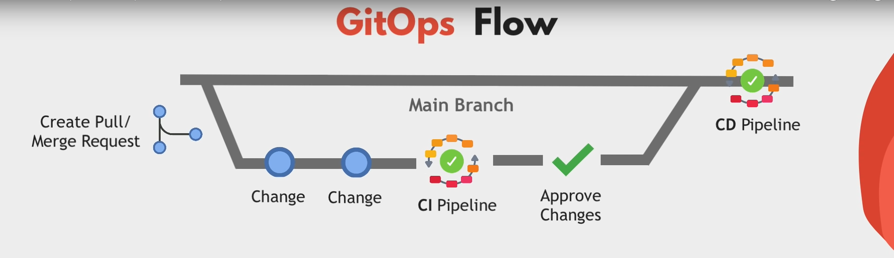

<h4 align="center">GitOps Flow  </h1>

### Steps

 1. Create Pull/Merge Request: Make changes to the code, collaborate with other team members on that pull request.
 2. Run CI Pipeline: It gives us the opportunity to validate the config files and test them just like we test application code changes.

 3. Approve changes: After testing these commits, other team members can approve the final changes. This way we have a tested and well-reviesed config changes before they get applied in any environment.

 4. Run CD Pipeline: Only after the Step #3, changes will be merged back into main branch and through a CD pipeline, get deployed to the environment. Whether it's changing sth in k8s cluster or updating the underlying infrastructure i.e., AWS.

 So we have an automated process which is more transparent and produces high quality infra or config code where multiple person collaborate on the change and things get tested. Rather than one engineer doing all the stuff from their laptop manually that others do not see or cannot review.

## CD Pipeline: Push-based vs Pull-based Deployment Models

As we see in GitOps Flow, once merged into the main branch, the changes will be automatically applied to the infrastructure through a CD pipeline. In GitOps, we have two ways of applying these changes; these are push or pull based deployments.

### Push-based Deployment

It is what we traditionally know from the application pipeline on Jenkins or GitLab CI/CD etc. Application is build

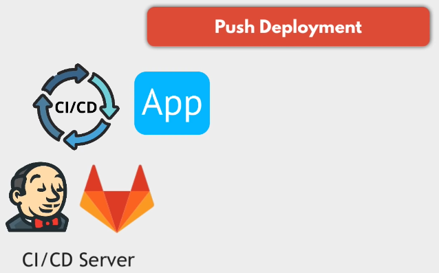

and pipeline executes command to deploy the new application version into the environment.

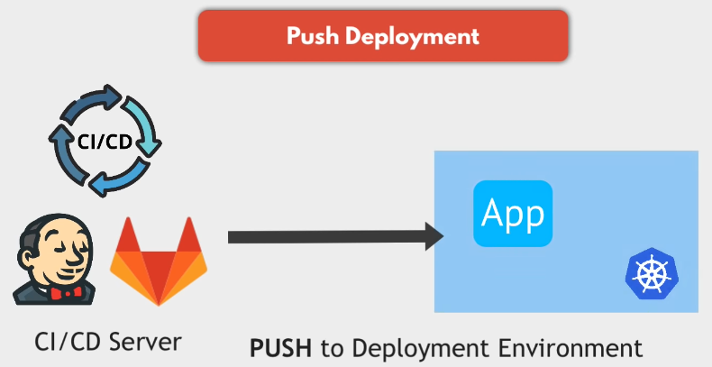

### Pull-based Deployment

Here we have an agent installed in the environment like in k8s cluster, that actively pulls the changes from the Git repository itself.

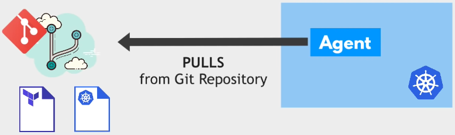

The agent will check regularly what is the state of the infrastructure code in the repository

and compare it to actual state in the environment where it's running

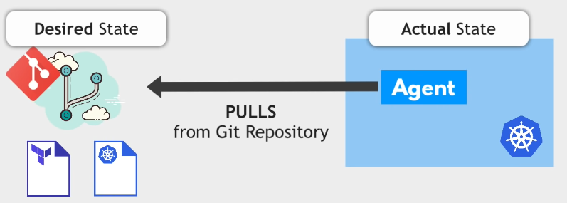

If it sees there is a difference in the repository, it will pull and apply these changes to get the environment from the actual state to the desired state defined in the repository.

Examples of GitOps tools that work with the pull-based model are Flux CD and Argo CD.

## Easy Rollback

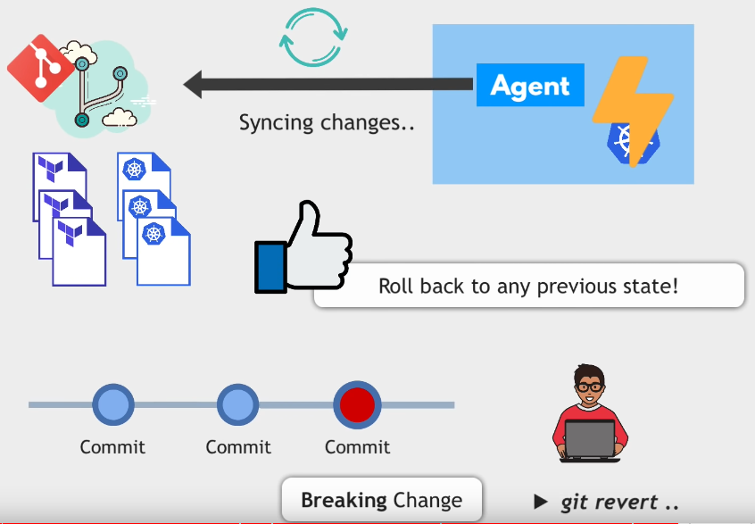

<h4 align="center">Breaked  </h1>

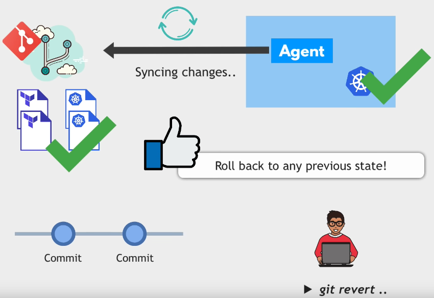

<h4 align="center">Fixed  </h1>

When we have version control for our code and the changes in our repository are automatically synced to the environment, we can easily rollback the environment to any previous state in our code. I gives us another big advantage, for example, if we make changes that break sth in the environment, so our cluster does not work anymore, we can just do git revert to undo the latest changes and get the environment back to the last working state.

## Git - Single Source of Truth

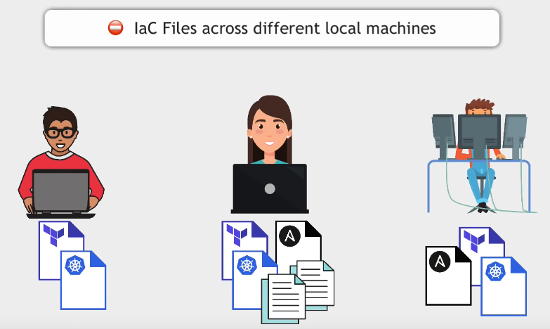

Instead of spreading our infrastructure as code and configuration as code etc. in different places and machines and basically having those files lying around on our computers, everything is stored centrally in a Git repository.

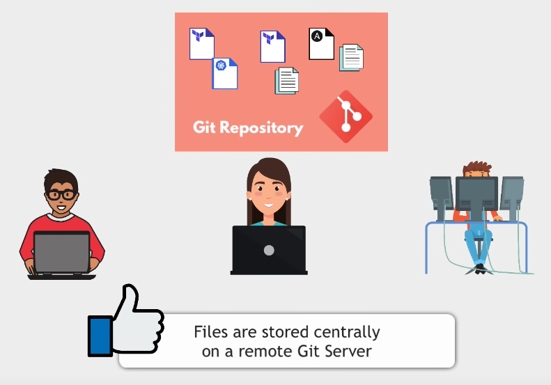

The environment is always synced with what's defined in that repository.

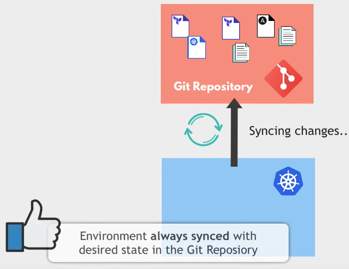

This means that Git repository becomes the single source of truth for your environment and this makes managing our infrastructure or our platform way easier.

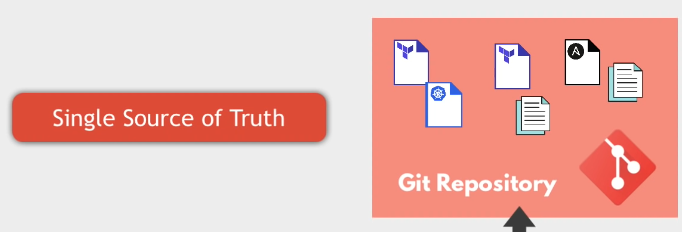

## Git - Increasing Security

GitOps also increases the security because now we do not have to give everyone in the team who needs to change sth on the infra or in k8s cluster direct access to it to execute the changes

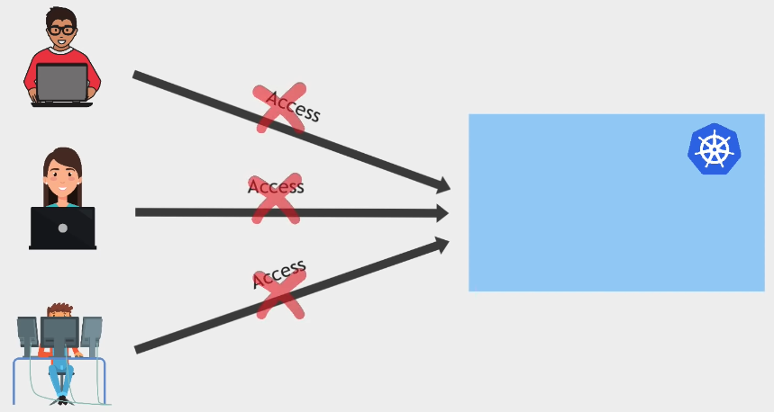

because it is the CD pipeline that deploys the changes, not individual team members from their laptops.

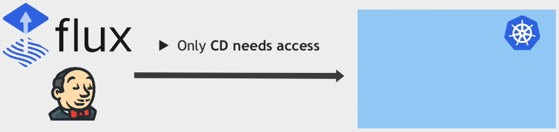

But anyone on the team can propose changes to the infra in the Git repository through pull requests and once it is time to merge that pull request and apply those changes, we can have much narrower group of people who are allowed to approve and merge those changes into the main branch so that it gets applied.

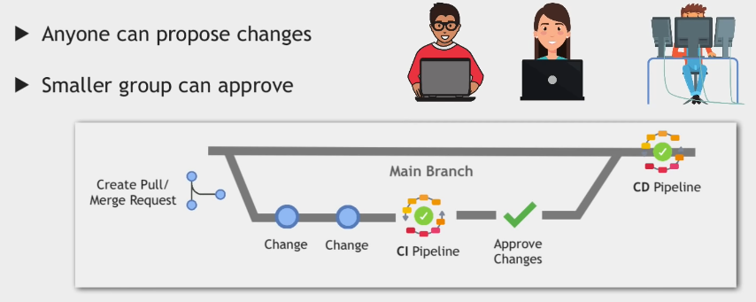

So as a result; we have

- Less Permissions to Manage
- More Secure Environment

## Wrap Up

To summarize, GitOps is an **Infrastructure as Code** with **Version Control**, **Pull/Merge Requests** and **CI/CD Pipeline**.

 

#### Note: The notes have taken from a YouTube video [What is GitOps, How GitOps works and Why it's so useful](https://www.youtube.com/watch?v=f5EpcWp0THw&ab_channel=TechWorldwithNana) from the "TechWorld with Nana", a YouTube channel. You can watch it and add/change the notes to improve the document. Thanks :)
